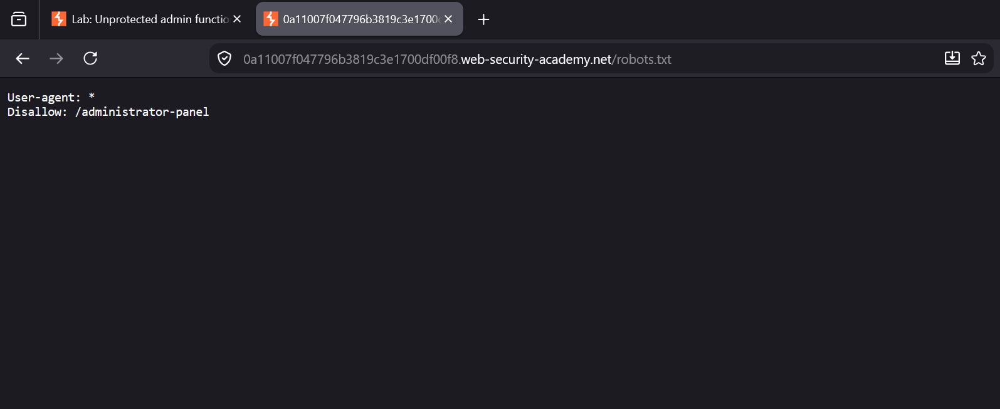
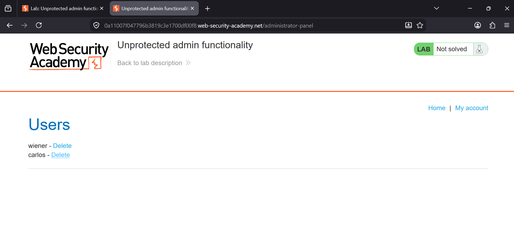
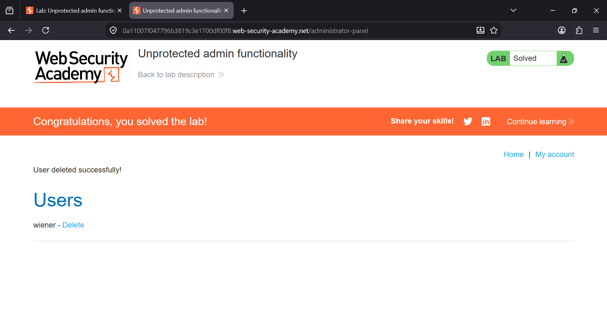

### Unprotected Admin Functionality

**Platform:** PortSwigger Web Security Academy  
**Category:** Access Control  
**Difficulty:** Apprentice  


### Overview

This lab demonstrates an **Access Control** vulnerability where sensitive administrative functionality is exposed without
any authentication or authorization checks.

The application unintentionally discloses the location of the administrator panel through the **robots.txt** file. 
Since the admin panel is publicly accessible, an attacker can directly browse to it and perform privileged actions without
logging in.


**Objective:**
Delete the user **carlos**.


### Vulnerability

The application exposes the administrator panel through the `robots.txt` file.

```
User-agent: *
Disallow: /administrator-panel
```

Although the directory is listed under the `Disallow` directive, **robots.txt is not a security mechanism**. It only 
tells compliant search engine crawlers which pages should not be indexed. Anyone can manually access the disclosed path.


# Steps 

## Step 1: Visit the robots.txt File

Open the lab and append `/robots.txt` to the lab URL.

Example:

```
https://LAB-ID.web-security-academy.net/robots.txt
```

The file reveals the hidden administrator directory:

```
User-agent: *
Disallow: /administrator-panel
```





## Step 2: Access the Administrator Panel

Replace `/robots.txt` in the URL with:

```
/administrator-panel
```

Since no authentication or authorization checks are enforced, the administrator panel loads successfully.

The page displays the list of users along with administrative options, including the ability to delete users.





## Step 3: Delete Carlos

Locate the user **carlos** and click the **Delete** link.

The application deletes the user immediately without requiring administrator authentication.

After deleting the user, the lab is marked as solved.





### Root Cause

The application relies on obscurity instead of proper authorization.

Although the administrator path is hidden from search engines using `robots.txt`, the endpoint itself has
**no access control**, allowing any user to access privileged functionality.


### Impact

An attacker can:

- Discover hidden administrative endpoints.
- Access sensitive administrator functionality.
- Perform privileged actions without authentication.
- Delete users or modify application data.
- Completely compromise administrative features.


### Remediation

- Never rely on `robots.txt` to hide sensitive resources.
- Enforce server-side authentication for all administrative pages.
- Implement proper role-based access control (RBAC).
- Return **403 Forbidden** for unauthorized users.
- Remove sensitive endpoints from publicly accessible locations whenever possible.


### Key Takeaway

`robots.txt` is **not a security feature**. It only provides crawling instructions for search engines. Sensitive 
endpoints must always be protected with proper authentication and authorization, regardless of whether their
URLs are publicly known.
