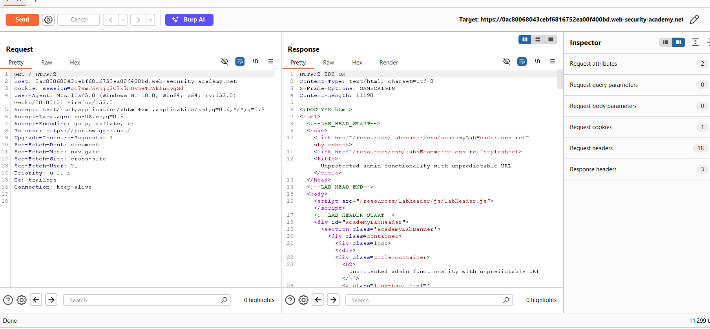
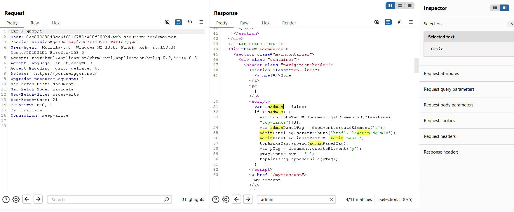
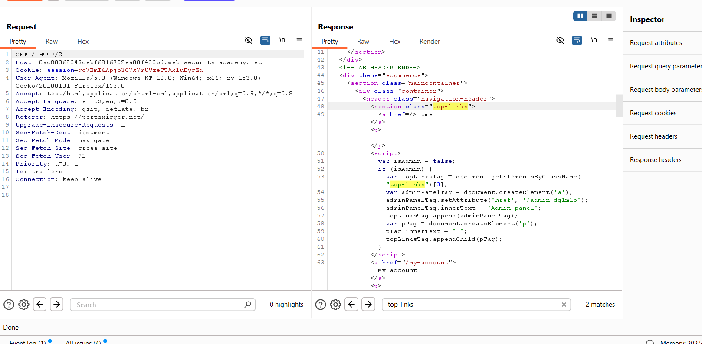
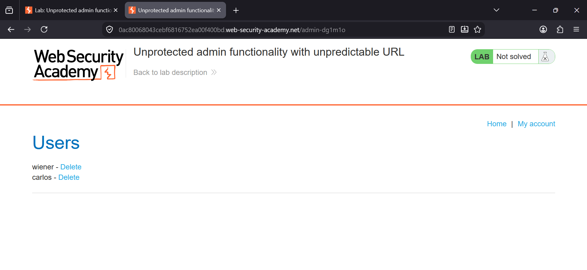
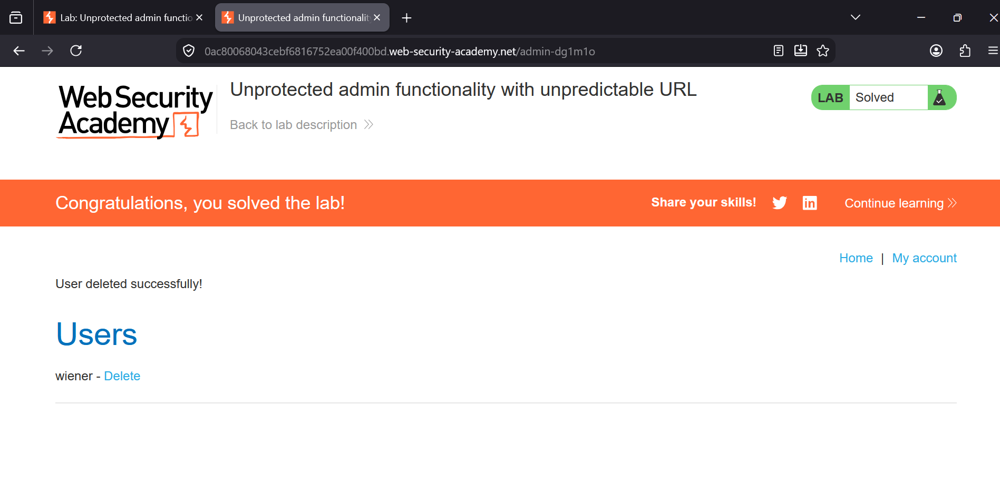

### Unprotected Admin Functionality with Unpredictable URL

**Platform:** PortSwigger Web Security Academy  
**Category:** Access Control  
**Difficulty:** Apprentice  


### Overview

This lab demonstrates an **Access Control** vulnerability where the administrator interface is not linked anywhere in the
application, but its location is exposed within the client-side JavaScript.

Although the URL is intended to be hidden, any user can inspect the application's source code and discover
the administrator endpoint. Since no authorization checks are performed, an attacker can directly access the admin panel
and perform privileged actions.


**Objective:** Delete the user **carlos**.


### Vulnerability

The application hides the administrator panel by using an unpredictable URL rather than implementing proper access control.

The page source contains JavaScript similar to:

```javascript
var isAdmin = false;

if (isAdmin) {
    adminPanelTag.setAttribute('href', '/admin-dg1m1o');
}
```

Even though `isAdmin` is set to `false`, the administrator URL (`/admin-dg1m1o`) is still present in the source code and 
can be discovered by anyone inspecting the response.


### Steps 

## Step 1: Intercept the Home Page Request

Open the lab and capture the request for the home page using **Burp Suite Proxy**.

Send the request to **Repeater** so the response can be inspected.





## Step 2: Inspect the Response Source

Search the response for the keyword:

```
admin
```

The JavaScript reveals the hidden administrator endpoint:

```javascript
adminPanelTag.setAttribute('href', '/admin-dg1m1o');
```

Although the application hides the link from normal users, the URL is still disclosed inside the source code.





## Step 3: Locate the Hidden Administrator Path

Search for the section containing:

```
top-links
```

This JavaScript dynamically creates the administrator link only when `isAdmin` is true, but the hidden URL is still 
exposed within the response.





## Step 4: Access the Administrator Panel

Browse directly to the disclosed administrator path:

```
/admin-dg1m1o
```

The administrator panel loads successfully without requiring administrator privileges.

The page displays all users along with administrative actions.





## Step 5: Delete Carlos

Click the **Delete** link next to **carlos**.

The application immediately deletes the user, confirming that the administrator functionality is completely unprotected.

The lab is now solved.





### Root Cause

The application attempts to hide administrative functionality by using an unpredictable URL instead of enforcing proper
authorization.

Since the administrator endpoint is embedded in the client-side JavaScript, any user can inspect the page 
source and discover it. The server fails to verify whether the requester has administrative privileges before granting 
access.


### Impact

An attacker can:

- Discover hidden administrator endpoints.
- Access privileged functionality without authentication.
- Delete or modify user accounts.
- Perform unauthorized administrative actions.
- Completely compromise application administration.


### Remediation

- Never rely on hidden or unpredictable URLs for security.
- Enforce server-side authentication and authorization on every administrative endpoint.
- Implement Role-Based Access Control (RBAC).
- Return **403 Forbidden** for unauthorized requests.
- Avoid exposing sensitive endpoint URLs in client-side JavaScript.


### Key Takeaway

Hidden URLs are **not** a security control. Any information delivered to the browser should be considered public. 
Administrative functionality must always be protected with proper server-side authorization checks, regardless of
whether the URL is obvious or unpredictable.
