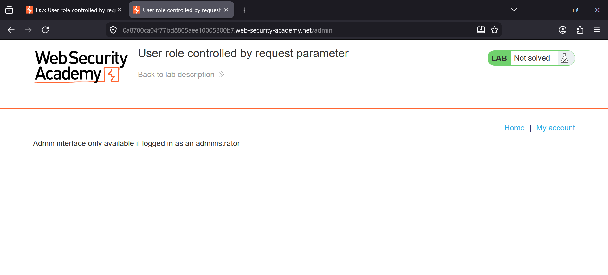
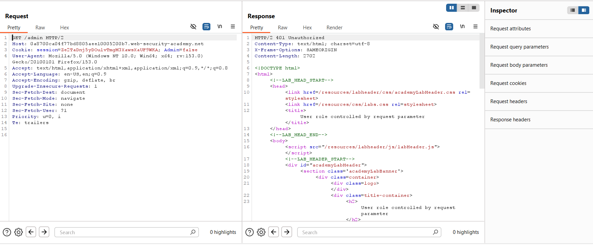
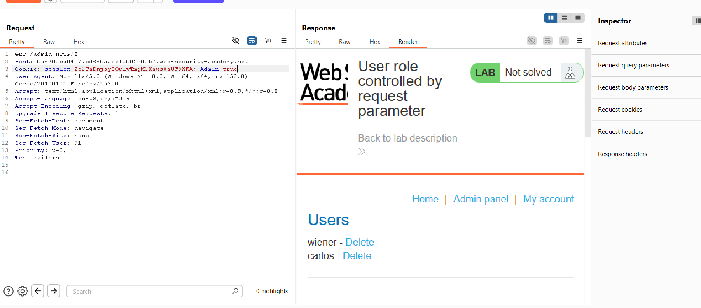
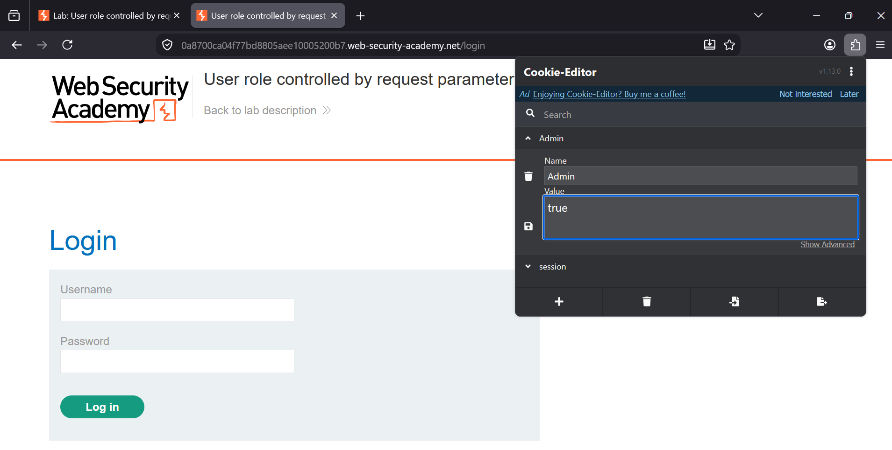
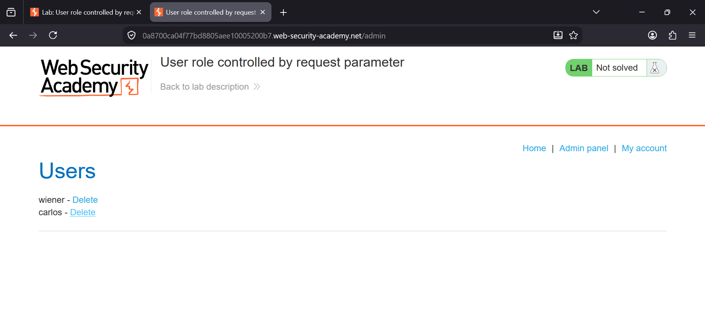

### User Role Controlled by Request Parameter

**Platform:** PortSwigger Web Security Academy  
**Category:** Access Control Vulnerabilities  
**Difficulty:** Apprentice


### Overview

This lab demonstrates an **access control vulnerability** where the application determines a user's privileges using a
client-controlled cookie. Since the `Admin` cookie can be modified by the user, an attacker can escalate privileges
simply by changing its value from `false` to `true`.


### Objective

Gain administrator access by modifying the `Admin` cookie and delete the user **carlos**.


## Steps

### Step 1: Attempt to Access the Admin Panel

Browse to the `/admin` endpoint without administrator privileges.

The application displays a message indicating that only administrators can access the admin interface.





### Step 2: Capture the `/admin` Request

Browse to the login page.

In Burp Suite, enable **Intercept** and **Response Interception**.

Log in using the provided credentials.

After logging in, browse to the `/admin` endpoint. Burp intercepts the request to `/admin`.

The request contains the following cookie:

```http
Cookie: session=<session-id>; Admin=false
```

At this point, the user is still treated as a normal user and the server responds with **401 Unauthorized**.

**Screenshot:**




### Step 3: Modify the `Admin` Cookie

While the `/admin` request is intercepted in Burp Repeater, change:

```http
Cookie: session=<session-id>; Admin=false
```

to:

```http
Cookie: session=<session-id>; Admin=true
```

Send the modified request.

The server now grants access to the administrator interface because it trusts the client-controlled `Admin` cookie.





### Step 4: Modify the Cookie Using Cookie Editor

The same privilege escalation can also be performed using the browser's Cookie Editor extension.

Locate the **Admin** cookie and change its value from:

```text
false
```

to

```text
true
```

Refresh the page after saving the modified cookie.





### Step 5: Access the Admin Panel and Delete Carlos

After changing the cookie, revisit the `/admin` page.

The admin interface is now accessible.

Delete the user **carlos** to complete the lab.





### Vulnerability

The application trusts a client-controlled cookie (`Admin`) to determine user privileges.

Because cookies can be modified by users, an attacker can simply change:

```http
Admin=false
```

to

```http
Admin=true
```

to gain administrator access.


### Impact

- Privilege escalation
- Unauthorized access to administrator functionality
- User account deletion
- Full compromise of administrative features


### Remediation

- Never store authorization information in client-controlled cookies.
- Store user roles securely on the server.
- Validate permissions for every privileged request.
- Use server-side session management.
- Implement proper role-based access control (RBAC).


### Key Takeaway

Authentication confirms **who the user is**, while authorization determines **what the user is allowed to do**.
Authorization decisions should always be enforced on the server rather than relying on values stored in client-controlled
cookies.
