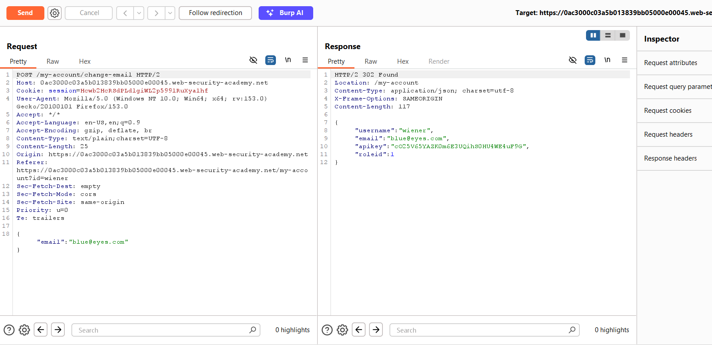
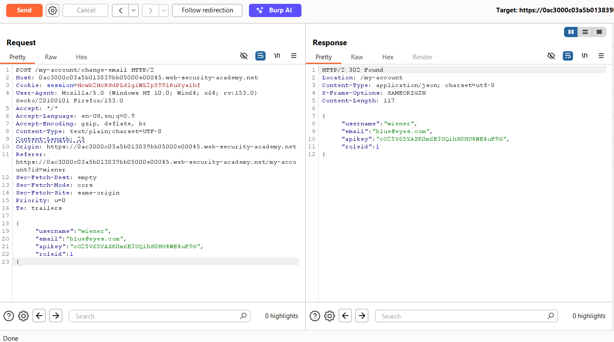
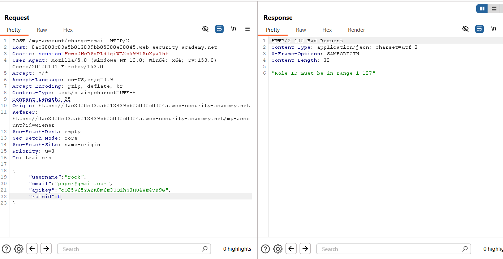
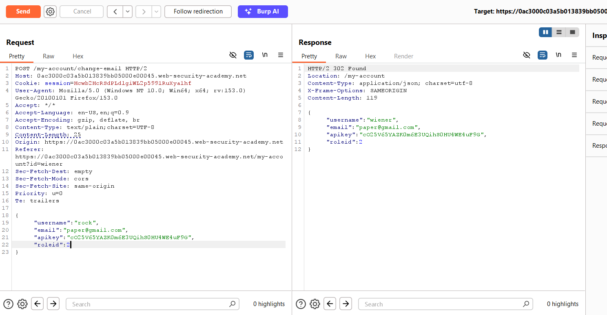
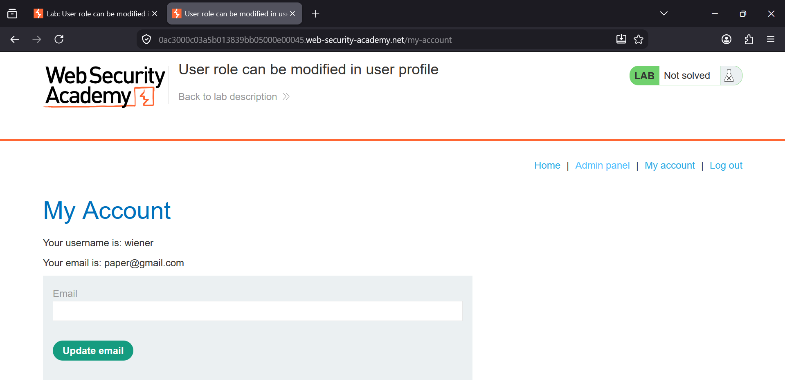
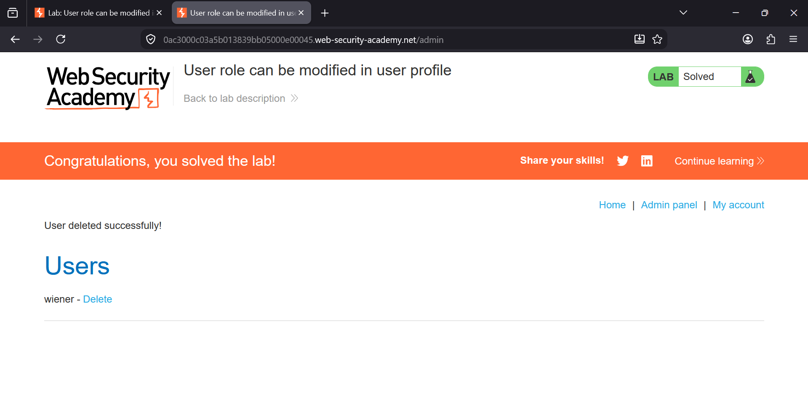

### User Role Can Be Modified in User Profile

**Category:** Access Control  
**Difficulty:** Practitioner  


### Lab Objective

The application exposes the user's role inside a JSON request/response. By modifying the `roleid` parameter in the 
profile update request, it is possible to escalate privileges to an administrator.

**Goal:** Become an administrator and delete the user **carlos**.


### Tools Used

- Burp Suite Professional
- Firefox Browser


# Step 1 – Log in and Update Your Email

Log in using the credentials provided by the lab and navigate to **My Account**.

Update your email address using the available form.

Intercept or send the request to **Burp Repeater**.

The response contains several JSON fields including:

- username
- email
- apikey
- **roleid**

Notice that your current account has:

```json
"roleid":1
```

This reveals that the application is exposing the user's authorization level directly to the client.





# Step 2 – Add the Role ID to the Request

Send the request to **Burp Repeater**.

The original request only updates the email.

Modify the JSON body by adding the role information.

From:

```json
{
    "email":"blue@eyes.com"
}
```

To:

```json
{
    "username":"wiener",
    "email":"blue@eyes.com",
    "apikey":"YOUR_API_KEY",
    "roleid":1
}
```

The server accepts the extra parameters without rejecting them.





## Step 3 – Test Whether Other Parameters Can Be Modified

Before attempting privilege escalation, test whether the application accepts modifications to other JSON fields.

In Burp Repeater, modify multiple parameters in the request body:

- Change the `username`
- Change the `email`
- Keep the existing `apikey`
- Change `roleid`

Example:

```json
{
    "username":"rock",
    "email":"paper@gmail.com",
    "apikey":"cO25V65YAZKOm6E3UQihS0HU4WE4uF9G",
    "roleid":0
}
```

The server rejects the request with the following error:

```
Role ID must be in range 1-127
```

This shows that:

- The application parses every JSON field sent by the client.
- It validates the `roleid` value only by checking whether it falls within an allowed numeric range.
- There is no authorization check preventing a normal user from attempting to modify sensitive parameters.
- The server does not reject unexpected or security-sensitive fields such as `username`, `apikey`, or `roleid`.

This behavior indicates a **mass assignment (auto-binding)** vulnerability, where client-controlled properties are
trusted by the server.





# Step 4 – Escalate Your Privileges

Now change the role to:

```json
"roleid":2
```

Send the modified request.

The response now returns:

```json
"roleid":2
```

This confirms that your account has successfully been promoted to an administrator.

### Screenshot




# Step 5 – Verify Administrator Access

Refresh the browser.

A new **Admin panel** link now appears in the navigation bar, confirming that your account has administrator privileges.





# Step 6 – Delete Carlos

Browse to:

```
/admin
```

Locate the user **carlos** and click **Delete**.

The lab is solved immediately after deleting the target user.





### Why This Vulnerability Exists

The application stores the user's authorization level inside a client-controlled JSON request.

Instead of determining privileges on the server, it trusts the value supplied by the client.

An attacker can simply modify:

```json
"roleid":2
```

to gain administrator privileges.

This is a classic **Privilege Escalation** vulnerability caused by broken access control.


### Impact

- Privilege escalation
- Unauthorized administrator access
- Administrative functionality exposed
- User deletion
- Complete compromise of access control


### Remediation

- Never trust client-supplied role information.
- Store roles exclusively on the server.
- Ignore sensitive fields such as `roleid`, `isAdmin`, or `permissions` when received from clients.
- Perform server-side authorization checks for every privileged action.
- Apply the principle of least privilege.


### Key Takeaways

- Never expose authorization data to the client.
- Client-controlled parameters should never determine user privileges.
- Always enforce authorization checks on the server.
- Test every hidden parameter for privilege escalation opportunities.

