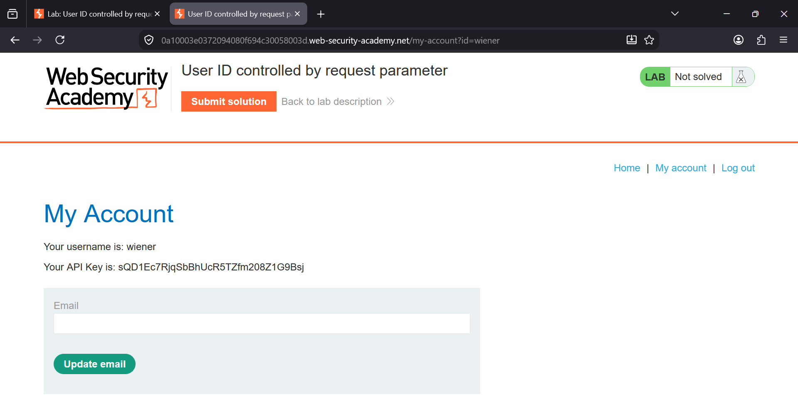
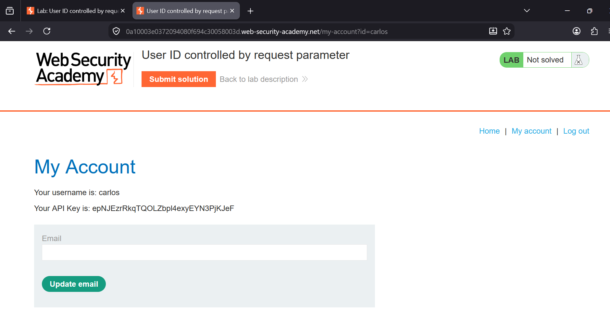
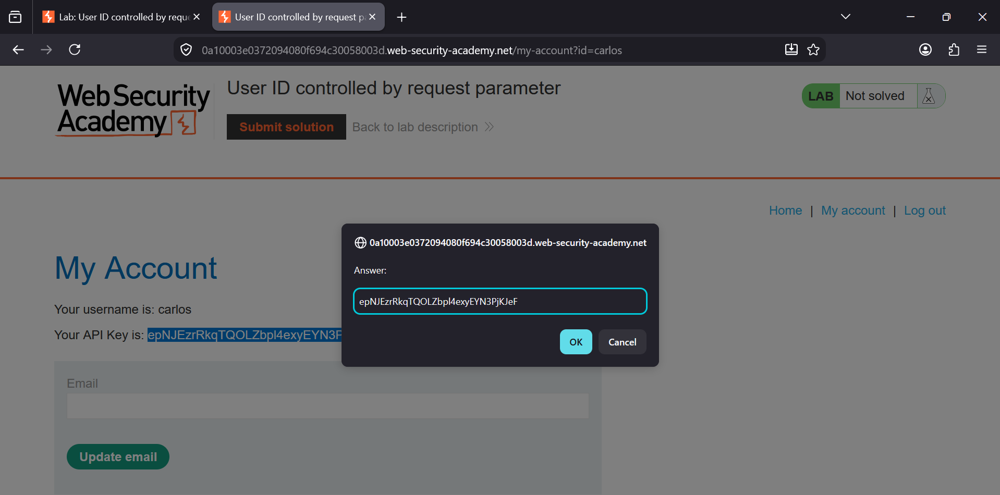
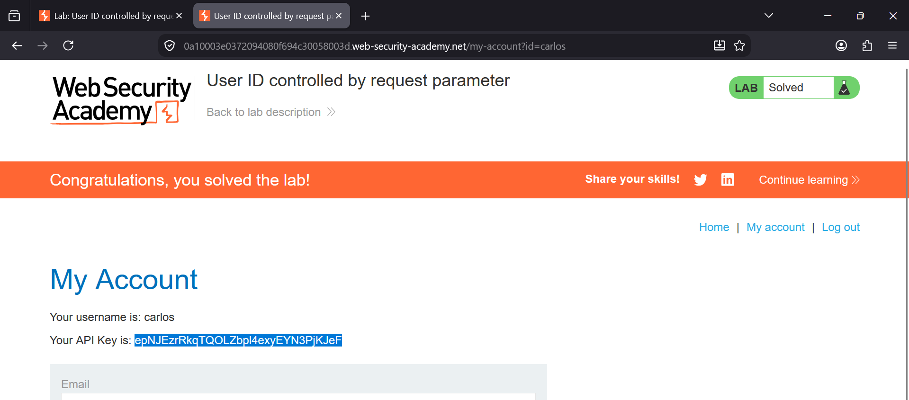

###  User ID Controlled by Request Parameter

**Category:** Access Control  
**Difficulty:** Apprentice  


### Lab Objective

The application uses the `id` parameter in the URL to determine which user's account information is displayed. Because
there are no proper authorization checks, an attacker can simply modify this parameter to access another user's 
account details.

**Goal:** Retrieve Carlos's API key and submit it to solve the lab.


### Tools Used

- Firefox Browser
- Burp Suite (Optional)


# Step 1 – Log in and Inspect the URL

Log in using the credentials provided by the lab and navigate to **My Account**.

Notice that the URL contains your username as the value of the `id` parameter:

```text
/my-account?id=wiener
```

The page displays your own account information, including:

- Username
- API Key
- Email update form

The presence of the username inside a client-controlled URL parameter suggests that the application may be vulnerable
to an **Insecure Direct Object Reference (IDOR)**.





# Step 2 – Change the User ID

Modify the URL manually by replacing:

```text
id=wiener
```

with

```text
id=carlos
```

Result:

```text
/my-account?id=carlos
```

After refreshing the page, the application loads Carlos's account instead of your own.

The page now reveals:

- Carlos's username
- Carlos's API key

This confirms that the application does not verify whether the authenticated user is authorized to access another user's 
account.





# Step 3 – Copy Carlos's API Key

Locate the API key displayed on Carlos's account page.

Select and copy the entire API key.

This value will be required to complete the lab.





# Step 4 – Submit the API Key

Click **Submit solution**.

Paste Carlos's API key into the submission dialog and click **OK**.

The lab validates the key and marks the challenge as solved.





### Why This Vulnerability Exists

The application relies entirely on the user-controlled `id` parameter to determine which account information should
be displayed.

Instead of verifying that the requested account belongs to the currently authenticated user, the server returns the 
requested user's data directly.

Because of this missing authorization check, an attacker can access sensitive information belonging to other users
simply by changing the URL.

This is a classic example of an **Insecure Direct Object Reference (IDOR)**, also known as **Broken Access Control**.


### Impact

- Unauthorized access to other users' accounts
- Disclosure of sensitive information
- Exposure of API keys and personal data
- Potential account compromise
- Broken access control


### Remediation

- Never trust user-supplied identifiers for authorization.
- Perform server-side authorization checks on every request.
- Ensure users can only access resources that belong to their own account.
- Use indirect object references where appropriate.
- Follow the principle of least privilege.


### Key Takeaways

- Always test URL parameters for IDOR vulnerabilities.
- Changing identifiers such as usernames or IDs may expose unauthorized data.
- Authentication alone is not enough; proper authorization checks must also be enforced.
- Sensitive information, such as API keys, should never be accessible simply by modifying a URL parameter.
