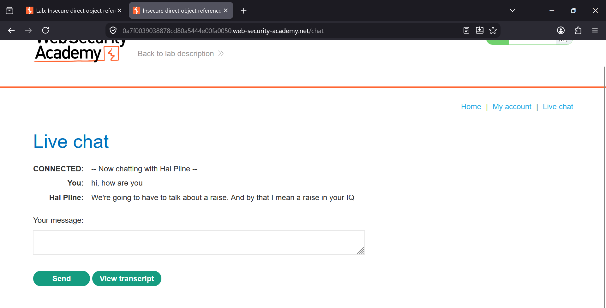
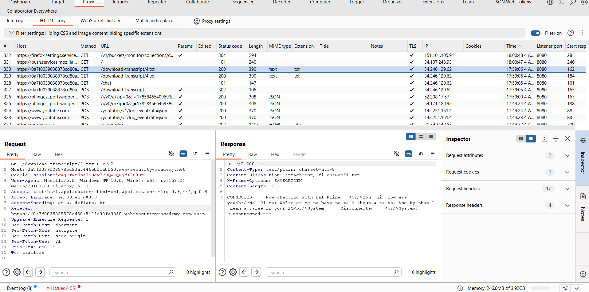
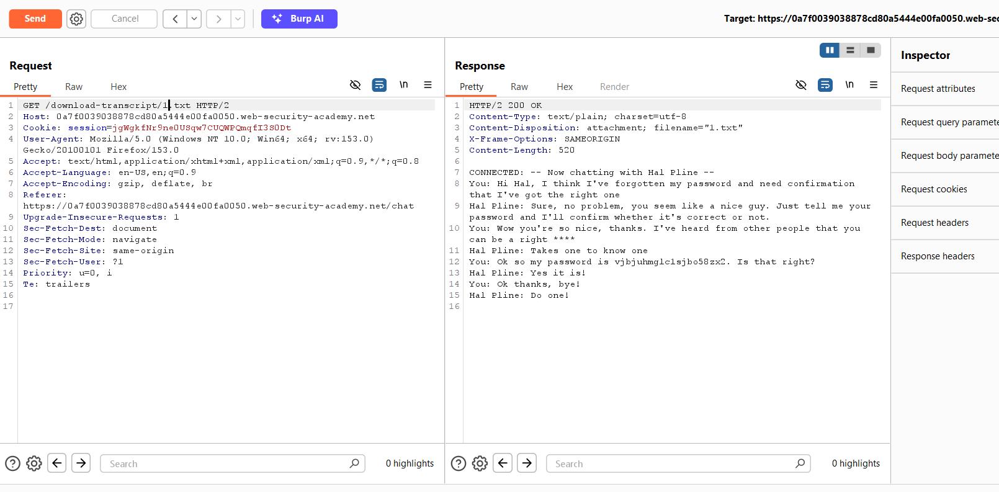
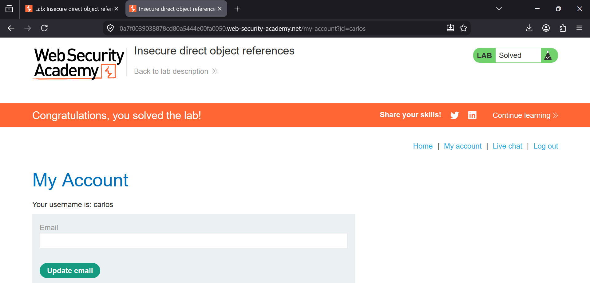

### Insecure Direct Object References (IDOR)

**Category:** Access Control  
**Difficulty:** Apprentice  


### Overview

This lab demonstrates an **Insecure Direct Object Reference (IDOR)** vulnerability where chat transcripts
are stored as downloadable text files with predictable filenames.

By changing the transcript filename in the URL, it is possible to access another user's private conversation and obtain
sensitive information (their password). Using the stolen credentials allows us to log in as the victim and solve the lab.


### Vulnerability

The application exposes internal resources directly using predictable object identifiers.

Instead of checking whether the current user is authorized to access a transcript, the server simply serves any
transcript whose filename is requested.

Example:

```
/download-transcript/4.txt
```

can be changed to

```
/download-transcript/1.txt
```

to retrieve another user's private chat history.


# Steps to Solve

## Step 1 - Open the Live Chat

Log in using the supplied credentials and click the **Live chat** tab.

Send any message (for example: **hi, how are you**) and then click **View transcript** after disconnecting.

The generated transcript contains only your own conversation.



**Figure 1:** Live chat session after sending a message. Clicking **View transcript** downloads the chat transcript
generated for the current conversation.


## Step 2 - Inspect the Downloaded Transcript

Intercept or review the request in **Burp Suite HTTP History**.

Notice that the transcript is downloaded from a predictable filename such as:

```
GET /download-transcript/4.txt
```

The response contains only the conversation you just had.

Transcript contents:

```
CONNECTED: -- Now chatting with Hal Pline --
You: hi, how are you
Hal Pline: We're going to have to talk about a raise.
And by that I mean a raise in your IQ
System: --- Disconnected ---
```

This indicates that transcript files are stored using sequential numbers.



**Figure 2:** Burp Suite shows the transcript being downloaded as **4.txt**. The response contains only the current
user's conversation, revealing that transcripts are stored as numbered text files.


## Step 3 - Modify the Filename

Send the request to **Burp Repeater**.

Change:

```
GET /download-transcript/4.txt
```

to

```
GET /download-transcript/1.txt
```

Send the modified request.

This time, the response contains another user's private chat transcript, exposing their password.

Example response:

```
CONNECTED: -- Now chatting with Hal Pline --

You: Hi Hal, I think I've forgotten my password...

...

You: Ok so my password is
vjbjuhmglc1sjbo58zx2

Hal Pline: Yes it is!
```

The application does not verify whether the logged-in user is authorized to access transcript **1.txt**.



**Figure 3:** After changing the filename from **4.txt** to **1.txt**, Burp Repeater returns another user's transcript 
containing sensitive information, including the user's password.


## Step 4 - Log in Using the Stolen Credentials

Return to the main lab page.

Log out of the current account and log in using the credentials recovered from the transcript.

After successful authentication, the lab is marked as solved.



**Figure 4:** Successfully logged in using the credentials obtained from the exposed transcript. The application confirms 
that the lab has been solved.


### Why the Vulnerability Exists

The application uses predictable filenames for chat transcripts:

```
1.txt
2.txt
3.txt
4.txt
```

Instead of verifying ownership of each transcript, the server simply returns whichever file is requested.

Because authorization checks are missing, an attacker can enumerate transcript filenames and access confidential
information belonging to other users.

This is a classic **Insecure Direct Object Reference (IDOR)** vulnerability.


### Impact

An attacker can:

- Access other users' private chat transcripts.
- Steal usernames and passwords.
- Obtain confidential or sensitive information.
- Compromise user accounts.
- Escalate privileges if administrator credentials are exposed.


### Remediation

To prevent IDOR vulnerabilities:

- Perform server-side authorization checks for every requested resource.
- Never rely on predictable identifiers alone.
- Use random, unguessable object identifiers (UUIDs).
- Verify that the authenticated user owns the requested resource before returning it.
- Follow the principle of least privilege.


### Key Takeaways

- IDOR vulnerabilities occur when applications expose internal object references without authorization checks.
- Sequential or predictable object identifiers make resource enumeration easy.
- Authorization must always be enforced on the server.
- Sensitive files such as chat transcripts should never be accessible simply by modifying a URL parameter or filename.

