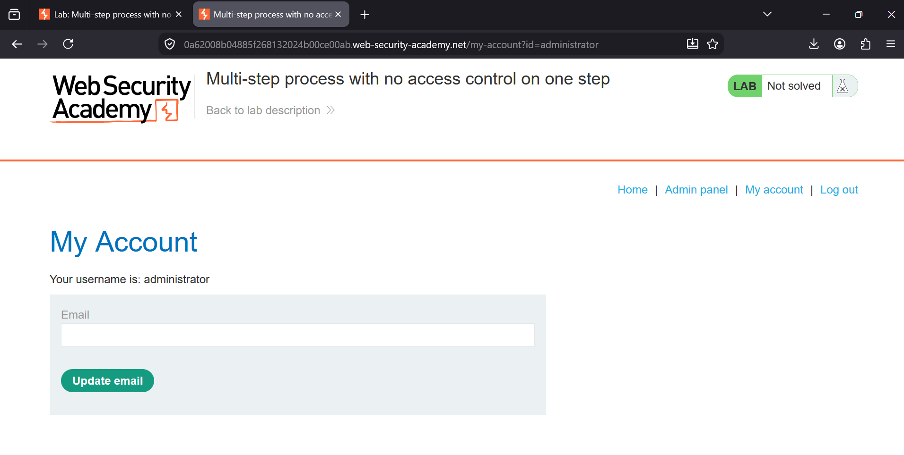
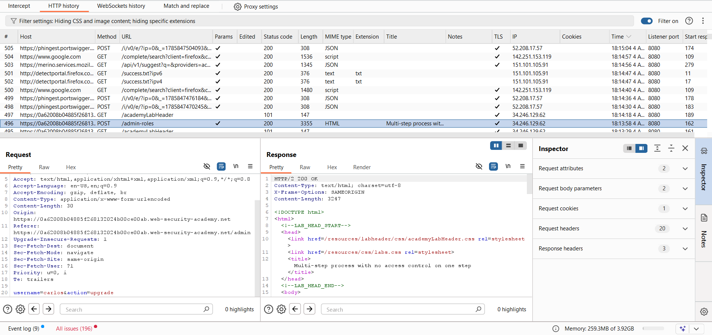
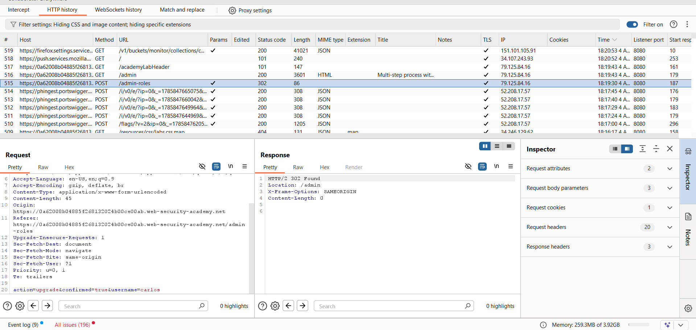
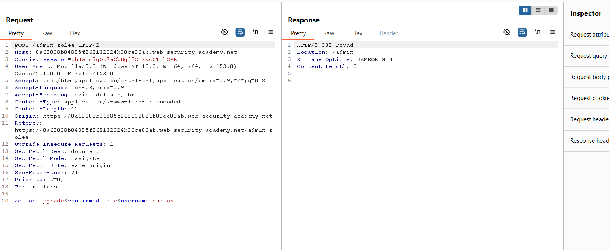
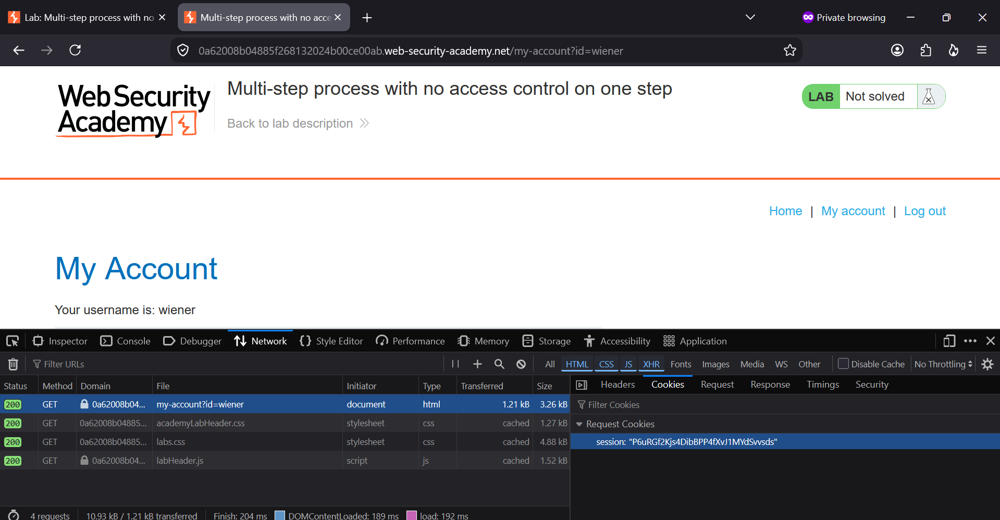
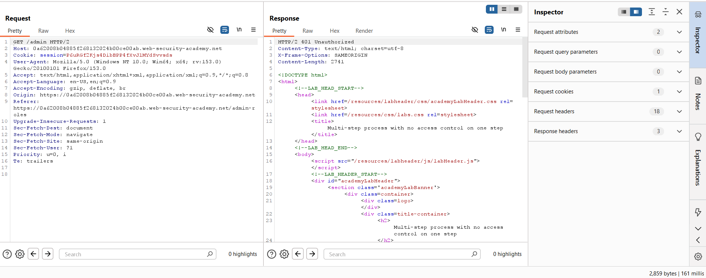
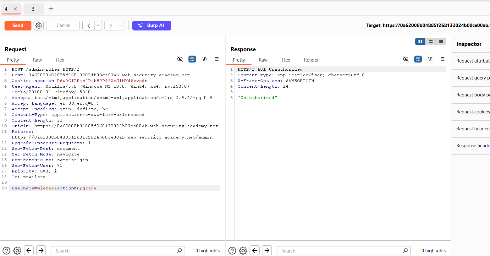
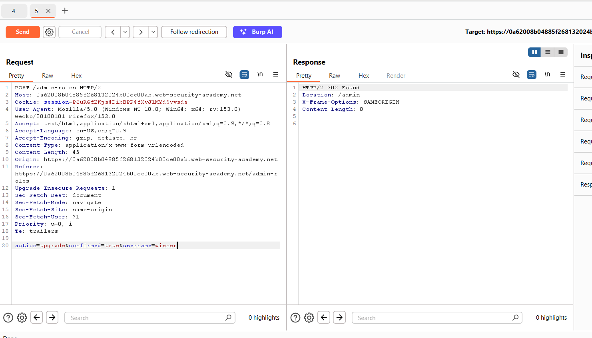
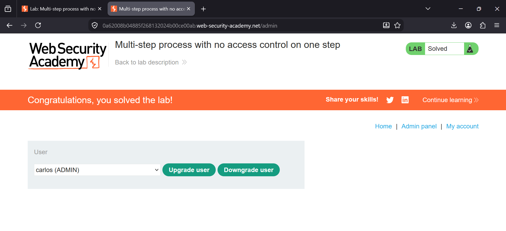

### Multi-step Process with No Access Control on One Step

**Platform:** PortSwigger Web Security Academy  
**Category:** Access Control  
**Difficulty:** Apprentice  

### Overview

This lab demonstrates a **broken access control vulnerability** in a multi-step administrative workflow. Although
the application correctly restricts access to the administrator interface, it fails to enforce authorization during one
of the confirmation steps. By replaying the confirmation request with a low-privileged user's session cookie,
it is possible to complete the privilege escalation process and promote a normal user to administrator.


# Step 1: Log in as the Administrator

Log in using the administrator credentials provided by the lab.

After logging in, navigate to the **Admin panel**.




# Step 2: Capture the Initial Upgrade Request

Inside the **Admin panel**, select **carlos** and click **Upgrade user**.

Intercept or locate the request in **HTTP History** and send the following request to **Burp Repeater**.

```
POST /admin-roles
```

The request body contains:

```
username=carlos&action=upgrade
```

This is the **first step** of the upgrade process.



---

# Step 3: Capture the Confirmation Request

Return to the browser and complete the upgrade process.

A second request is generated to confirm the action.

Locate this request in **HTTP History** and send it to **Burp Repeater** as well.

The request body now contains:

```
action=upgrade&confirmed=true&username=carlos
```

This is the vulnerable confirmation step.






---

# Step 4: Open a Private Browser and Log in as Wiener

Open a new **Private/Incognito** browser window.

Log in using the non-administrator account:

- **Username:** wiener
- **Password:** peter

After logging in, open the browser's Developer Tools and copy **Wiener's session cookie**.



---

# Step 5: Replace the Session Cookie in the Confirmation Request

Return to **Burp Repeater**.

Open the **second request** (the one containing `confirmed=true`).

Replace the administrator's session cookie with **Wiener's session cookie** copied from the private browser.

The modified request should still contain:

```
action=upgrade&confirmed=true&username=carlos
```

Send the request.

The server responds with:

```
302 Found
Location: /admin
```

This indicates that the confirmation step accepted the low-privileged user's session because it lacks proper access control.



---

# Step 6: Follow the Redirection

Click **Follow redirection** in Burp Repeater.

The redirected request returns **401 Unauthorized**, confirming that Wiener still cannot directly access the admin panel.

This behavior shows that the application protects the admin page itself, but not the confirmation endpoint.

---

# Step 7: Modify the First Request

Now return to the **first request** stored in Repeater.

Replace:

```
username=carlos
```

with

```
username=wiener
```

The request body becomes:

```
username=wiener&action=upgrade
```

Send the request.



---

# Step 8: Modify the Confirmation Request

Return to the **second request**.

Replace:

```
username=carlos
```

with

```
username=wiener
```

Keep:

```
confirmed=true
```

The final request body becomes:

```
action=upgrade&confirmed=true&username=wiener
```

Send the request.

The server again returns:

```
302 Found
Location: /admin
```

indicating that the confirmation has completed successfully for Wiener.



---

# Step 9: Verify the Result

Refresh the browser.

Wiener has now been promoted to **Administrator**, and the lab is successfully solved.



---

### Vulnerability

The application performs the privilege escalation using a **two-step workflow**:

1. Initiate the role upgrade.
2. Confirm the upgrade.

Although the application correctly protects the administrator interface, it **fails to perform authorization checks
during the confirmation request**. Since this endpoint trusts the supplied session without verifying administrative 
privileges, an attacker can replay the confirmation using a normal user's session and complete the privilege escalation.

---

### Impact

- Privilege escalation
- Broken Access Control
- Unauthorized role modification
- Administrative privilege takeover
- Compromise of application integrity


### Remediation

- Enforce authorization checks on **every step** of multi-step workflows.
- Validate user permissions on the server for each request independently.
- Never assume that a previous authorized request guarantees authorization for subsequent requests.
- Bind confirmation requests to the authenticated administrator's session.
- Revalidate both the session and the user's privileges before applying sensitive changes.


### Conclusion

This lab demonstrates that protecting only the initial administrative interface is insufficient. Every request
involved in a sensitive workflow must independently verify the user's authorization. Missing access control on even
a single confirmation step allows attackers to bypass intended restrictions and perform privileged actions.
