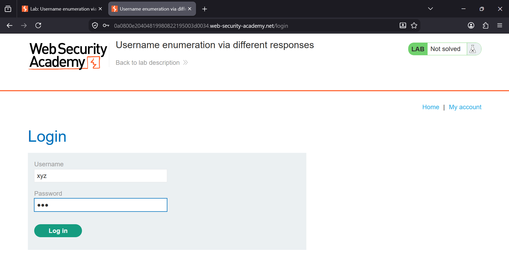

### Username Enumeration via Different Responses

**Platform:** PortSwigger Web Security Academy  
**Category:** Authentication  
**Difficulty:** Apprentice  


### Overview

This lab demonstrates an **Authentication Username Enumeration** vulnerability where the application returns different error
messages for invalid usernames and invalid passwords. These differences allow an attacker to determine whether a username 
exists before attempting to guess its password.

After identifying a valid username, the password was successfully brute-forced using **Burp Suite Intruder** and the 
provided password list.


### Objective

- Identify a valid username by observing differences in server responses.
- Brute-force the password of the valid user.
- Successfully log in to solve the lab.


### Tools Used

- Burp Suite Professional
- Burp Intruder
- PortSwigger Username List
- PortSwigger Password List
- Firefox


### Vulnerability

The login functionality returns different responses depending on whether:

- The username does not exist.
- The username exists but the password is incorrect.

Because of these inconsistent responses, an attacker can enumerate valid usernames and then perform password guessing only 
against legitimate accounts.


### Steps Performed

# Step 1 — Capture the Login Request

Entered random credentials in the login form.

```text
Username: xyz
Password: abc
```

Intercepted the POST request using Burp Suite.




# Step 2 — Send the Request to Intruder

Right-clicked the captured request and selected:

```text
Send to Intruder
```


# Step 3 — Configure Username Payload

Highlighted only the username value.

```http
username=§xyz§
password=abc
```

Kept the password fixed while testing usernames.

**Attack Type**

```text
Sniper
```


# Step 4 — Load Username Wordlist

Loaded the provided username list into the payload section.

Started the Intruder attack.


# Step 5 — Identify the Valid Username

Compared the responses.

Most responses had:

```text
Length: 3352
```

One request returned:

```text
Length: 3354
```

This difference indicated a valid username.

**Valid Username**

```text
arizona
```


# Step 6 — Brute Force the Password

Modified the request:

```http
username=arizona
password=§abc§
```

Loaded the password list into Intruder.

Started another Sniper attack.


# Step 7 — Find the Correct Password

Most responses returned:

```http
HTTP/1.1 200 OK
```

One response returned:

```http
HTTP/1.1 302 Found
```

The redirect indicated successful authentication.

**Correct Credentials**

```text
Username: arizona
Password: 777777
```


# Step 8 — Lab Solved

Logged in successfully using the discovered credentials.

The application redirected to the user account page and the lab status changed to **Solved**.


### Root Cause

The application exposes different server responses during authentication:

- Invalid username → One error response.
- Valid username + incorrect password → Different error response.

These inconsistencies leak information about valid accounts and enable username enumeration.


### Impact

An attacker can:

- Enumerate valid usernames.
- Reduce the search space for password attacks.
- Perform targeted brute-force attacks.
- Increase the likelihood of unauthorized account access.


### Remediation

- Return a generic authentication error such as:

```text
Invalid username or password.
```

- Ensure response length, status code, and response time remain consistent for all failed login attempts.
- Implement rate limiting.
- Enforce account lockout after repeated failed attempts.
- Require Multi-Factor Authentication (MFA).
- Monitor and alert on repeated login failures.


### Key Takeaway

Authentication systems should never reveal whether a username exists. Even subtle differences in response messages, 
response lengths, status codes, or timing can allow attackers to enumerate valid users and significantly improve the 
effectiveness of brute-force attacks. Consistent responses combined with rate limiting and MFA greatly reduce this risk.
