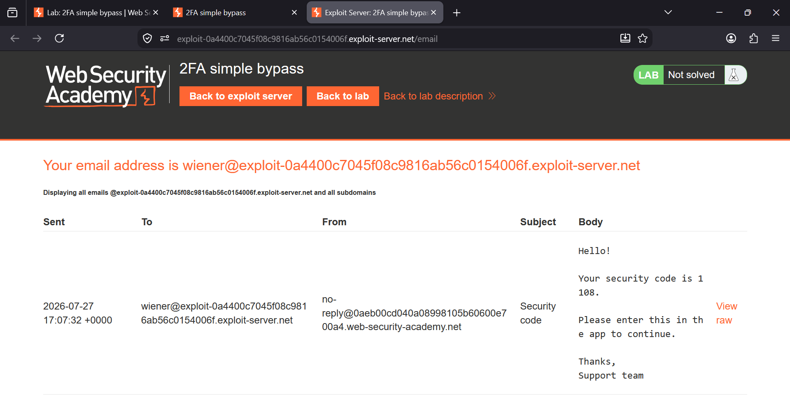
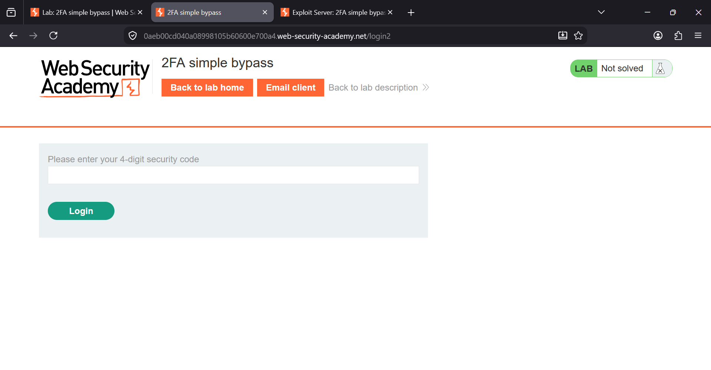
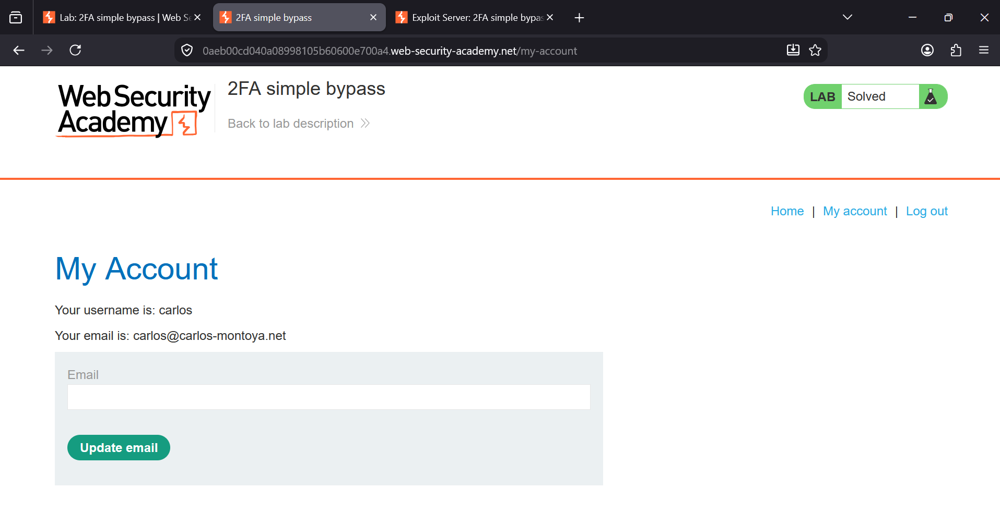

### 2FA Simple Bypass

**Platform:** PortSwigger Web Security Academy
**Category:** Authentication  
**Difficulty:** Apprentice  


### Overview

This lab demonstrates a **2FA (Two-Factor Authentication) bypass** vulnerability caused by improper access control.

The application requires a second authentication factor after a successful login. However, it fails to verify whether the
second factor has actually been completed before granting access to protected resources.

**Goal:** Access Carlos's account by bypassing the 2FA verification step.


### Steps to Solve

# Step 1: Log in as Wiener

First, log in using the provided credentials:

- **Username:** `wiener`
- **Password:** `peter`

After logging in, navigate to the **Email client** to understand how the application delivers the one-time security code. 
The email contains the 4-digit verification code used for the second authentication step.

> **Note:** This step is only to observe how the 2FA mechanism works.




# Step 2: Log in as Carlos

Return to the login page and use the provided credentials for Carlos:

- **Username:** `carlos`
- **Password:** `montoya`

After entering the credentials, the application redirects to the **2FA verification page**, asking for a 4-digit security 
code.

Instead of entering the code, modify the URL manually.

Change:

```
/login2
```

to:

```
/my-account
```

and press **Enter**.




# Step 3: 2FA Successfully Bypassed

The application grants direct access to Carlos's account without validating the second authentication factor.

The lab is now solved.




### Vulnerability

The application authenticates the user's username and password but **does not verify whether the second authentication
step has been completed** before allowing access to protected pages.

An attacker with valid credentials can simply navigate directly to authenticated endpoints and completely bypass the 2FA 
process.


### Impact

- Two-factor authentication can be bypassed.
- Stolen credentials are sufficient to compromise accounts.
- The second authentication factor provides no effective protection.


### Prevention

- Enforce 2FA validation on the server before granting access to protected resources.
- Maintain a session flag indicating whether 2FA has been completed.
- Reject requests to authenticated endpoints until second-factor verification succeeds.
- Perform authorization checks on every protected endpoint instead of relying on client-side navigation.


## Key Takeaway

**2FA is only effective when enforced server-side.** Simply redirecting users to a verification page is not enough if protected resources do not validate that the second authentication factor has actually been completed.
