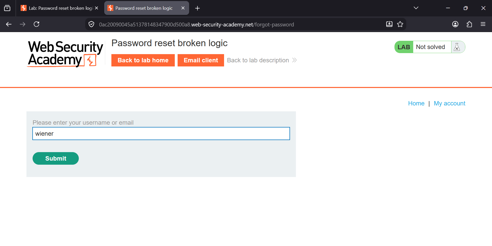
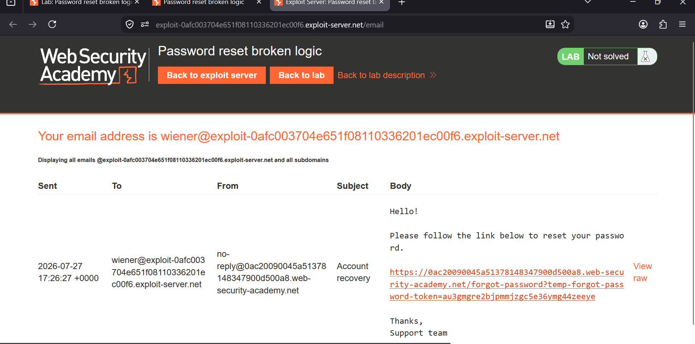
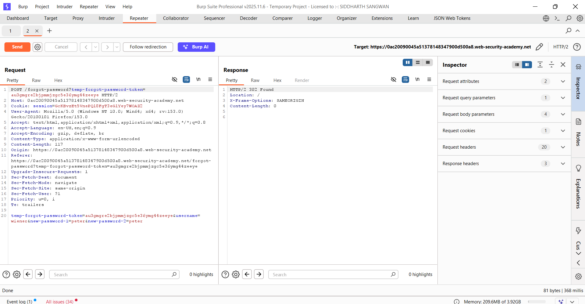
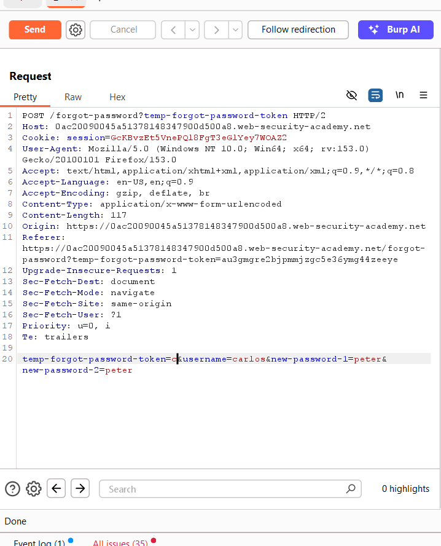
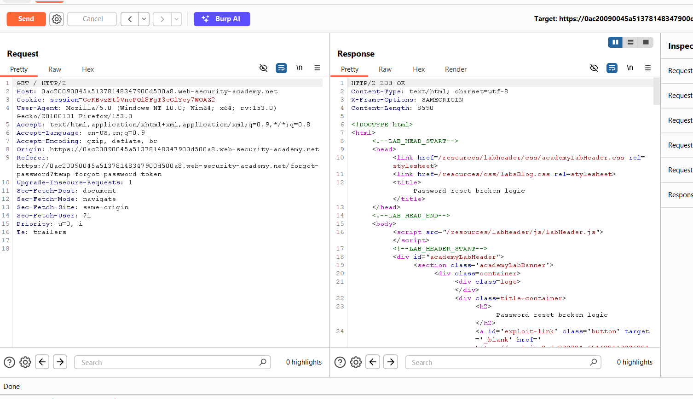
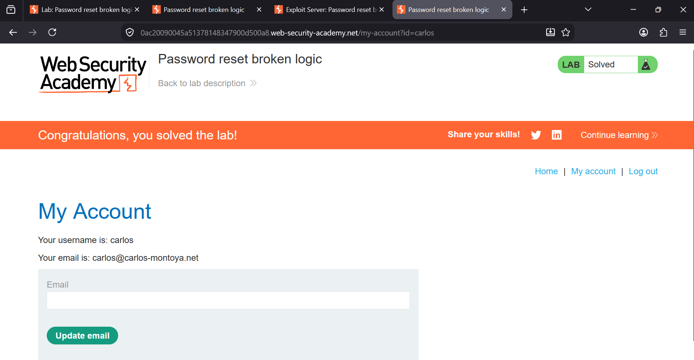

### Password Reset Broken Logic

**Platform:** PortSwigger Web Security Academy                                                                      
**Category:** Authentication  
**Difficulty:** Apprentice  


### Overview

This lab demonstrates a **broken password reset implementation** where the application trusts a user-controlled parameter
during the password reset process.

Although the reset token belongs to one user, the application fails to verify that the **username** submitted with the
request matches the owner of the reset token. By modifying the username parameter, an attacker can reset another user's 
password.

**Goal:** Reset Carlos's password and log in to his account.


### Steps to Solve

# Step 1: Request a Password Reset for Wiener

Navigate to **Forgot Password** and request a password reset for the user **wiener**.




# Step 2: Open the Password Reset Email

Open the email sent to Wiener and click the password reset link.

The URL contains a temporary password reset token.




# Step 3: Submit a New Password and Capture the Request

Click the password reset link from Wiener's email.

Enter a new password (for example, `peter`) in both password fields and submit the form.

Intercept the **POST** request in Burp Suite before it reaches the server.

The request contains the following parameters:

- `temp-forgot-password-token`
- `username=wiener`
- `new-password-1`
- `new-password-2`




# Step 4: Modify the Request

Before forwarding the intercepted request, make the following changes:

- Change:

```text
username=wiener
```

to

```text
username=carlos
```

- Remove the value of the `temp-forgot-password-token` parameter so it becomes:

```text
temp-forgot-password-token=
```

The modified request body looks like this:

```text
temp-forgot-password-token=&username=carlos&new-password-1=peter&new-password-2=peter
```

Forward the request.

The application accepts the request and resets Carlos's password to the new password.




# Step 5: Password Reset Successful

After forwarding the modified request, Burp Suite follows the redirection and returns a **200 OK** response, indicating that the password reset request was processed successfully.




# Step 6: Log In as Carlos

Return to the login page and sign in using the updated credentials:

- **Username:** `carlos`
- **Password:** `peter`

You will successfully authenticate as Carlos.




## Lab Solved

After logging in as Carlos with the new password, you gain access to his account and complete the lab.

### Vulnerability

The application trusts the **username** parameter supplied by the client instead of verifying that the password reset token
belongs to the same user.

As a result, an attacker can obtain a valid reset token for their own account, replace the username with another user's 
account, and reset that user's password.


### Impact

- Unauthorized password resets.
- Full account takeover.
- Loss of confidentiality and integrity of user accounts.
- Complete compromise of authentication.


### Prevention

- Bind password reset tokens to a specific user on the server.
- Ignore any client-supplied username during the password reset process.
- Verify that the reset token belongs to the account being updated.
- Generate single-use, time-limited reset tokens.
- Invalidate reset tokens immediately after successful use.


### Key Takeaway

**Never trust client-controlled identifiers during sensitive operations.** Password reset tokens should uniquely
identify the account being reset, and the server should never rely on a user-supplied `username` parameter for
authorization.
