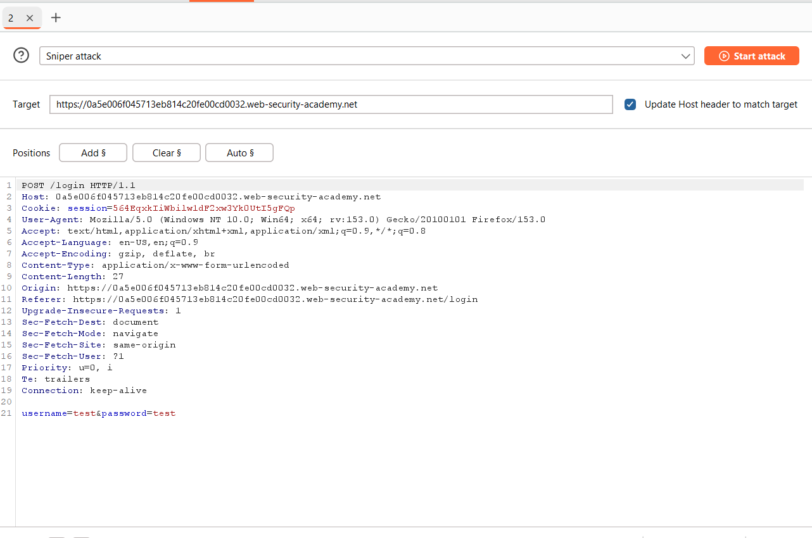
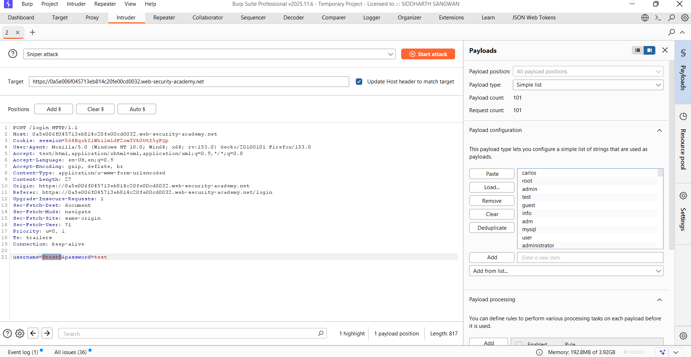
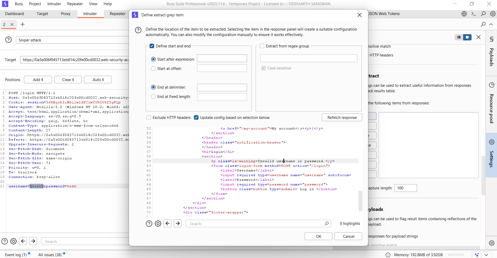
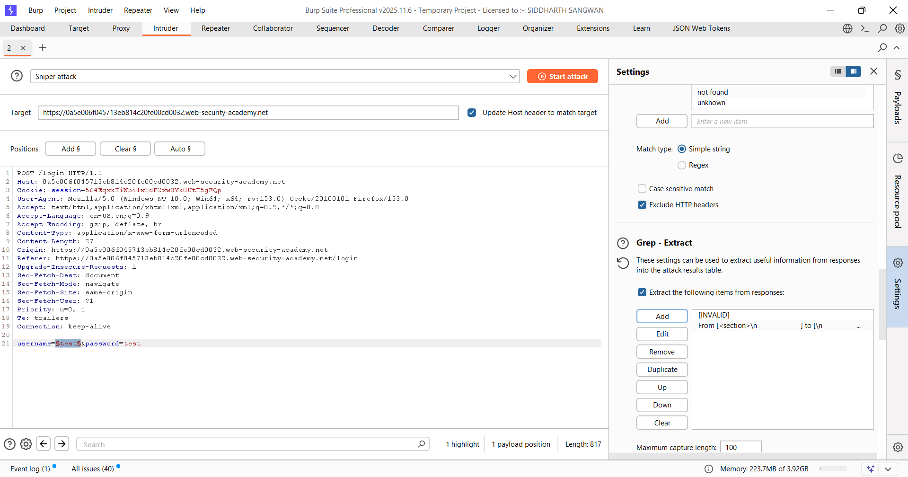
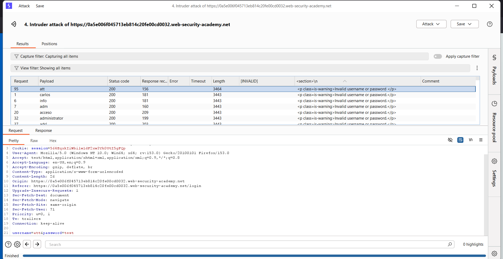
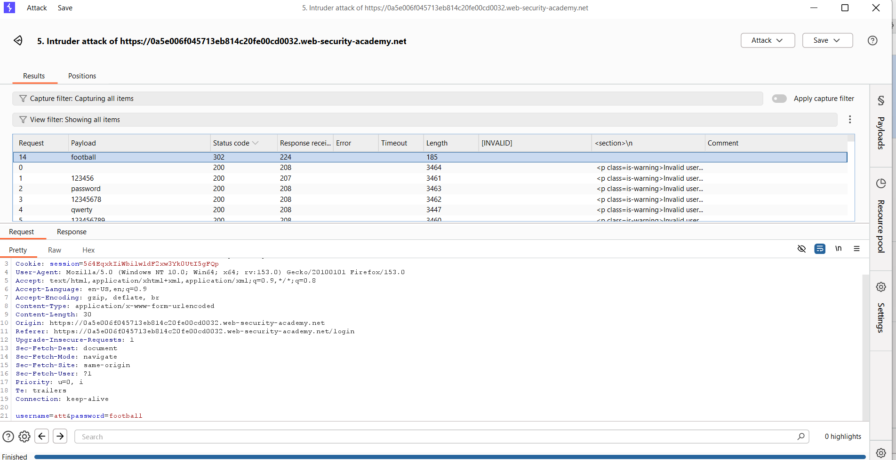
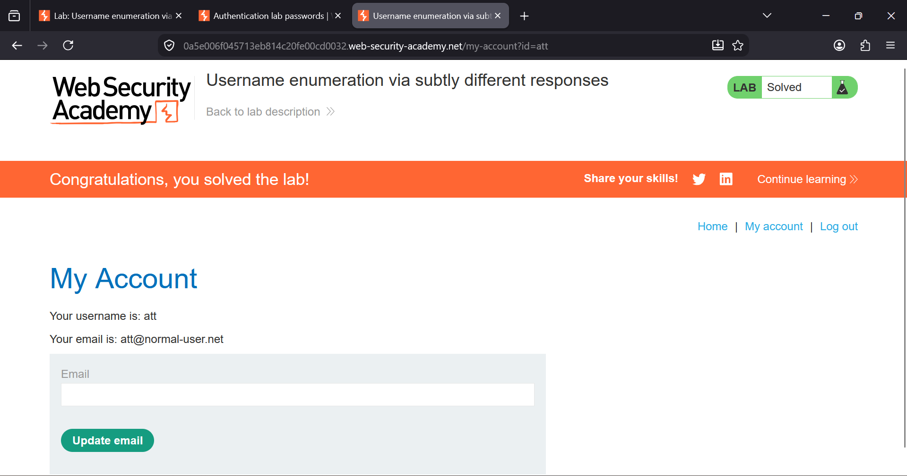

### Username Enumeration via Different Responses

**Platform:** PortSwigger Web Security Academy                                                                    
**Category:** Authentication  
**Difficulty:** Apprentice  


### Overview

This lab demonstrates a **Username Enumeration** vulnerability where the application returns different responses depending on
whether the supplied username exists.

By observing the server's response while trying different usernames, it is possible to identify a valid account. After 
discovering the valid username, a password brute-force attack can be performed using a password wordlist to successfully 
authenticate.


### Objective

- Enumerate a valid username.
- Brute-force the password for that user.
- Log in to solve the lab.


### Tools Used

- Burp Suite Professional
- Burp Intruder
- Firefox Browser
  
### Steps


# Step 1: Capture the Login Request

Open the login page.

Enter any random credentials and intercept the request using Burp Suite.

Send the request to **Intruder**.




# Step 2: Enumerate Usernames

Highlight only the **username** value.

Click **Add §** to mark it as the payload position.

Select **Sniper Attack**.

Load the provided username wordlist.

The password remains fixed as any random value.

Example:

```
username=test
password=test
```

Start the attack.




# Step 3: Configure Grep - Extract

To easily identify differences in the server responses:

- Open the **Settings** tab.
- Under **Grep - Extract**, click **Add**.
- In the response window, scroll until you find the message:

```
Invalid username or password.
```

- Highlight only the text of the error message.
- Burp Suite will automatically configure the extraction settings.
- Click **OK**, then start the Intruder attack.




# Step 4: Identify the Valid Username

After the attack completes, Burp adds a new column containing the extracted error message.

Sort the results using this column and compare the responses.

Most usernames return the message:

```
Invalid username or password.
```

However, one response is slightly different. Instead of ending with a full stop (`.`), the error message ends with a
**trailing space**.

This subtle difference reveals that the username is valid.

In this lab, the valid username is:

```
att
```




# Step 5: Brute Force the Password

Replace the username with the valid one:

```
username=att
```

Highlight only the password value.

Load the provided password wordlist.

Start another **Sniper** attack.




# Step 6: Find the Correct Password

During the attack, one request stands out because it returns:

- HTTP Status **302 Redirect**
- Different response length

This indicates successful authentication.

The correct password is:

```
football
```




# Step 7: Login

Use the discovered credentials:

```
Username: att
Password: football
```

After logging in successfully, the lab is solved.




### Key Takeaways

- Different authentication responses can leak valid usernames.
- Username enumeration significantly reduces the search space for password attacks.
- Response length, status codes, and error messages are useful indicators during testing.
- Applications should always return identical responses for failed login attempts to prevent information disclosure.
- Rate limiting, account lockout, and MFA help mitigate brute-force attacks.


### Remediation

- Return a **generic error message** (e.g., *"Invalid username or password"*) for all failed login attempts.
- Keep **status codes, response lengths, and response times consistent** to prevent username enumeration.
- Implement **rate limiting** and **account lockout** to mitigate brute-force attacks.
- Enable **Multi-Factor Authentication (MFA)** for an additional layer of security.
- Monitor login activity and **log suspicious authentication attempts**.
  
