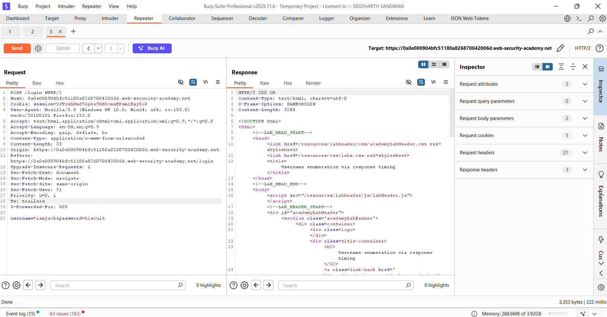
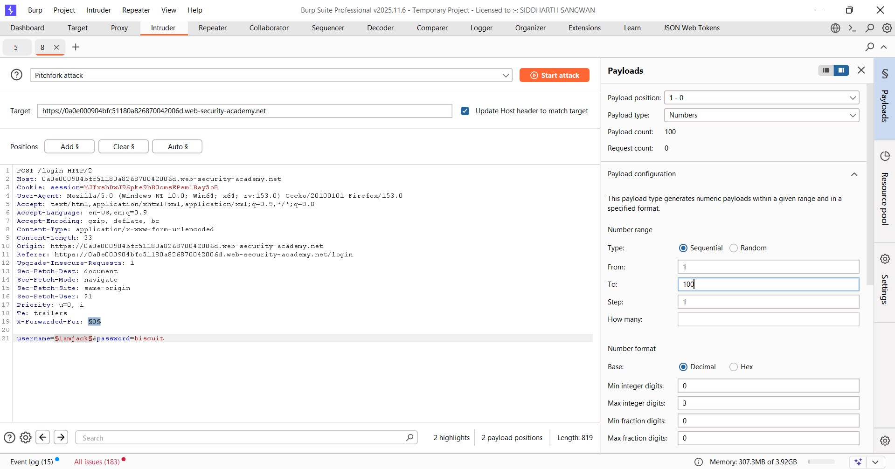
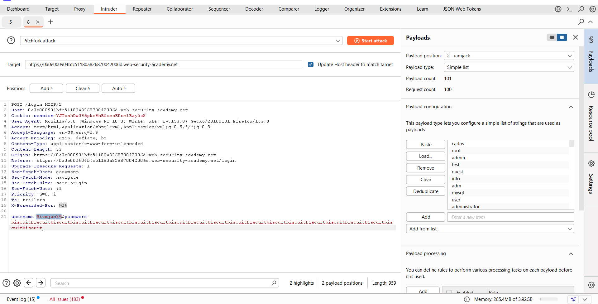
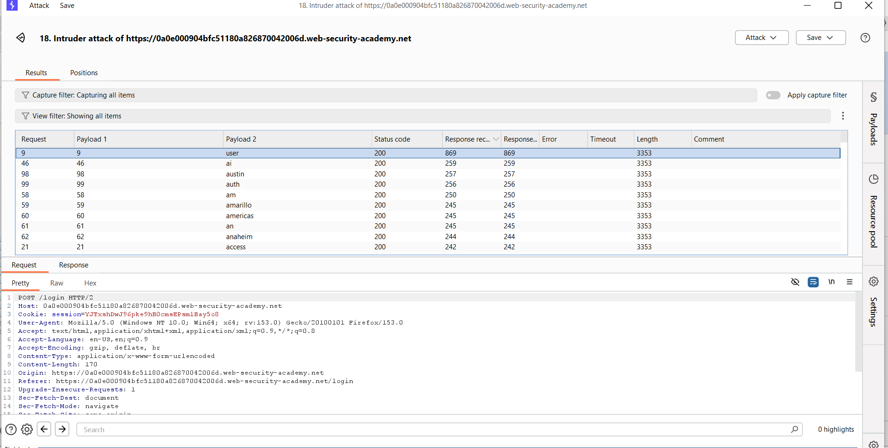
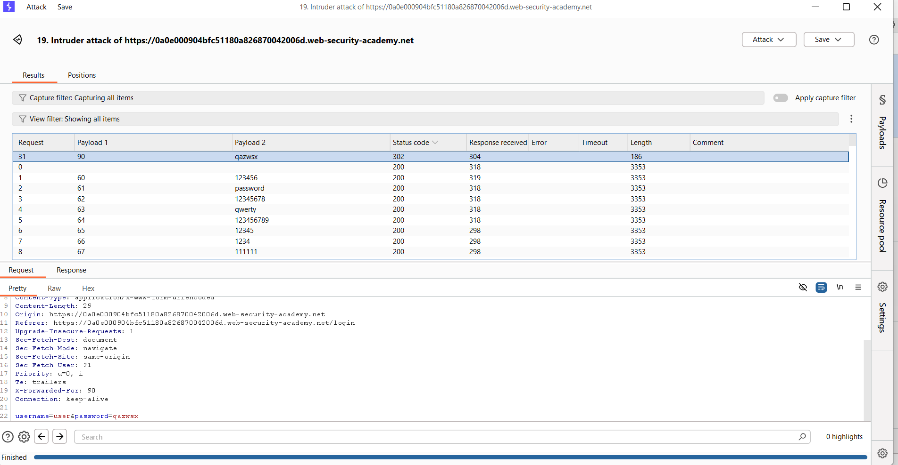
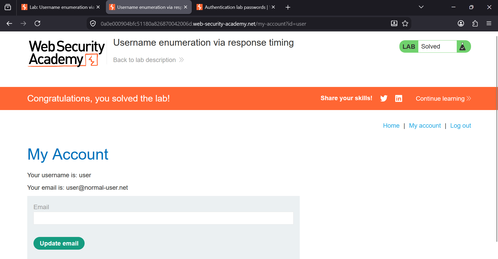

### Username Enumeration via Response Timing

**Category:** Authentication  
**Difficulty:** Practitioner  
**Platform:** PortSwigger Web Security Academy

### Overview

This lab demonstrates a **username enumeration vulnerability based on response timing**. Although the application returns 
the same error message for every failed login attempt, it takes slightly longer to process requests for valid usernames 
because it performs additional password verification. The application also relies on the client-controlled 
`X-Forwarded-For` header for rate limiting, allowing an attacker to bypass the IP-based brute-force protection by spoofing
a different IP address for every request.


### Objective

- Bypass the application's IP-based brute-force protection.
- Identify a valid username using response timing.
- Brute-force the password of the valid user.
- Log in successfully to solve the lab.


### Tools Used

- Burp Suite Professional
- Burp Repeater
- Burp Intruder
- Firefox Browser


# STEPS

# Step 1: Capture the Login Request

Open the login page and submit any invalid username and password while Burp Suite is intercepting the request.

Capture the `POST /login` request and send it to **Burp Repeater** for further testing.




# Step 2: Analyze the Application Behavior

In **Burp Repeater**, experiment with different usernames and passwords.

After several failed login attempts, notice that the application temporarily blocks your IP address, indicating that
**IP-based brute-force protection** is enabled.

Next, add the following header to the request:

```http
X-Forwarded-For: 1
```

Change its value and resend the request multiple times. The application accepts this header and treats every new value as
a different client IP address. This allows the IP-based rate limit to be bypassed.

While testing, pay close attention to the response times.

- Requests with **invalid usernames** respond in nearly the same amount of time.
- Requests with **valid usernames** take slightly longer, especially when using a very long password (around 100 characters).

This happens because the server performs password verification only after confirming that the username exists.


# Step 3: Configure Burp Intruder

Send the login request to **Burp Intruder**.

Select **Pitchfork** as the attack type.

Add the following payload positions:

- `X-Forwarded-For`
- `username`

Replace the password with a very long string (approximately 100 characters). A longer password increases the processing
time, making the timing difference easier to identify.




# Step 4: Configure the Payloads

Configure **Payload Position 1** for the `X-Forwarded-For` header.

Use the following settings:

- **Payload Type:** Numbers
- **Range:** 1 – 100
- **Step:** 1

Each request will use a different spoofed IP address, preventing the application from blocking the attack.


Next, configure **Payload Position 2**.

Load the provided username wordlist using the **Simple List** payload type.

Each request will now test a different username while simultaneously changing the spoofed IP address.




# Step 5: Identify the Valid Username

Start the Intruder attack.

After the attack finishes, click **Columns** and enable the following options:

- **Response received**
- **Response completed**

These columns display the time taken by the server to process each request.

Compare the response times for all usernames. Most usernames return responses in nearly the same amount of time because
the application immediately rejects invalid usernames.

However, one username consistently has a noticeably longer response time than the others. This happens because the 
application first verifies that the username exists and then spends additional time checking the long password before 
returning the response.

To ensure the result is reliable, repeat the request for the suspected username several times. If it consistently 
produces a longer response time than the rest, it confirms that the username is valid.

In this lab, the username **`user`** consistently had the highest response time (approximately **869 ms**), while the 
remaining usernames responded in around **190–220 ms**.

Therefore, the valid username is:

```
user
```



# Step 6: Brute-Force the Password

Create a new **Pitchfork** attack using the same login request.

Add the `X-Forwarded-For` header again and assign it as **Payload Position 1** using the same numeric payload (1–100).

Replace the username with the valid username identified in the previous step:

```
user
```

Add a payload position only to the **password** parameter and load the provided password wordlist.

Start the Intruder attack.


# Step 7: Identify the Correct Password

After the attack completes, sort the results by **Status Code**.

Most login attempts return:

```
HTTP/1.1 200 OK
```

One request returns:

```
HTTP/1.1 302 Found
```

The **302 Redirect** indicates that the login was successful and the application redirected the user after authentication.

The password associated with the **302** response is the correct password.

Use the discovered credentials to log in to the application and access the user account page to successfully solve the lab.




### Result

Successfully bypassed the IP-based brute-force protection by spoofing the client IP using the `X-Forwarded-For` header. 
Response timing differences were used to identify a valid username, and a password brute-force attack successfully 
discovered the correct credentials, allowing authentication and completion of the lab.



### Remediation

- Return identical responses and maintain consistent response times for both valid and invalid usernames.
- Do not rely on client-controlled headers such as `X-Forwarded-For` for security decisions unless they are added by a
  trusted reverse proxy.
- Implement account-based rate limiting instead of IP-only restrictions.
- Use Multi-Factor Authentication (MFA) to reduce the impact of compromised credentials.
- Monitor authentication logs and detect repeated login attempts or abnormal authentication behavior.


### Key Takeaways

- Response timing differences can reveal valid usernames even when error messages are identical.
- Long passwords amplify timing differences, making username enumeration easier.
- Trusting the `X-Forwarded-For` header allows attackers to bypass IP-based rate limiting.
- An HTTP **302 Redirect** during password brute-forcing typically indicates successful authentication.
