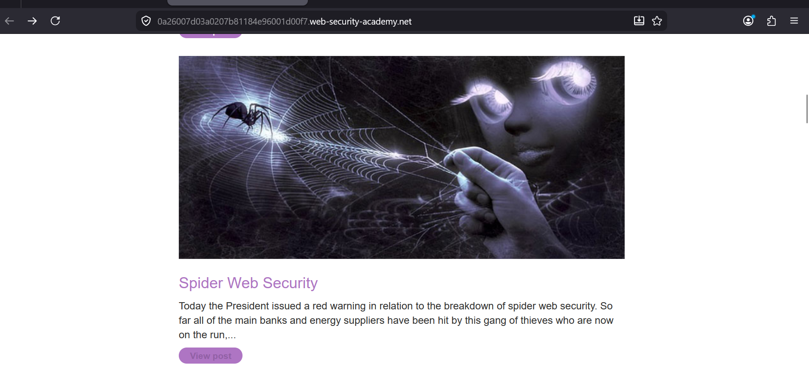
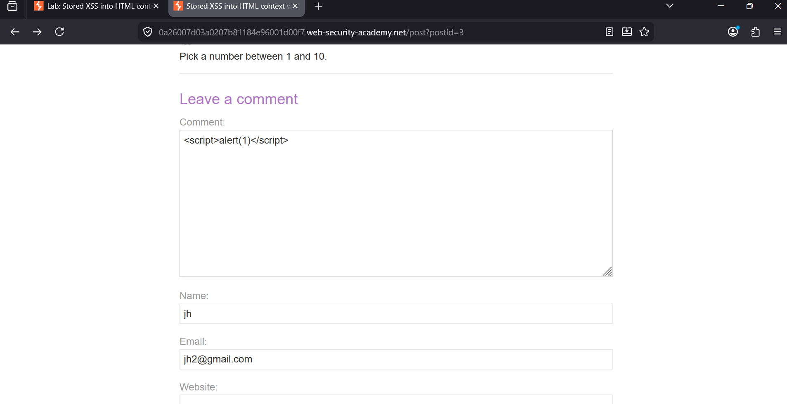
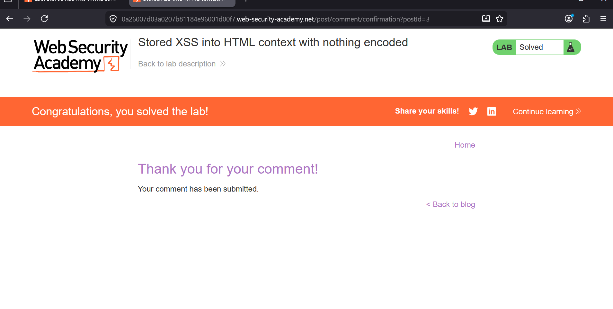

### Stored XSS into HTML Context with Nothing Encoded

**Category:** Cross-Site Scripting (XSS)                                                            
**Difficulty:** Apprentice                                               
**Platform:** PortSwigger Web Security Academy                                    

### Objective
The goal of this lab was to exploit a Stored Cross-Site Scripting (Stored XSS) vulnerability in the blog's comment section. Since the application stores user input and displays it later without any sanitization or output encoding, it is possible to inject JavaScript that executes whenever the page is viewed.

### Walkthrough
I started by opening the vulnerable blog post titled "Spider Web Security." This page contains a comment section where visitors can submit comments.

**Step 1: Open the Blog Post:**                                                 
The vulnerable page contains a comment form where user input is stored and later displayed.



**Step 2: Inject the Payload:**                                                                                                    
In the comment field, I entered the following payload:
```
<script>alert(1)</script>                                                                  
```
I filled in the required fields:                                                          
Comment:``` <script>alert(1)</script>```                                                  
Name: ```jh```                                                                                              
Email: ```jh2@gmail.com```                                                     
Website: ```Left blank```                                                                                 
After submitting the form, the comment was successfully stored by the application.



**Step 3: Confirm the Exploit**                                                      
After the comment was submitted, the application accepted it without filtering the input. When the stored comment was rendered on the page, the JavaScript executed, triggering the alert(1) popup.

The lab was then marked as solved.



### Why the Vulnerability Exists
The application stores user comments in the backend and later inserts them directly into the HTML page without escaping special characters such as < and >.
Because the browser interprets the stored input as HTML instead of plain text, the injected <script> tag is executed whenever the page is loaded.
This is what makes it a Stored XSS vulnerability.

### Impact
Unlike Reflected XSS, a Stored XSS payload remains on the server and affects every user who visits the vulnerable page.
In a real-world application, this could allow an attacker to:
1. Steal user session cookies
2. Hijack authenticated accounts
3. Perform actions on behalf of victims
4. Redirect users to malicious websites
5. Deliver phishing pages or additional client-side attacks

### Result
Successfully exploited a Stored XSS vulnerability by injecting a JavaScript payload into the blog comment section.
The payload executed when the stored comment was displayed, confirming the vulnerability and completing the lab.

### Remediation
To prevent this type of vulnerability, applications should:
1. Encode all user input before displaying it in HTML.
2. Apply context-aware output encoding.
3. Enable automatic escaping in template engines.
4. Validate and sanitize user input where necessary.
5. Implement a strong Content Security Policy (CSP) to reduce the impact of any XSS vulnerabilities.

### Key Takeaways
1. Stored XSS occurs when user input is permanently stored and later rendered without proper encoding.
2. Output encoding is one of the most effective defenses against XSS.
3. Even a simple payload like <script>alert(1)</script> can demonstrate a serious security issue when no filtering is applied.
4. Stored XSS is generally more dangerous than Reflected XSS because every visitor to the affected page can be impacted.
