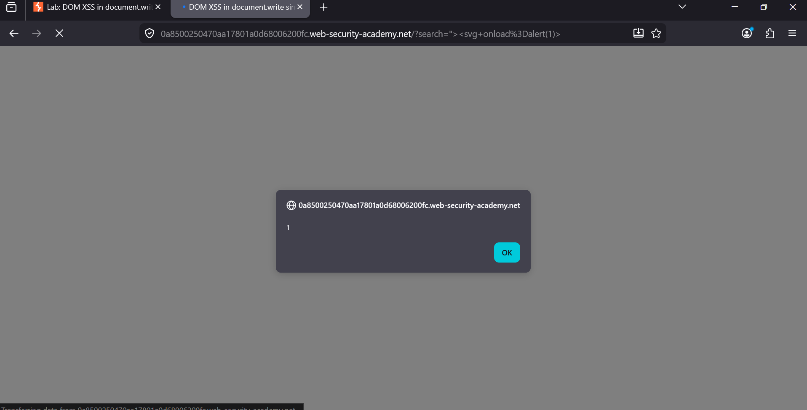

### DOM XSS in document.write sink using source location.search

**Category:** DOM-based Cross-Site Scripting (XSS)                                                     
**Difficulty:** Apprentice                                                        
**Platform:** PortSwigger Web Security Academy                                                  

### Overview
This lab demonstrates a DOM-based Cross-Site Scripting (XSS) vulnerability in the blog's search functionality. 
The application reads user input directly from the URL (location.search) and writes it to the page using document.write() 
without any validation or encoding.
The objective of this lab is to exploit this behavior and execute JavaScript by triggering an alert() popup.                                                                          


### Objective
Exploit the DOM XSS vulnerability to execute the following JavaScript:
```
alert(1)
```

### Vulnerability Analysis
After performing a search, the search term appeared directly on the results page.                                   
Example:                                                                         
```https://<lab-id>.web-security-academy.net/?search=test```                                                      
Inspecting the page with Developer Tools revealed that the application takes the value from location.search and inserts 
it into the page using document.write().

The vulnerable code follows this pattern:
```
document.write('<h1>0 search results for \'' + query + '\'</h1>');
```
Since the user input is inserted directly into the HTML without any escaping, it becomes possible to inject HTML and
JavaScript into the page.

### Exploitation Steps

**1. Open the search page**
Navigate to the lab and perform any search.

**2. Inspect the page**
Using Developer Tools, identify that the search parameter is passed from location.search into a document.write() sink.                                          


**3. Inject the payload**
Enter the following payload in the search box:
```
"><svg onload=alert(1)>
```
This payload injects an SVG element whose onload event executes JavaScript as soon as the browser renders it.                                                           


**4. Submit the search**
After submitting the payload, the browser immediately executes:
```
alert(1)
```
The alert confirms that the injected JavaScript has been executed successfully.                                                


**5. Lab Solved**
The lab is marked as solved after the payload executes successfully.

### Proof of Concept
Payload
```
"><svg onload=alert(1)>
```
Request
```
GET /?search="><svg onload=alert(1)>
```
Result
The injected SVG executes its onload event, triggering an alert(1) popup and completing the lab.

### Root Cause
The vulnerability exists because:
1. User input is taken directly from location.search.
2. The input is inserted into the page using document.write().
3. No HTML encoding or input sanitization is applied before rendering the data.

This combination allows an attacker to inject and execute arbitrary JavaScript in the victim's browser.

### Remediation
To prevent this vulnerability:
1. Avoid using document.write() for rendering dynamic content.
2. Use safe DOM APIs such as textContent or createElement().
3. Properly HTML-encode user-controlled data before inserting it into the page.
4. Treat all values from location.search, location.hash, and other DOM sources as untrusted.
5.Implement a strict Content Security Policy (CSP) to reduce the impact of XSS vulnerabilities.

### Key Takeaway
DOM-based XSS occurs entirely on the client side. Even if the server never reflects malicious input, JavaScript 
can still create a vulnerability by reading attacker-controlled data from the URL and inserting it into dangerous
DOM sinks like document.write(). Always validate and safely render user-controlled input before adding it to the page.
