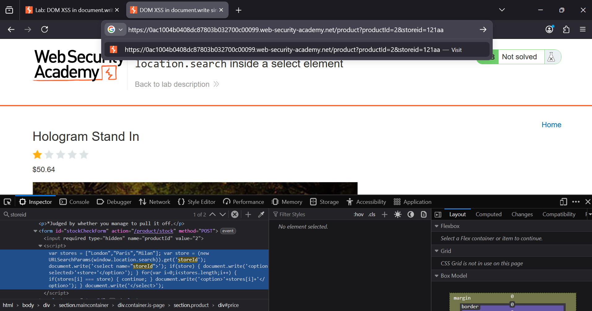
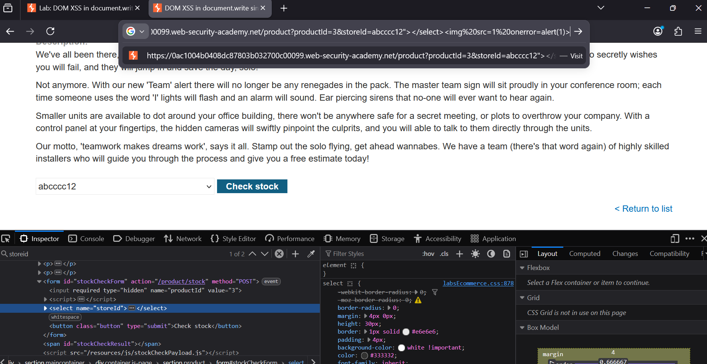
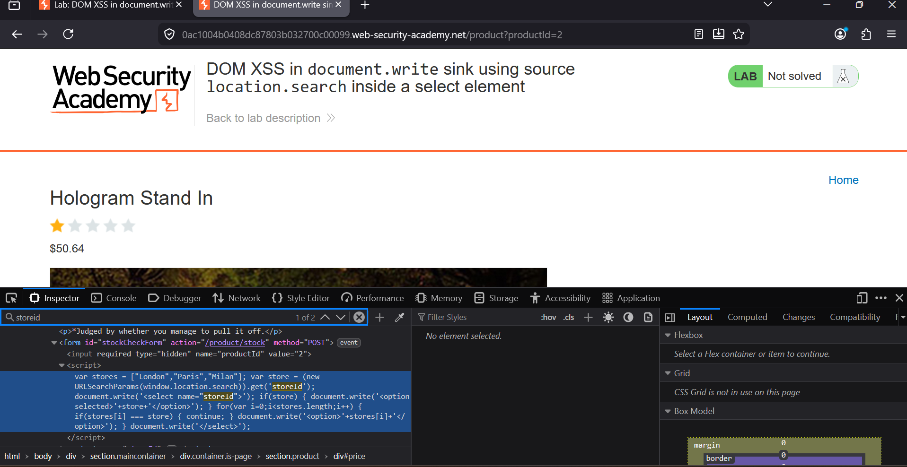

### DOM XSS in `document.write` Sink Using Source `location.search` Inside a Select Element

**Category:** DOM-Based Cross-Site Scripting (XSS)  
**Difficulty:** Practitioner  
**Platform:** PortSwigger Web Security Academy  

### Overview
This lab demonstrates a DOM-based XSS vulnerability where the application reads the `storeId` parameter from 
`location.search` and inserts it directly into the page using `document.write()` without any sanitization.

The objective is to inject JavaScript and trigger an `alert()` popup.

### Objective

Exploit the DOM XSS vulnerability and execute:

```javascript
alert(1)
```

### Vulnerability Analysis

Inspecting the page with Developer Tools revealed the following vulnerable code:

```javascript
var store = (new URLSearchParams(window.location.search)).get('storeId');

document.write('<select name="storeId">');

if (store) {
    document.write('<option selected>' + store + '</option>');
}
```

The application takes user input from `location.search` and writes it directly into the HTML using `document.write()`. 
Since no encoding is applied, an attacker can inject HTML and JavaScript into the page.

### Exploitation Steps

1. Inspect the page and identify that the `storeId` parameter is written directly into a `<select>` element using `document.write()`.

   

2. Craft the following payload:

   ```html
   abcccc12"></select>
   ```

   

3. Append the payload to the `storeId` parameter in the URL.

   

4. Load the page. The injected `` element triggers its `onerror` event and executes `alert(1)`.

   

5. The lab is marked as solved.

### Proof of Concept

**Payload**

```html
"></select>
```

**Request**

```http
GET /product?productId=3&storeId="></select>
```

**Result**

The browser displays an `alert(1)` popup, confirming successful DOM XSS.

### Root Cause

- User input is read from `location.search`.
- The value is inserted into the page using `document.write()`.
- No validation or output encoding is applied before rendering the HTML.

### Remediation

- Avoid using `document.write()` for dynamic content.
- Use safer DOM APIs such as `textContent` or `createElement()`.
- HTML-encode user-controlled input before inserting it into the page.
- Treat all URL parameters as untrusted input.

### Key Takeaway

DOM XSS occurs when client-side JavaScript inserts attacker-controlled data into dangerous DOM sinks like `document.write()`. Always validate and safely encode data taken from URL parameters before rendering it in the page.

