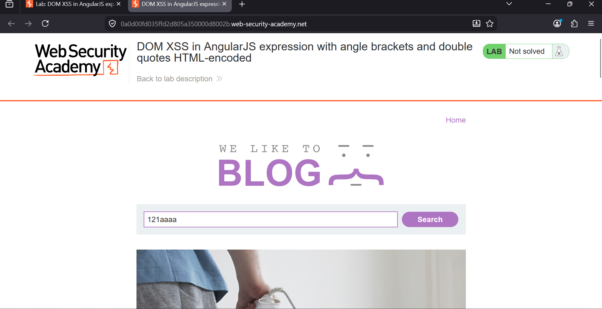
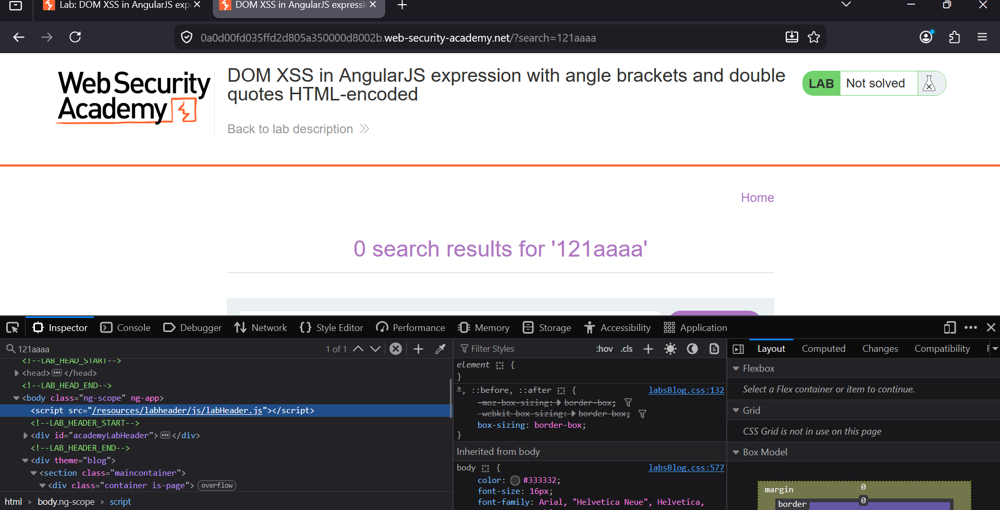
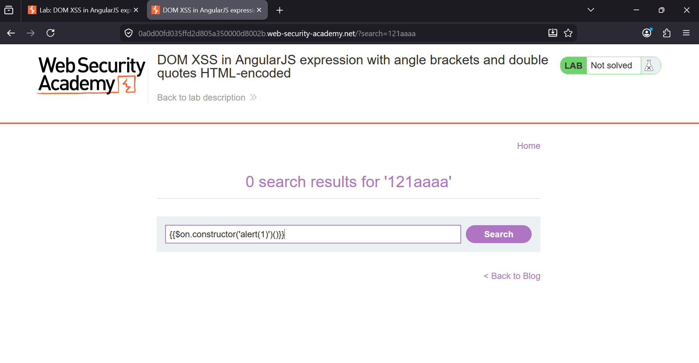
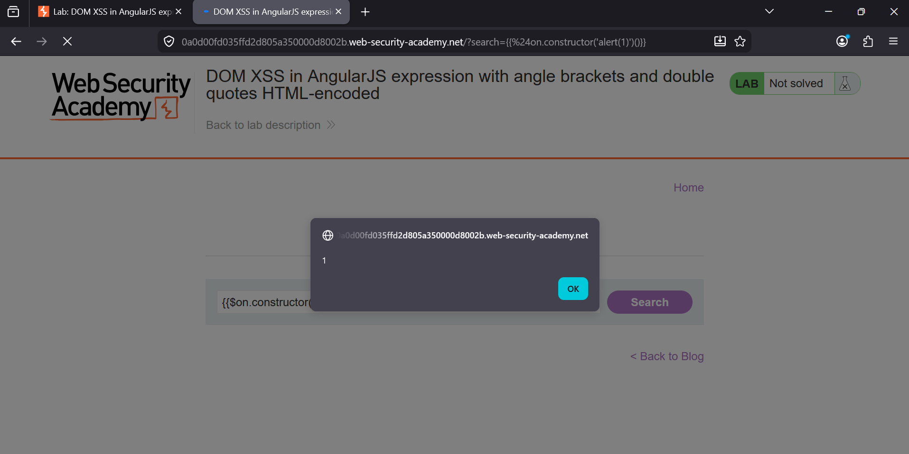

###  DOM XSS in AngularJS Expression with Angle Brackets and Double Quotes HTML-Encoded

**Category:** Cross-Site Scripting (XSS)                                                              
**Difficulty:** Practitioner                                                                       
**Platform:** PortSwigger Web Security Academy                                                                      

### Overview
This lab demonstrates a **DOM-based Cross-Site Scripting (XSS)** vulnerability in an application using **AngularJS**.
Although the application HTML-encodes angle brackets (`<`, `>`) and double quotes (`"`), the search parameter is still 
interpreted by AngularJS as an expression. This allows JavaScript execution without injecting HTML tags.

The goal is to execute JavaScript by injecting an AngularJS expression into the search parameter.

### Vulnerability
The application reflects the value of the `search` parameter inside an AngularJS context.
Instead of rendering the input as plain text, AngularJS evaluates expressions enclosed within double curly braces (`{{ }}`).
Since AngularJS expressions are executed by the framework, HTML encoding alone is insufficient to prevent XSS.

### Initial Observation
Searching for any text reflects it back on the page.

### Exploitation Steps

1. Open the lab and search for any value (e.g., `121aaaa`) to confirm that the input is reflected on the page.

   

2. Inspect the page using Developer Tools (`F12`) and verify that AngularJS is enabled by locating the `ng-app` attribute.

   

3. Enter the following payload into the search box:

```javascript
{{$on.constructor('alert(1)')()}}
```

4. Submit the search. AngularJS evaluates the expression, resulting in JavaScript execution.

   

5. An `alert(1)` dialog appears, confirming successful DOM XSS and solving the lab.

   

---

### Payload Used

```javascript
{{$on.constructor('alert(1)')()}}
```

---

### Key Takeaways

- HTML encoding alone does not prevent AngularJS expression injection.
- Expressions inside `{{ }}` are evaluated by AngularJS.
- The `Function` constructor can be abused to execute arbitrary JavaScript.
- Client-side template injection can lead to DOM-based XSS even when HTML tags are blocked.

### Root Cause
The application reflects user-controlled input inside an **AngularJS expression context** without preventing AngularJS
from evaluating it. Although angle brackets (`<`, `>`) and double quotes (`"`) are HTML-encoded, the input is still
processed by AngularJS because it is enclosed within `{{ }}`. This allows an attacker to execute arbitrary JavaScript
using AngularJS expressions such as the `Function` constructor.

### Remediation

- Do not render untrusted user input inside AngularJS expressions (`{{ }}`).
- Upgrade to a supported version of AngularJS or migrate to a modern framework, as older AngularJS versions contain
  known expression injection risks.
- Treat all user input as untrusted and apply **context-aware output encoding**.
- Disable or avoid dynamic template compilation (`$compile`) for user-controlled content.
- Enforce a strong **Content Security Policy (CSP)** to reduce the impact of XSS attacks.
- Validate and sanitize user input on both the client and server sides before rendering it.


