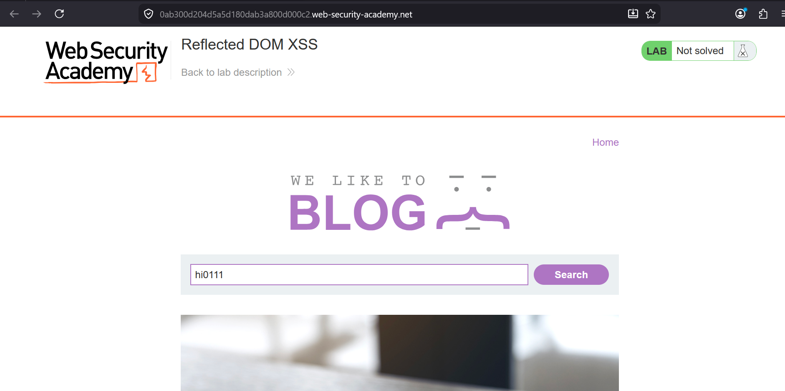
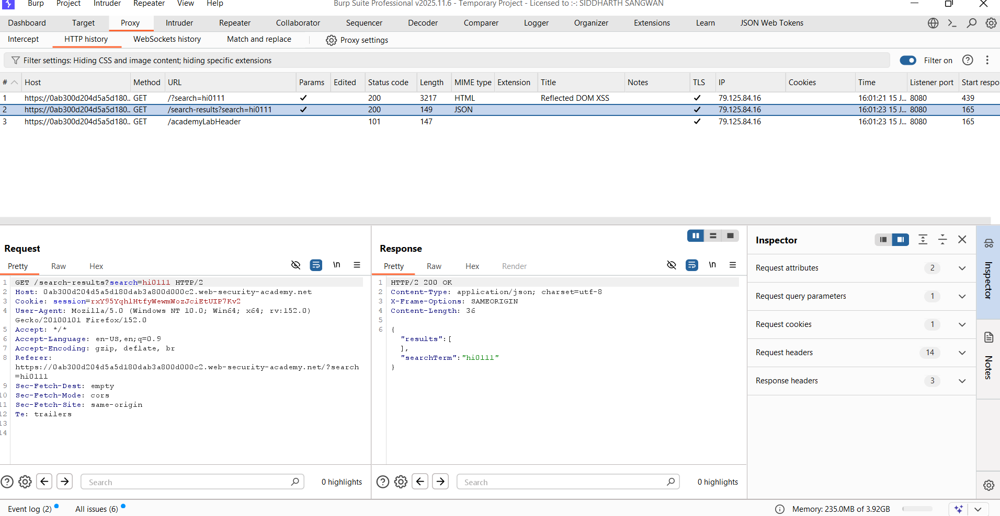
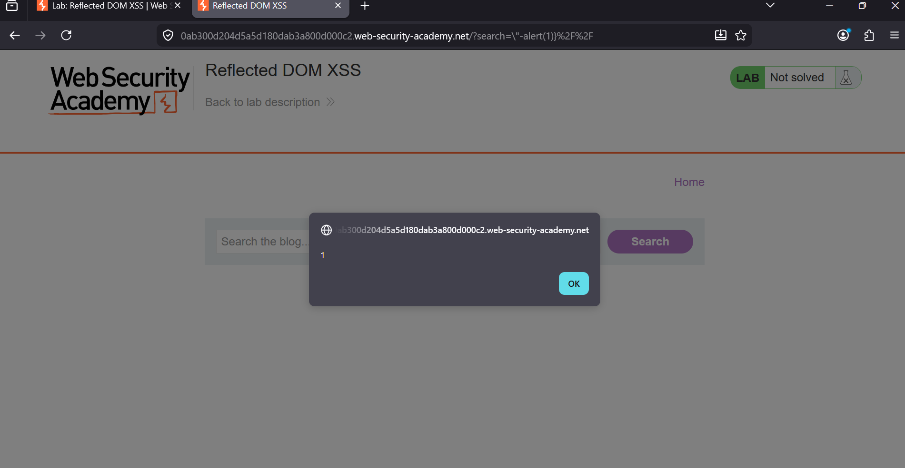

### Reflected DOM XSS

**Category:** Cross-Site Scripting (XSS)  
**Difficulty:** Practitioner  
**Platform:** PortSwigger Web Security Academy  

### Overview

This lab demonstrates a **Reflected DOM-Based XSS** vulnerability. The application fetches the search term from a JSON
response and inserts it into JavaScript without properly escaping user-controlled input. By breaking out of the
JSON string, arbitrary JavaScript can be executed.

### Explanation Steps

1. Open the lab and search for any value (e.g., `hi0111`).

   

2. Intercept the request using **Burp Suite** and observe the response from:

```
/search-results?search=hi0111
```

The response contains the user input inside a JSON object:

```json
{
    "results": [],
    "searchTerm": "hi0111"
}
```

   

3. Replace the search term with the following payload:

```javascript
\"-alert(1)}//
```

4. Submit the request.

   

5. The payload breaks out of the JSON string and executes `alert(1)`, solving the lab.

   


### Payload Used

```javascript
\"-alert(1)}//
```

---

### Payload Explanation

The payload works by breaking the JavaScript context created from the JSON response.

```
\"-alert(1)}//
```

- `\"` escapes the opening quote so the injected payload becomes part of the JavaScript.
- `-alert(1)` executes the `alert(1)` function.
- `}` closes the JavaScript object.
- `//` comments out the remaining code, preventing syntax errors.

Because the application inserts user input into executable JavaScript without proper escaping, 
the browser interprets the payload as code instead of data.

### Root Cause

The application embeds user-controlled input directly into JavaScript after retrieving it from a JSON response.
Although the input is JSON-encoded, it is not safely escaped before being used in a JavaScript context, allowing
an attacker to break out of the string and execute arbitrary JavaScript.

### Remediation

- Never insert untrusted data directly into JavaScript code.
- Properly escape user input for the JavaScript context before rendering.
- Use safe DOM APIs such as `textContent` or `innerText` instead of building JavaScript dynamically.
- Validate and sanitize user input on the server and client side.
- Enforce a strong **Content Security Policy (CSP)** to reduce the impact of XSS attacks.


### Key Takeaways

- JSON encoding alone does not prevent DOM XSS.
- Context-aware output encoding is essential.
- User input should never be concatenated into executable JavaScript.
- Using safe DOM APIs significantly reduces the risk of XSS.
