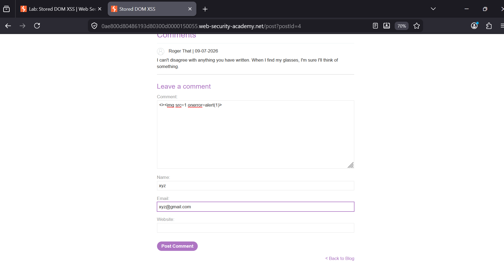
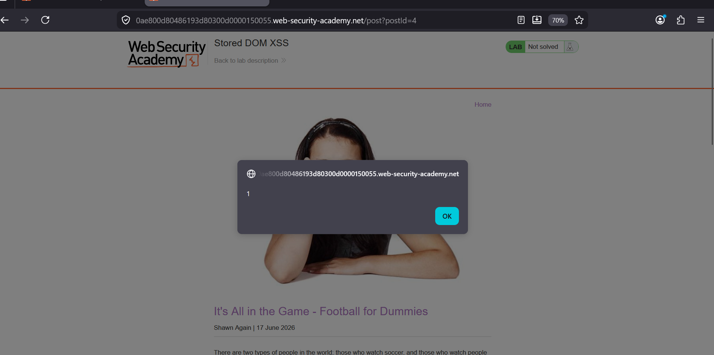

### Stored DOM XSS

**Category:** Cross-Site Scripting (XSS)  
**Difficulty:** Practitioner  
**Platform:** PortSwigger Web Security Academy  


### Overview
This lab demonstrates a **Stored DOM-Based Cross-Site Scripting (XSS)** vulnerability. User-supplied comments are
stored by the application and later rendered in the browser without proper sanitization.
As a result, malicious HTML is interpreted by the browser, allowing JavaScript execution when the stored comment is viewed.

### Explanation Steps

1. Open any blog post and scroll down to the **Leave a comment** section.

2. In the **Comment** field, submit the following payload:

```html
<>
```

Fill in the required fields (Name and Email) and submit the comment.



3. Reload or revisit the blog post.

4. When the stored comment is rendered, the invalid image triggers the `onerror` event, executing `alert(1)` and solving the lab.



### Payload Used

```html
<>
```

### Payload Explanation

```html
<>
```
- `<>` creates an empty HTML tag, helping bypass the application's parsing logic.
- `` loads an invalid image source.
- Since the image cannot be loaded, the `onerror` event is triggered.
- `alert(1)` executes JavaScript when the error occurs.
The payload is stored in the application's database and executed every time the malicious comment is viewed.

### Root Cause
The application stores user input and later inserts it into the DOM using an unsafe method such as `innerHTML`
without sanitizing or encoding the content. Because HTML is interpreted by the browser, an attacker can inject
malicious elements that execute JavaScript when rendered.

### Remediation

- Sanitize all user-supplied HTML before storing or displaying it.
- Encode user input according to the output context.
- Use safe DOM APIs such as `textContent` instead of `innerHTML` whenever possible.
- Validate input on both the client and server side.
- Implement a strong **Content Security Policy (CSP)** to reduce the impact of XSS.

### Key Takeaways

- Stored DOM XSS persists on the server and executes whenever the malicious content is viewed.
- Rendering untrusted HTML with `innerHTML` is unsafe.
- Event handlers such as `onerror` are common XSS vectors.
- Proper output encoding and HTML sanitization are essential to prevent stored XSS.
