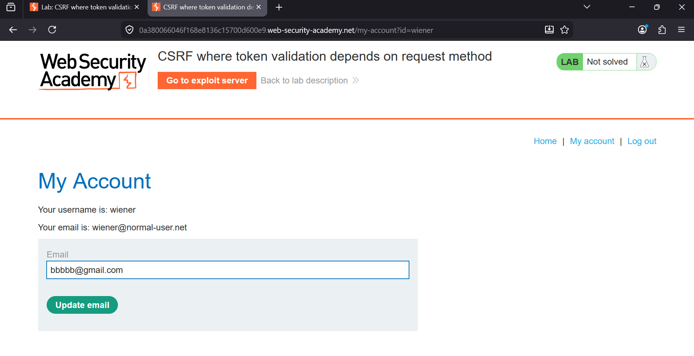
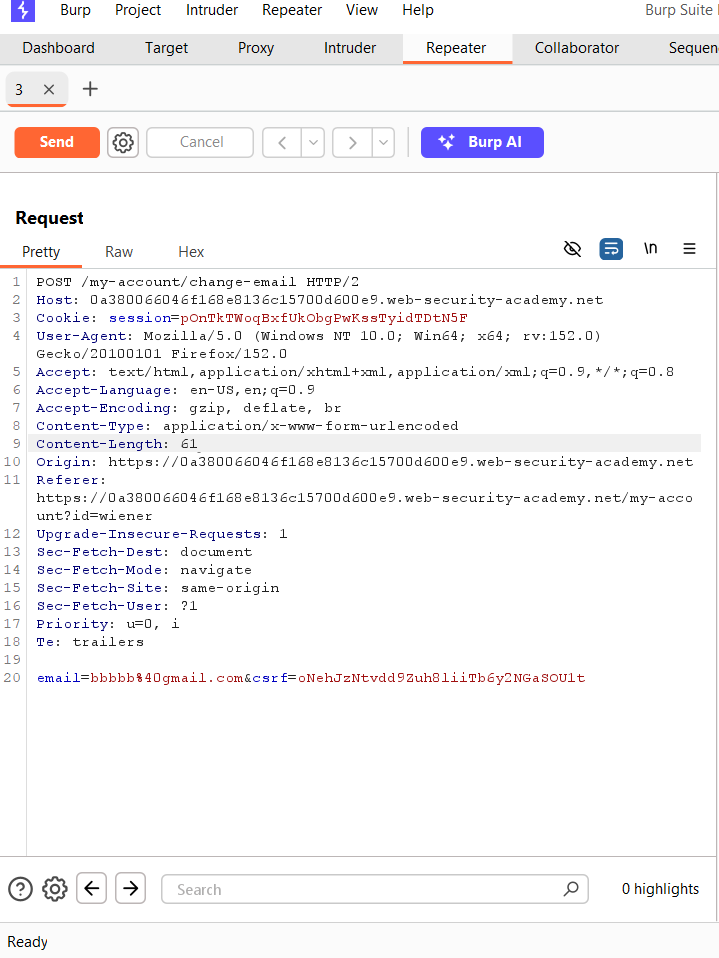
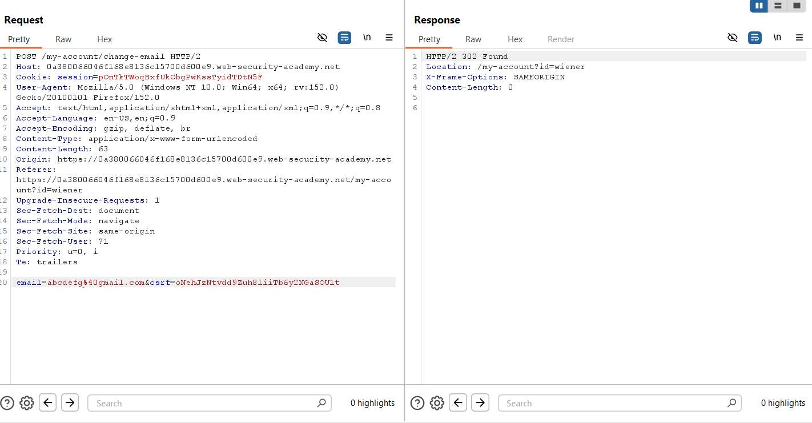
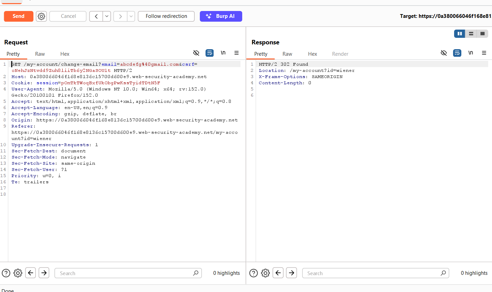
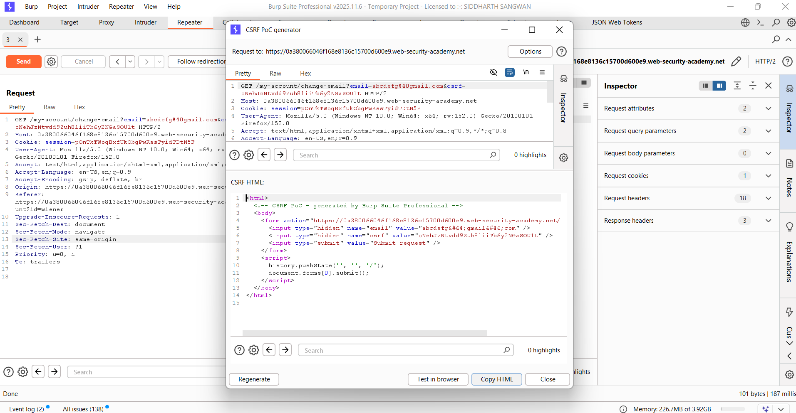
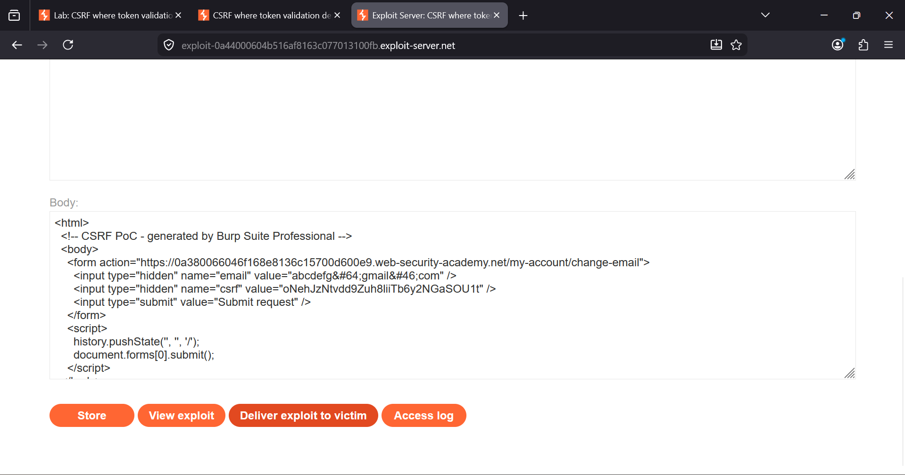
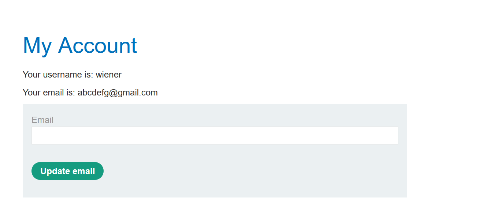
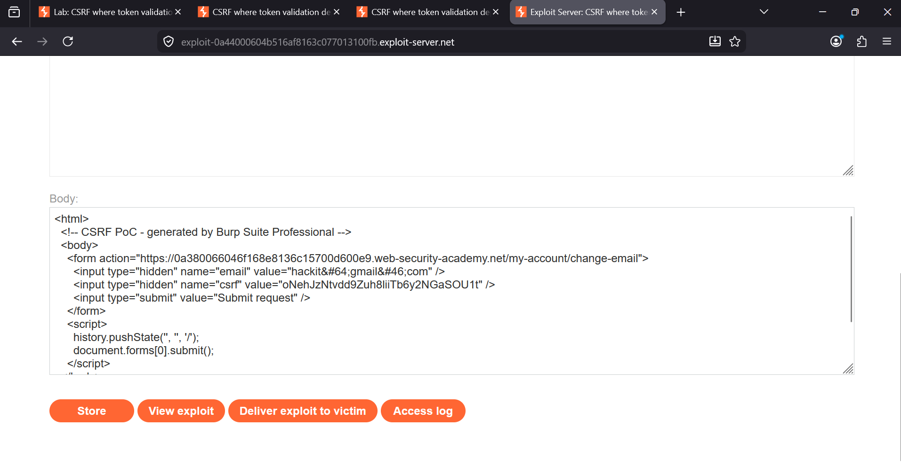
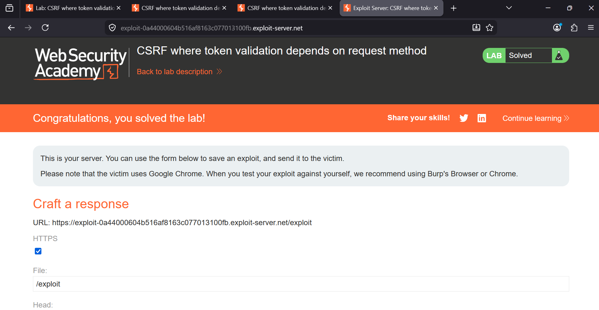

###  CSRF Where Token Validation Depends on Request Method

**Category:** Cross-Site Request Forgery (CSRF)  
**Difficulty:** Practitioner  
**Platform:** PortSwigger Web Security Academy

## Overview
This lab demonstrates a CSRF vulnerability where the application validates the CSRF token **only for POST requests**. 
By changing the request method from **POST** to **GET**, the server processes the request without enforcing CSRF protection.

An attacker can exploit this behavior by creating a malicious page that forces the victim's browser to send a crafted
GET request, changing the victim's email address without their consent.


### Objective

Exploit the application's inconsistent CSRF validation and change the victim's email address using a forged request.


### Steps

## Step 1: Observe the Email Change Functionality

Log in to the application and navigate to **My Account**. Enter a new email address and intercept the request using Burp
Suite.




## Step 2: Capture the POST Request

Intercept the email update request in Burp Suite Repeater.

The original request uses:

- **Method:** POST
- **Endpoint:** `/my-account/change-email`
- **Parameters:**
  - `email`
  - `csrf`



## Step 3: Verify the Request

Modify the email value and resend the POST request.

The server accepts the request because a valid CSRF token is supplied.




## Step 4: Change POST to GET

Convert the request into a GET request by:

- Changing the HTTP method to **GET**
- Moving the parameters into the URL

Example:

```http
GET /my-account/change-email?email=abcdefg@gmail.com&csrf=oNehJzNtvdd9Zuh8liiTb6y2NGaSOU1t
```

The request is still accepted.

This confirms that CSRF validation depends on the request method rather than the endpoint itself.





## Step 5: Generate a CSRF PoC

Right-click the GET request and select:

```
Engagement Tools → Generate CSRF PoC
```

Burp generates HTML that automatically submits the forged request.



## Step 6: Upload the PoC to the Exploit Server

Copy the generated HTML into the exploit server and replace the email with the attacker-controlled email address.



## Step 7: Test the Exploit

Click **View Exploit**.

The victim's browser automatically sends the forged GET request and updates the email address.




## Step 8: Deliver the Exploit

Click **Deliver exploit to victim**.

The victim visits the malicious page, and the browser performs the unauthorized email change.




## Step 9: Lab Solved

After the exploit is delivered successfully, PortSwigger marks the lab as solved.




### Why the Exploit Works

The application validates the CSRF token **only for POST requests**.

When the request method is changed to **GET**, the server:

- Processes the request
- Ignores CSRF validation
- Accepts the supplied parameters

Because browsers automatically send authenticated GET requests, an attacker can trigger the request from a malicious
webpage without the user's knowledge.

### Vulnerability

The application inconsistently validates CSRF tokens based solely on the HTTP request method.

Since GET requests are processed without enforcing CSRF protection, attackers can forge state-changing requests.


### Impact

- Unauthorized email changes
- Unauthorized account actions
- Account takeover (if email is used for password resets)
- Loss of user trust


### Root Cause

- CSRF protection applied only to POST requests.
- State-changing functionality accessible through GET requests.
- Server trusts the request method instead of validating every sensitive request.


### Remediation

- Validate CSRF tokens for **every** state-changing request.
- Never perform sensitive operations through GET requests.
- Restrict account modifications to POST, PUT, or PATCH methods.
- Use SameSite cookies to reduce CSRF risk.
- Verify the Origin or Referer header where appropriate.


### Key Takeaways

- CSRF protection must not depend on the HTTP method.
- GET requests should never modify application state.
- Every sensitive action should enforce CSRF validation consistently.
- Burp Suite's CSRF PoC Generator makes it easy to demonstrate CSRF vulnerabilities.


### Result

Successfully exploited inconsistent CSRF validation by changing the request method from **POST** to **GET**, generated 
a CSRF proof of concept, delivered the exploit through the exploit server, and completed the lab.
