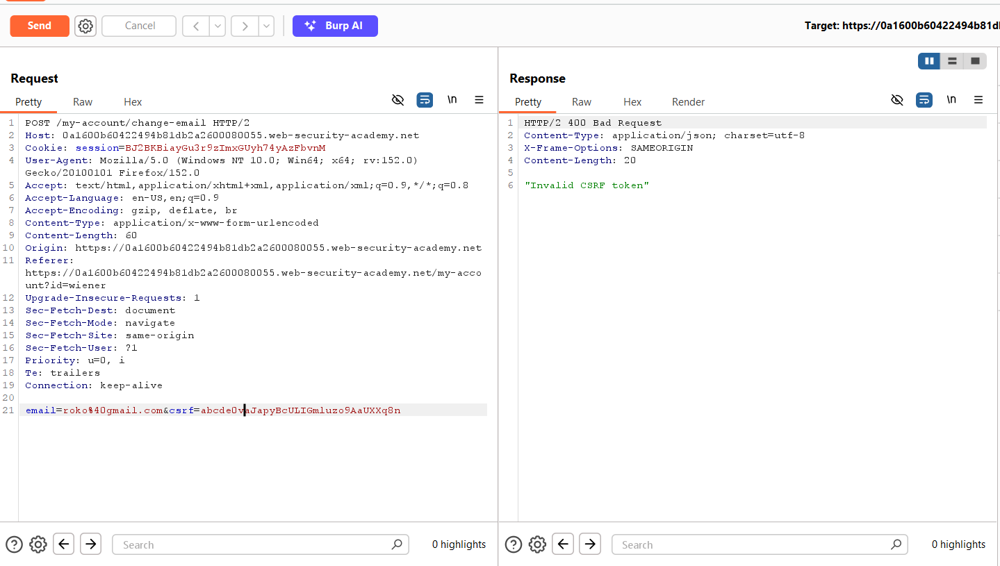
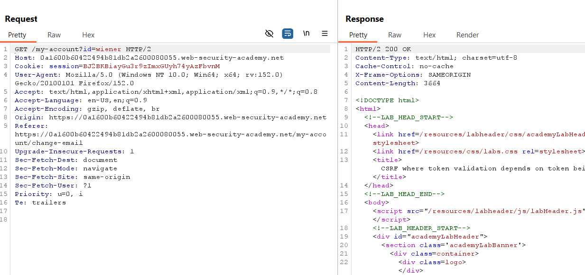
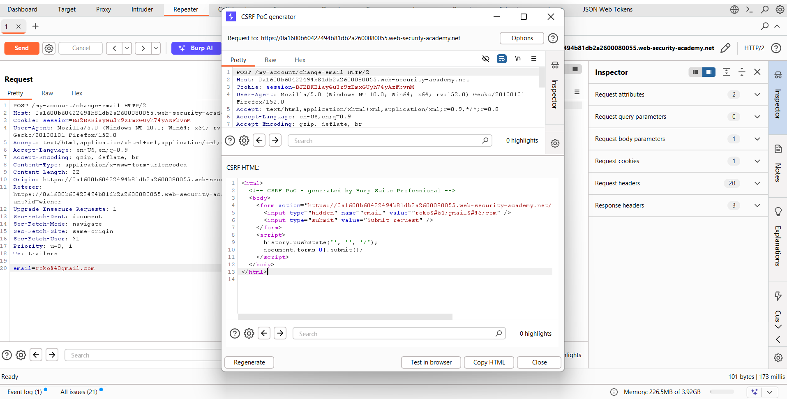
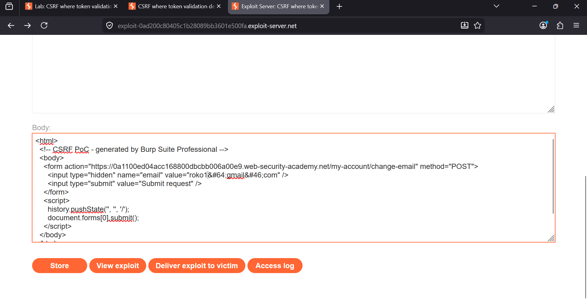
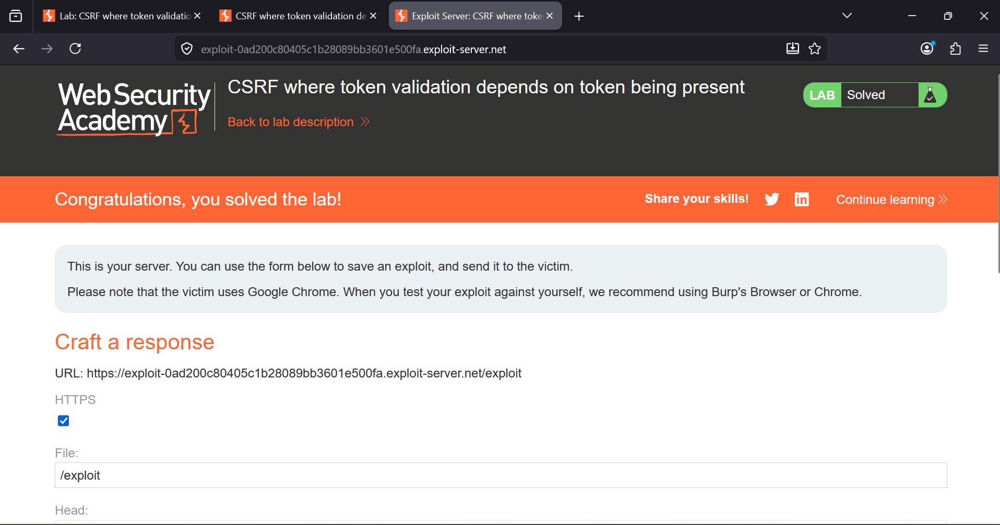

### CSRF Where Token Validation Depends on Token Being Present

**Category:** Cross-Site Request Forgery (CSRF)  
**Difficulty:** Practitioner  
**Platform:** PortSwigger Web Security Academy  

### Overview
This lab demonstrates a flawed CSRF protection mechanism where the server only validates the CSRF token **if the token is
included in the request**. If the `csrf` parameter is completely omitted, the server skips validation and processes the
request successfully.
This allows an attacker to craft a CSRF attack by removing the token from the request entirely.


### Objective
Change the victim's email address by exploiting the application's weak CSRF validation.


Step 1: Capture the Email Change Request

Log in to the application and navigate to **My Account**.
Intercept the request responsible for changing the email address using Burp Suite.

The original request contains a valid CSRF token.




Step 2: Verify CSRF Token Validation

Modify the CSRF token to an invalid value and send the request.
The server responds with:
```
Invalid CSRF token
```
This confirms that the application validates the token **when it is present**.




Step 3: Remove the CSRF Token

Delete the entire `csrf` parameter from the request body and resend it.

Example:

```http
POST /my-account/change-email HTTP/2

email=roko%@gmail.com
```

The request succeeds because the server only checks the token if it exists.

Generate a CSRF Proof of Concept using **Burp Suite → Engagement Tools → Generate CSRF PoC**.




Step 4: Deliver the Exploit

Copy the generated HTML into the exploit server.
Store the exploit and click **Deliver exploit to victim**.

When the victim visits the malicious page, the hidden form automatically submits and changes the victim's email address
without requiring a valid CSRF token.




### Result

The victim's email address is successfully changed, proving that the application's CSRF protection can be bypassed simply
by omitting the token.




### Root Cause
The server validates the CSRF token **only when the token is present** in the request.

Instead of rejecting requests that lack a CSRF token, the application accepts them and processes the action.

Pseudo logic:

```php
if (csrf_parameter_exists) {
    validate_token();
}

process_request();
```

Because validation is skipped when the parameter is missing, an attacker can simply remove the token from the forged request.


### Exploit Summary

1. Intercept the email change request.
2. Verify that an invalid token is rejected.
3. Remove the `csrf` parameter completely.
4. Generate a CSRF PoC using Burp Suite.
5. Upload the HTML to the exploit server.
6. Deliver the exploit to the victim.
7. The victim's email address changes successfully.


### Impact

- Account settings can be modified without the user's consent.
- Sensitive actions become vulnerable to CSRF attacks.
- Attackers can trick authenticated users into performing unwanted actions.


### Remediation

- Always require a CSRF token for every state-changing request.
- Reject any request where the CSRF token is missing.
- Validate the token against the user's session.
- Use the `SameSite` cookie attribute where appropriate.
- Verify the `Origin` and `Referer` headers as an additional defense.


### Key Takeaway

A CSRF defense is ineffective if the server only validates the token when it is supplied. Missing tokens must always result
in request rejection; otherwise, attackers can bypass protection simply by omitting the parameter.
