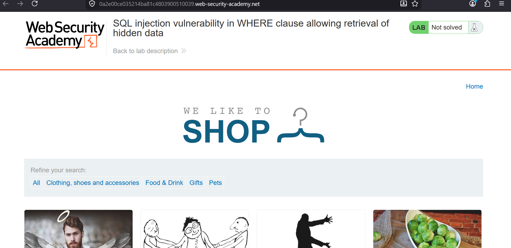
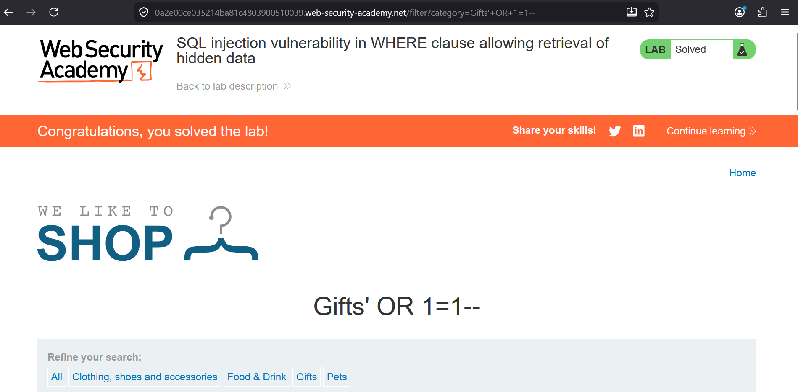

### SQL Injection in WHERE Clause Allowing Retrieval of Hidden Data

**Category:** SQL Injection  
**Difficulty:** Apprentice  
**Platform:** PortSwigger Web Security Academy

### Objective
This lab demonstrates how an SQL injection vulnerability in a product category filter can be used to bypass the application's filtering logic.
The objective is to retrieve all products, including those that are intended to remain hidden from users.

### Vulnerability Overview
The application passes the value of the category parameter directly into an SQL query without proper sanitization or parameterization. 
Because the input is treated as part of the SQL statement, an attacker can alter the query's logic by supplying specially crafted input.

### Methodology
1. Located the category parameter in the product filtering request.
2. Tested the input with a single quote (') to check whether it affected the SQL query.
3. The resulting database error indicated that user input was being interpreted as SQL syntax.
4. Since the parameter was used in a WHERE clause, I verified that the query logic could be manipulated to return additional records.
5. After modifying the query condition, the application displayed all products, including those that were not meant to be publicly accessible.

### Payload
Gifts' OR 1=1--

### Why It Works
The vulnerability exists because user input is concatenated directly into an SQL statement instead of being treated as data.
By modifying the logical conditions within the WHERE clause, the database evaluates a much broader condition than the developer intended. 
Since the remaining portion of the query is ignored after the injected comment sequence, the restriction that normally hides unreleased products is no longer applied.

### Remediation
1. Use parameterized queries or prepared statements.
2. Never construct SQL queries through string concatenation.
3. Validate user input against expected values where possible.
4. Apply the principle of least privilege to database accounts.
5. Avoid exposing detailed database error messages to users.
