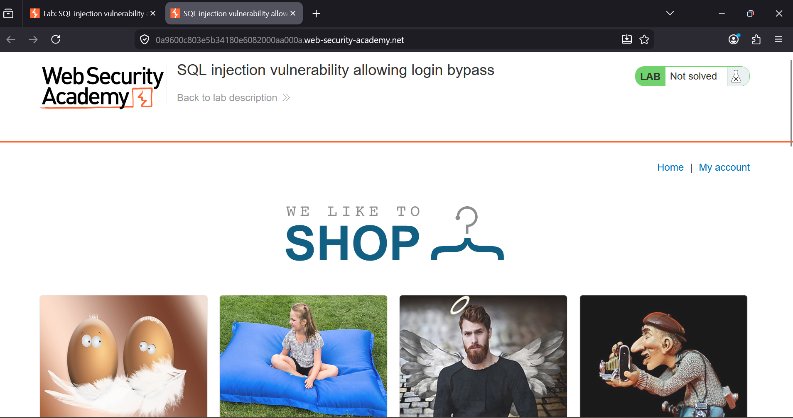
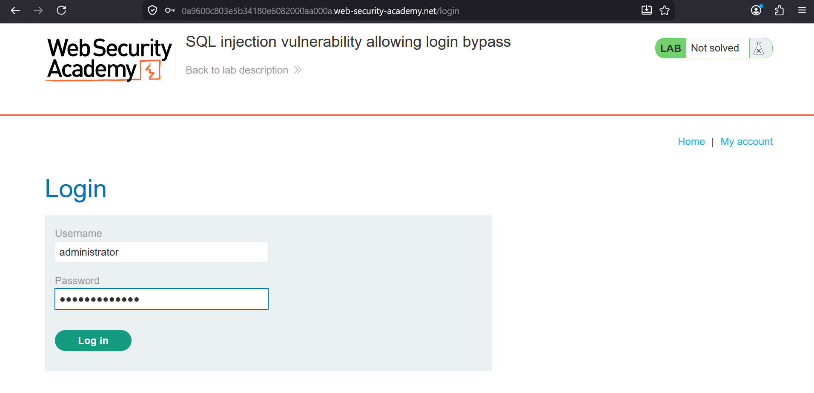
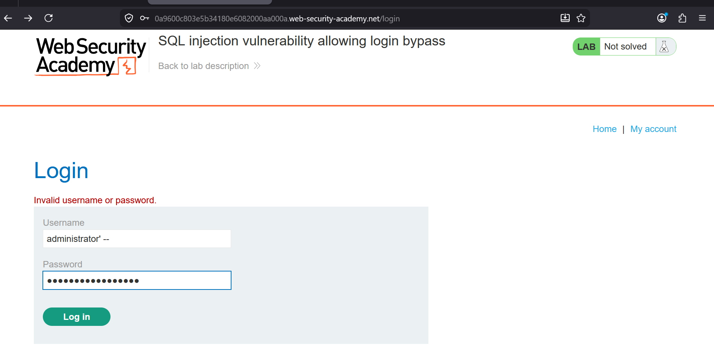
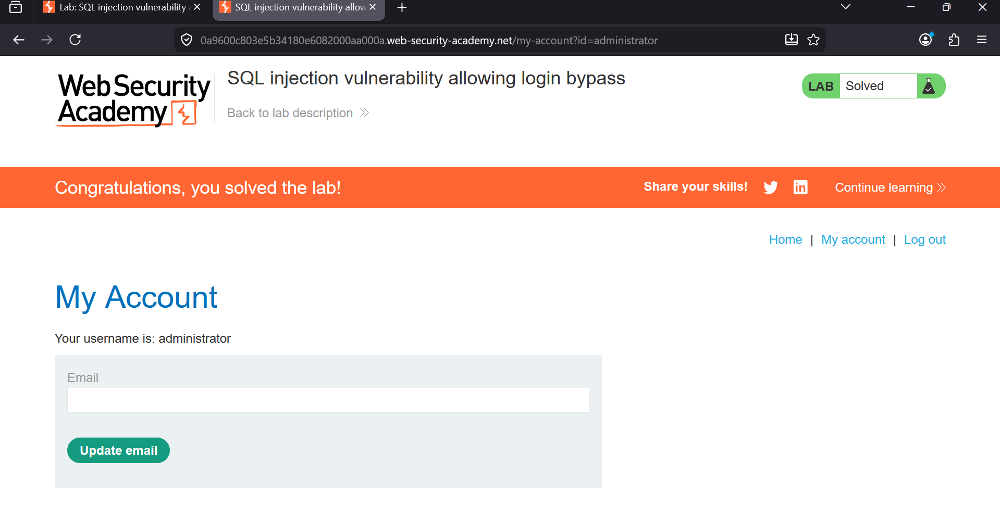

### SQL Injection Vulnerability Allowing Login Bypass

**Category:** SQL Injection  
**Difficulty:** Apprentice  
**Platform:** PortSwigger Web Security Academy

### Overview
This lab demonstrates a classic SQL injection vulnerability in a login form that allows an attacker to bypass authentication without knowing 
a valid username or password by manipulating the SQL query executed by the application.
The objective was to log in as the administrator user without knowing the account's password.

### Vulnerability
The login functionality inserts the submitted username and password directly into an SQL query, likely similar to:

SELECT * FROM users WHERE username = '<username>' AND password = '<password>'

Since user input is concatenated directly into the query without proper sanitization or parameterized statements, SQL syntax can be injected to change the query's logic.

### Methodology
1. Navigate to the Login Page
Open the login page and locate the Username and Password fields.

2. Attempt a Normal Login (Optional)
Entering a normal username and password results in an authentication failure.

3. Inject SQL into the Username Field
Enter the following payload in the Username field, leaving the Password field as anything (or blank):
         administrator'--
The -- comments out the remainder of the SQL query, including the password check.

4. Confirm Success
After submitting the request, the application authenticates as the administrator user and redirects to:
/my-account?id=administrator

### Why This Works
1. The application builds SQL queries using string concatenation instead of parameterized queries (prepared statements).
2. The single quote (') closes the username string early.
3. The SQL comment sequence (--) causes the database to ignore the remainder of the query, including the AND password = '...' condition.
4. As a result, the application only verifies that the administrator user exists and grants access without validating the password.

### Impact
An attacker can:
1. Bypass authentication for any known or guessable username.
2. Gain unauthorized access to privileged accounts such as administrator.
3. Potentially escalate to further database compromise if other SQL injection points are present.

### Remediation
1. Use parameterized queries (prepared statements) for all database interactions instead of concatenating user input into SQL queries.
2. Apply the principle of least privilege to the database account.
3. Use input validation and allow-lists where appropriate.
4. Use an ORM or query builder that automatically parameterizes queries.
5. Implement a Web Application Firewall (WAF) as an additional layer of defense.
