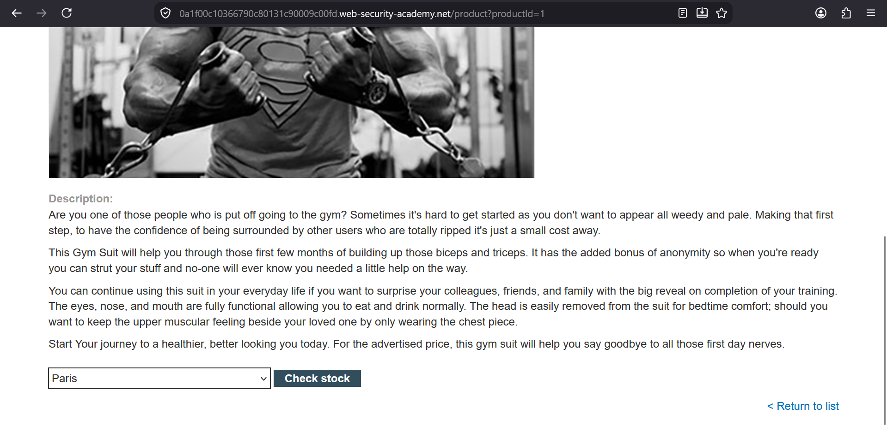
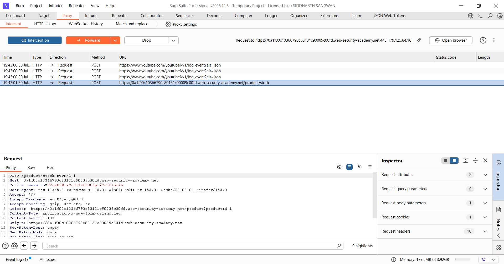
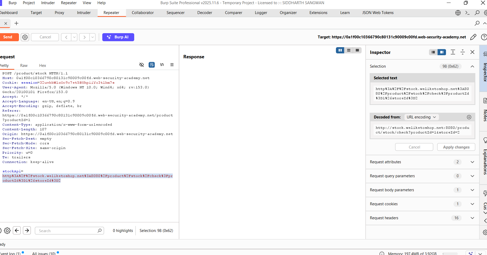
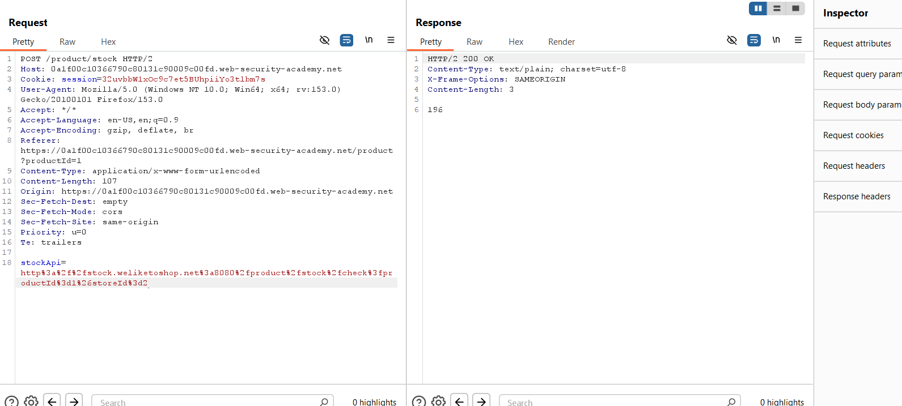
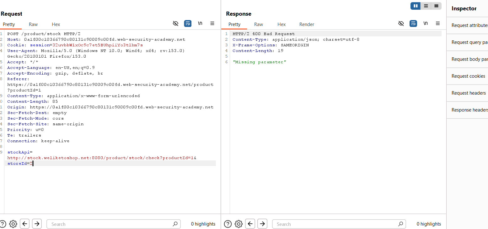
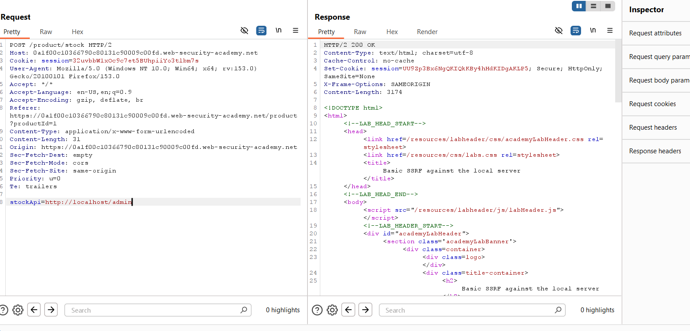
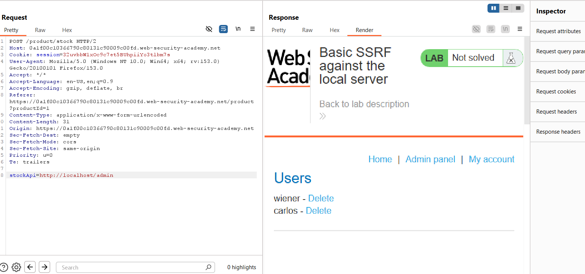
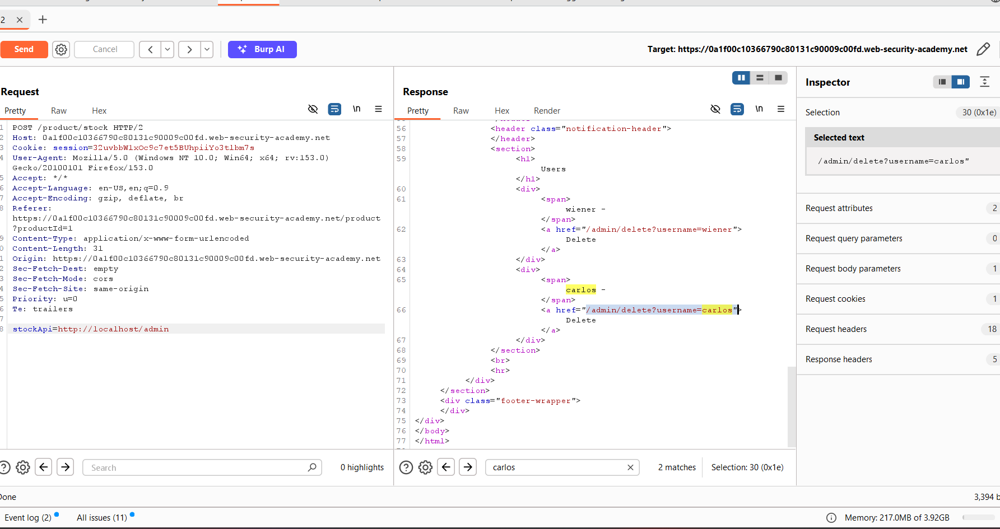
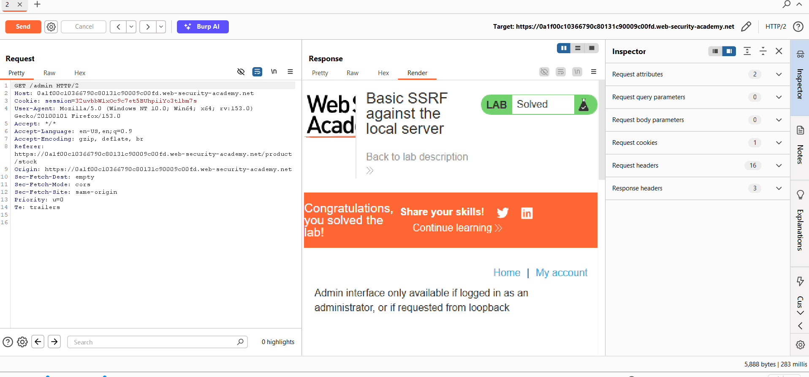

### Basic SSRF Against the Local Server

**Category:** Server-Side Request Forgery (SSRF)  
**Difficulty:** Apprentice  
**Platform:** PortSwigger Web Security Academy


### Overview

This lab demonstrates a **Server-Side Request Forgery (SSRF)** vulnerability where the application retrieves stock
information from a backend service using the `stockApi` parameter. Since the application does not properly validate
this parameter, an attacker can manipulate it to force the server to make requests to internal resources such as the
administrator interface. By exploiting this behavior, it is possible to access the internal admin panel and delete
the user **carlos**, successfully solving the lab.


### Objective

- Identify the SSRF injection point.
- Access the internal administrator interface.
- Delete the user **carlos**.
- Solve the lab.


### Tools Used

- Burp Suite Professional
- Burp Repeater
- Firefox Browser


# Step 1: Capture the Stock Check Request

Open any product page and click the **Check stock** button. This feature sends a request to the backend to retrieve the
product's stock information.

Intercept this request using Burp Suite and send it to **Repeater** for further analysis.




# Step 2: Inspect the Captured Request

After capturing the request, observe the request body in Burp Repeater.

The request contains a parameter named **`stockApi`**, which is responsible for retrieving the stock information from the
backend server.




# Step 3: Decode the `stockApi` Parameter

Notice that the value of the **`stockApi`** parameter is URL-encoded.

Using Burp Suite's **Inspector** panel, the decoded value can be viewed on the right-hand side.

Encoded value:

```
http%3A%2F%2Fstock.weliketoshop.net%3A8080%2Fproduct%2Fstock%2Fcheck%3FproductId%3D1%26storeId%3D2
```

Decoded value:

```
http://stock.weliketoshop.net:8080/product/stock/check?productId=1&storeId=2
```

Decoding the parameter helps us understand the actual URL that the application is requesting and confirms that the 
`stockApi` parameter is the SSRF injection point.




# Step 4: Verify the Original Request

Send the request containing the original **encoded** `stockApi` value.

The server successfully retrieves and returns the stock information, confirming that the application is making a backend
request using the supplied URL.




# Step 5: Test the Decoded URL

Now replace the encoded value with its decoded version and send the request again.

The application still returns the stock information successfully. This confirms that the backend accepts the decoded URL 
directly, allowing us to modify it for further testing.




# Step 6: Access the Internal Administrator Panel

Replace the entire value of the `stockApi` parameter with:

```text
http://localhost/admin
```

Send the request.

Since the request is being made by the server itself, it can access the internal administrator interface that is normally
inaccessible to external users.




# Step 7: Locate the Delete Endpoint

Follow the rendered response of the previous request.

The response displays the internal administrator panel. Inspecting the page reveals the endpoint used to delete the user
**carlos**:

```text
/admin/delete?username=carlos
```

This endpoint will be used in the next request.



---

# Step 8: Delete the User Carlos

Replace the `stockApi` value with the delete endpoint:

```text
http://localhost/admin/delete?username=carlos
```

Send the request and follow the redirection.

The server processes the request internally and deletes the user **carlos**.




# Step 9: Verify the Exploit

After following the redirection, the lab is marked as solved, confirming that the SSRF attack was successful.




### Payloads Used

### Original Encoded Value

```text
http%3A%2F%2Fstock.weliketoshop.net%3A8080%2Fproduct%2Fstock%2Fcheck%3FproductId%3D1%26storeId%3D2
```

### Decoded Value

```text
http://stock.weliketoshop.net:8080/product/stock/check?productId=1&storeId=2
```

### Access Admin Panel

```text
http://localhost/admin
```

### Delete Carlos

```text
http://localhost/admin/delete?username=carlos
```

---

### Result

Successfully exploited a **Server-Side Request Forgery (SSRF)** vulnerability by modifying the `stockApi` parameter. 
Using SSRF, the internal administrator interface was accessed, the delete endpoint was identified, and the user **carlos** 
was deleted, successfully completing the lab.


### Remediation

- Validate and restrict all user-supplied URLs using an allowlist.
- Block requests to localhost, loopback, and private IP ranges.
- Do not allow user input to directly control server-side requests.
- Restrict outbound network access from the application server.
- Validate both hostnames and resolved IP addresses to prevent SSRF bypass techniques.
- Monitor and log outbound requests for suspicious activity.


### Key Takeaways

- SSRF occurs when an application fetches user-controlled URLs without proper validation.
- URL decoding helps identify the actual backend request before modifying it.
- Internal services such as `localhost` should never be directly accessible through user-controlled input.
- SSRF can expose administrative interfaces and lead to unauthorized actions on internal systems.
