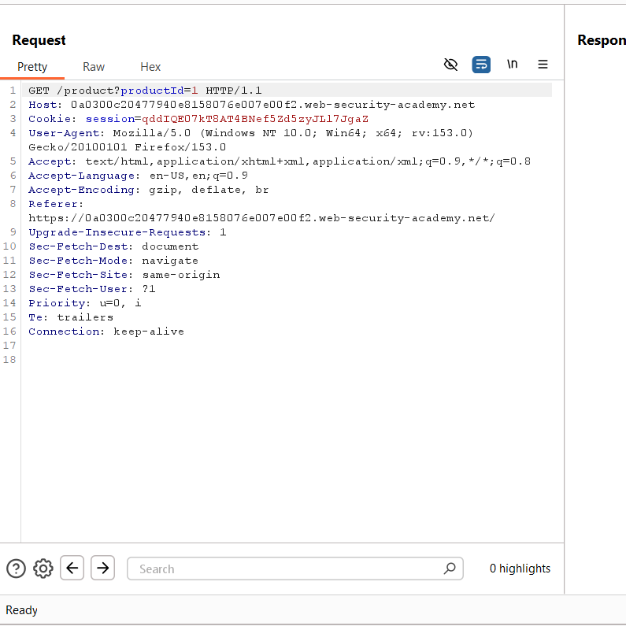
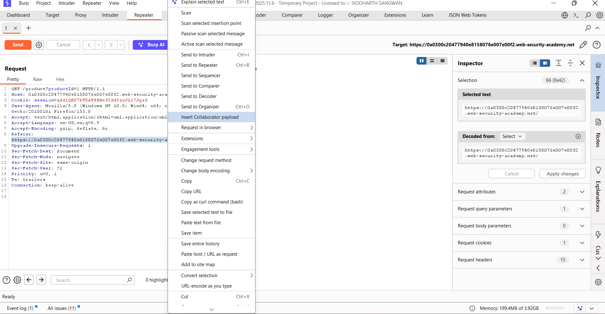
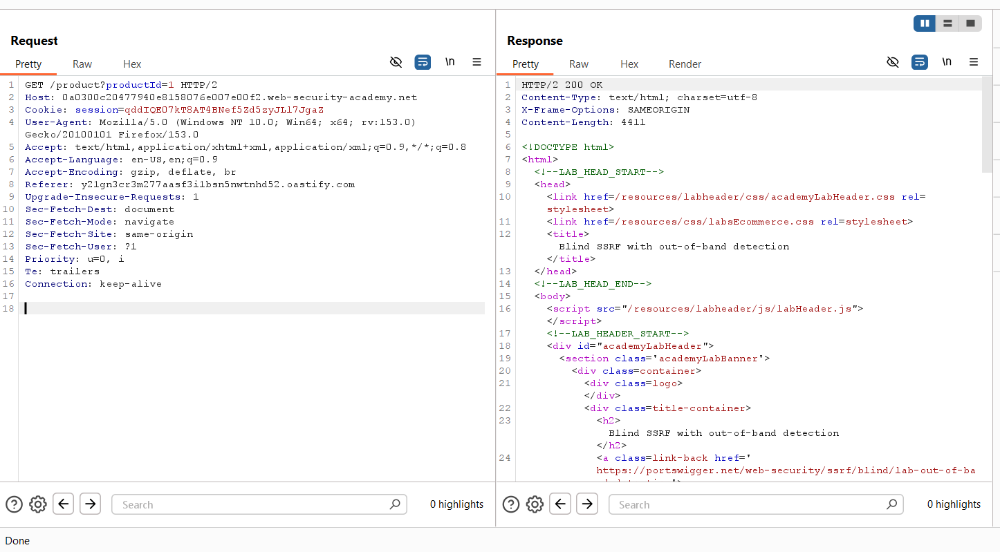
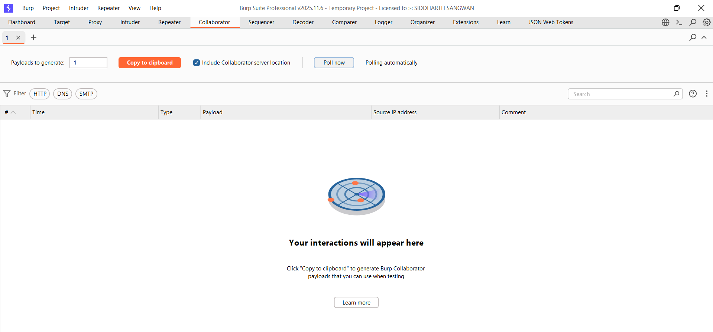
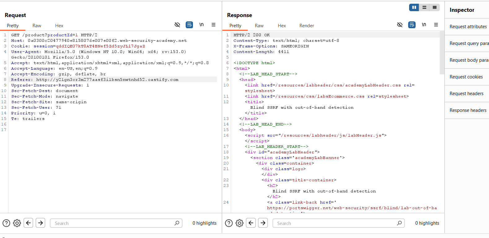
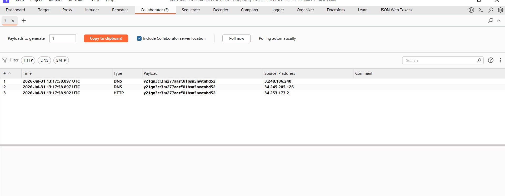
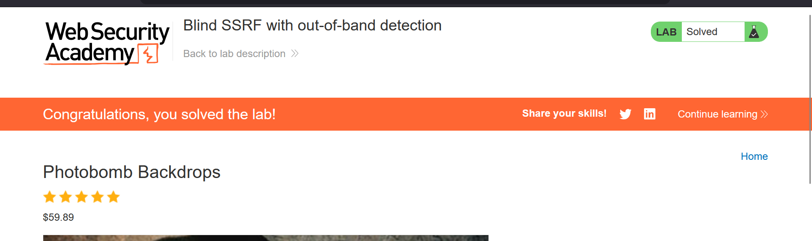

### Blind SSRF with Out-of-Band Detection

**Platform:** PortSwigger Web Security Academy  
**Category:** Server-Side Request Forgery (SSRF)  
**Difficulty:** Practitioner


### Overview

This lab demonstrates a **Blind Server-Side Request Forgery (Blind SSRF)** vulnerability where the application performs
server-side requests without returning the response to the attacker.

Since the response cannot be viewed directly, the vulnerability is confirmed using **Burp Collaborator**, which
detects external DNS and HTTP requests generated by the vulnerable server.

The vulnerable functionality is the **Referer** header sent when requesting a product page.


### Objective

Trigger a blind SSRF request that causes the server to interact with a Burp Collaborator payload and verify the 
interaction through Burp Collaborator.


### Tools Used

- Burp Suite Professional
- Burp Repeater
- Burp Collaborator


# Step 1 – Capture the Product Request

Visit any product page in the lab and intercept the request using Burp Suite.

Send the request to **Repeater** for modification.




The captured request contains the following header:

```
Referer: https://0a0300c20477940e8158076e007e00f2.web-security-academy.net/
```

This header is later used as the SSRF injection point.


# Step 2 – Generate a Burp Collaborator Payload

Inside Burp Repeater, highlight the **Referer** header value.

Right-click the selected URL and choose:

```
Insert Collaborator payload
```

Burp automatically generates a unique Collaborator domain that will be used to detect out-of-band interactions.





# Step 3 – Replace the Referer Header

After inserting the generated Collaborator payload, replace the original Referer value with the generated domain.

Example:

```
Referer: http://y21gn3cr3m277aasf3i1bsn5nwtnhd52.oastify.com
```

Send the modified request.

The application returns a normal **HTTP/2 200 OK** response because Blind SSRF does not reveal the server-side request
in the response.




At this stage, no visible indication of SSRF is shown in the HTTP response.


# Step 4 – Open Burp Collaborator

Navigate to the **Collaborator** tab in Burp Suite.

Initially, there are no interactions because the server has not yet contacted the Collaborator payload.





# Step 5 – Verify the Injected Payload

Return to Repeater and verify that the Collaborator domain has replaced the original Referer header.

The request should now look similar to:

```
Referer: http://y21gn3cr3m277aasf3i1bsn5nwtnhd52.oastify.com
```

Send the request once again if necessary.





# Step 6 – Poll Burp Collaborator

Click **Poll now** inside the Collaborator tab.

Burp Collaborator displays incoming interactions generated by the vulnerable server.

The Collaborator log records:

- DNS lookup
- HTTP request

These interactions confirm that the application made a server-side request to the supplied external domain.




The presence of both DNS and HTTP interactions confirms the Blind SSRF vulnerability.


# Step 7 – Lab Solved

After the Collaborator interaction is detected, PortSwigger marks the lab as solved.





### Vulnerability Explanation

Unlike traditional SSRF, **Blind SSRF** does not return the fetched response to the attacker.

Instead, attackers verify exploitation by observing external interactions initiated by the vulnerable server.

Burp Collaborator provides a unique domain that records:

- DNS lookups
- HTTP requests
- SMTP requests (if applicable)

Any interaction with this domain proves that the server attempted to fetch the supplied URL.


### Root Cause

The application trusts user-controlled input from the **Referer** header and performs server-side requests without
validating the destination.

Because no filtering or allowlist is implemented, attackers can force the server to connect to arbitrary external systems.


### Impact

Successful Blind SSRF can allow attackers to:

- Identify SSRF vulnerabilities without receiving application responses.
- Scan internal infrastructure.
- Reach cloud metadata services.
- Access internal web applications.
- Interact with internal APIs.
- Potentially chain SSRF into remote code execution depending on the target environment.


### Remediation

To mitigate Blind SSRF:

- Never perform server-side requests using untrusted user input.
- Validate all supplied URLs.
- Implement strict allowlists for permitted domains.
- Block requests to internal IP ranges.
- Restrict access to cloud metadata endpoints.
- Disable unnecessary outbound network access from application servers.
- Log and monitor unexpected outbound connections.


### Key Takeaways

- Blind SSRF cannot be confirmed through application responses alone.
- Burp Collaborator is an effective out-of-band detection mechanism.
- DNS and HTTP interactions confirm successful exploitation.
- Input validation and outbound request restrictions are critical defenses against SSRF.
