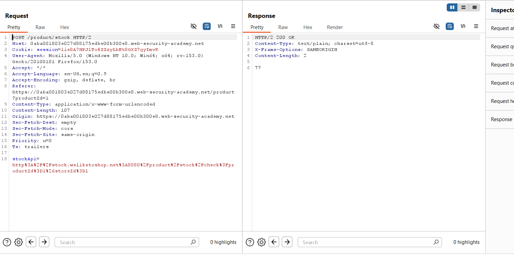
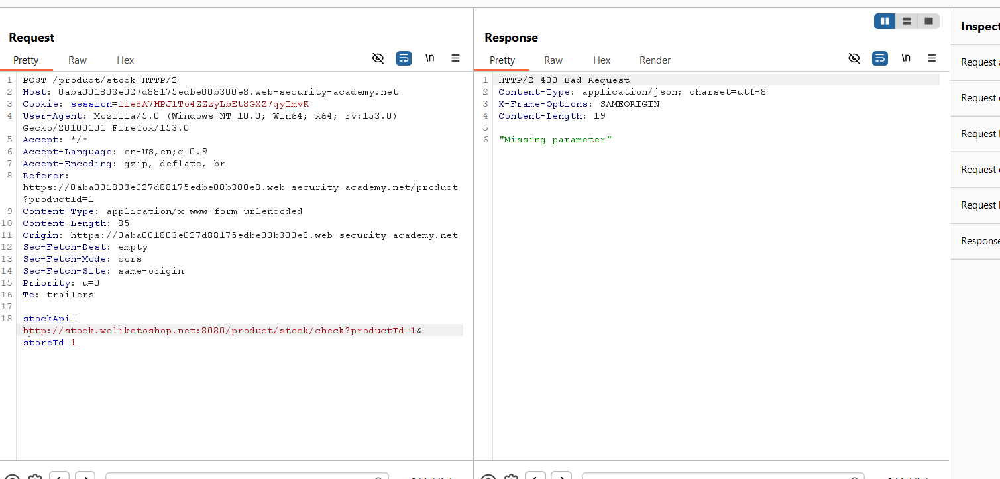
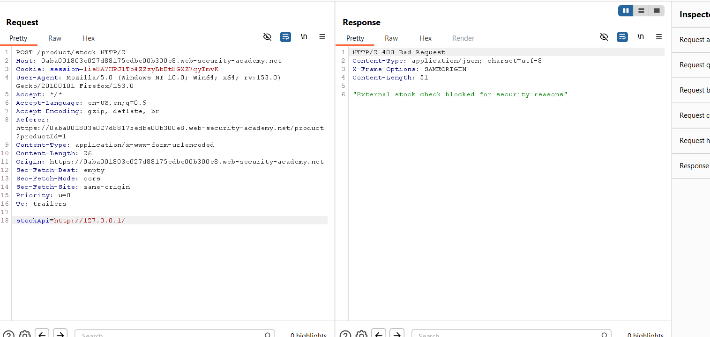
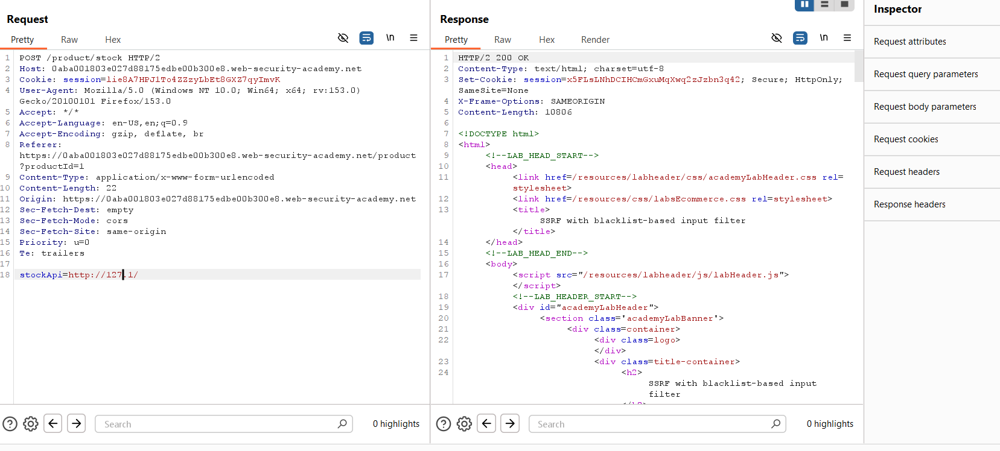
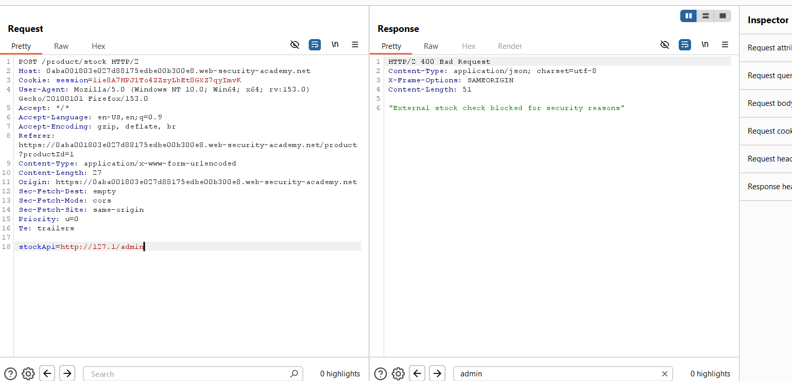
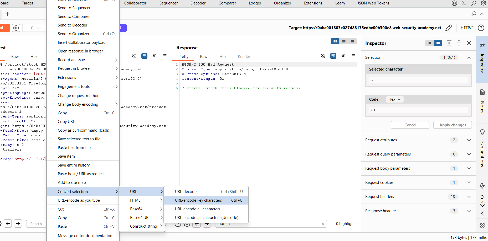
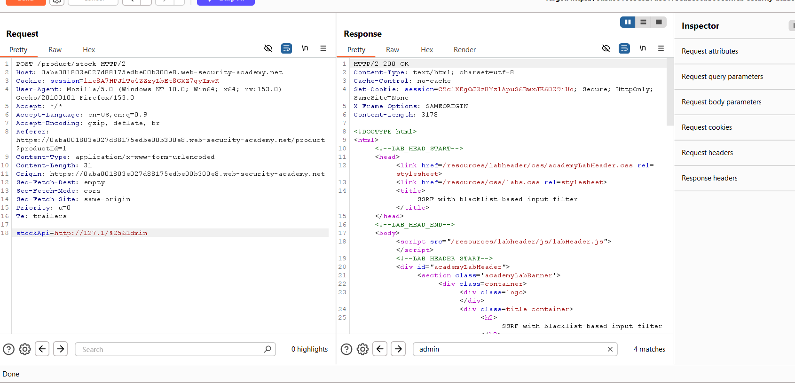
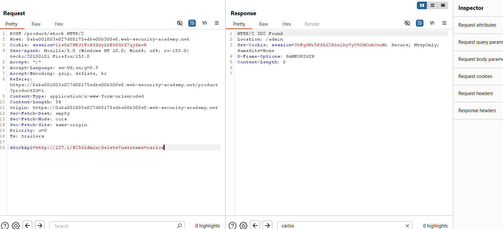
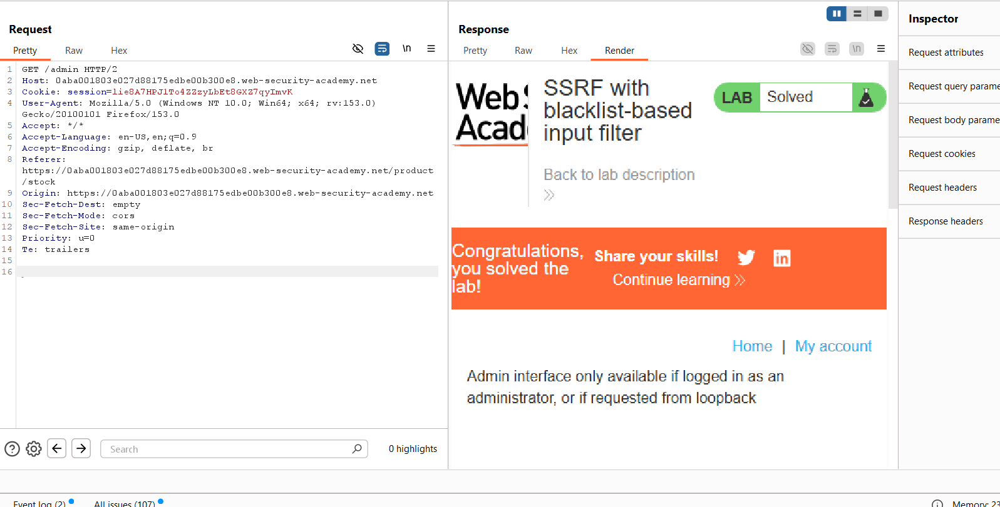

### SSRF with Blacklist-Based Input Filter

**Category:** Server-Side Request Forgery (SSRF)  
**Difficulty:** Practitioner  

### Overview

In this lab, the application checks product stock by sending a request to an internal API. The `stockApi` parameter
is user-controlled, making it vulnerable to SSRF. A blacklist attempts to block access to internal resources, but
it can be bypassed using alternative IP formats and URL encoding.


## Steps to Solve

### 1. Intercept the Stock Check Request

Open any product page and click **Check Stock**. Capture the request in Burp Suite.



The request contains a `stockApi` parameter pointing to the internal stock service.


### 2. Verify the Parameter

Send the request to Burp Repeater and modify the `stockApi` value.



The server returns a **400 Bad Request**, confirming that it processes and validates this parameter.


### 3. Test Localhost Access

Replace the `stockApi` URL with:

```
http://127.0.0.1/
```



The application blocks the request because `127.0.0.1` is blacklisted.


### 4. Bypass the Blacklist

Use the shortened loopback address instead:

```
http://127.1/
```



The request succeeds, proving the blacklist only checks for specific string patterns.


### 5. Access the Admin Panel

Trying:

```
http://127.1/admin
```

is still blocked.



URL-encode the first letter of `admin`:

```
http://127.1/%61dmin
```

Use Burp's **Convert Selection → URL → URL-encode key characters**.



The request now reaches the internal admin panel.




### 6. Delete the User

Use the following payload:

```
http://127.1/%2561dmin/delete?username=carlos
```



The server returns **302 Found**, indicating the delete request was processed successfully.


### 7. Verify the Lab

Visit the lab page to confirm completion.



The lab is now marked as **Solved**.


### Key Takeaways

- Identified an SSRF vulnerability through the `stockApi` parameter.
- Bypassed blacklist filtering using the shortened IP `127.1`.
- Bypassed path filtering with URL encoding (`%61dmin`).
- Accessed the internal admin panel and deleted the target user.
- Successfully completed the PortSwigger lab.


### Remediation

- Use an **allowlist** of trusted destinations instead of blacklists.
- Never allow users to control internal request destinations.
- Normalize and validate URLs before processing them.
- Restrict access to internal services from user-controlled requests.
