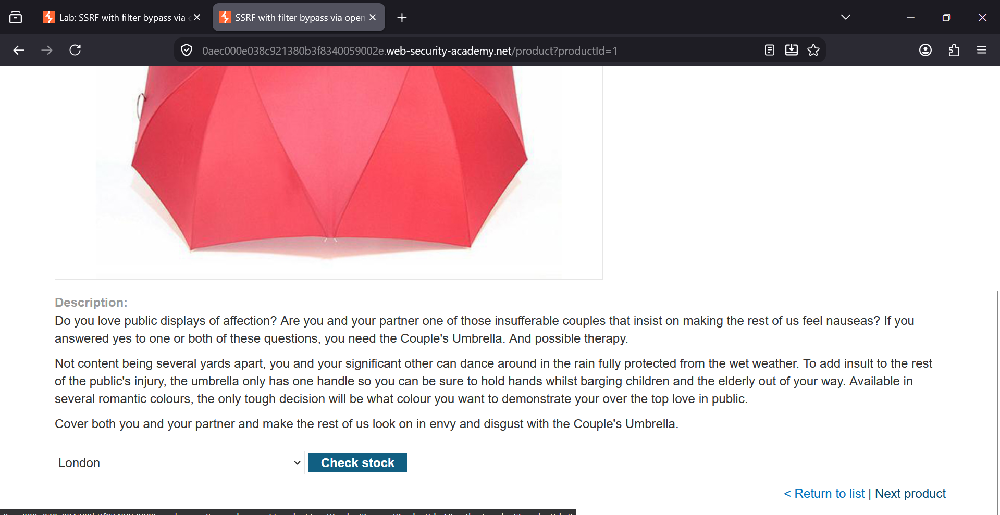
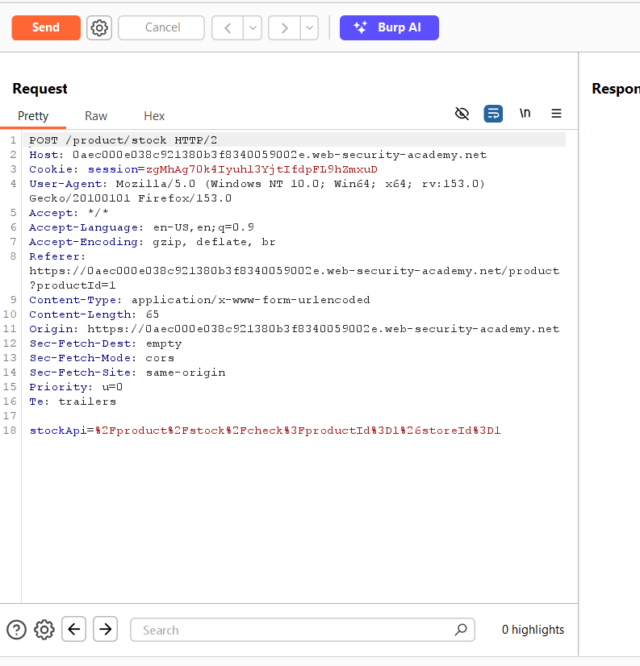
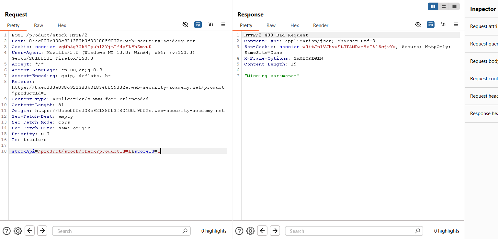
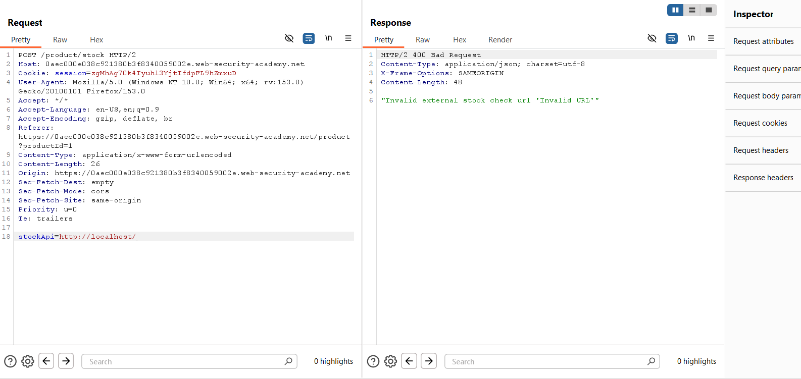
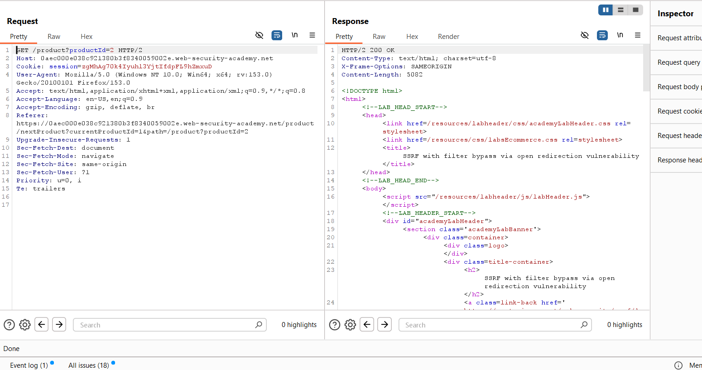
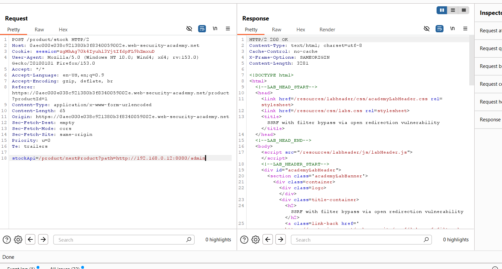
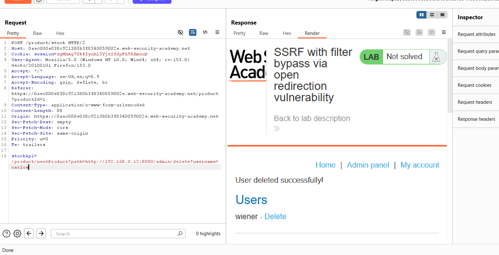
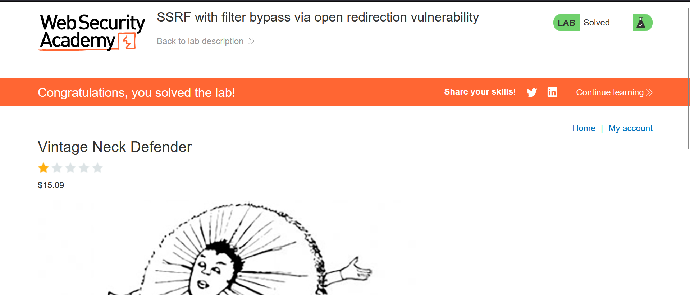

### SSRF with Filter Bypass via Open Redirection Vulnerability

**Category:** Server-Side Request Forgery (SSRF)  
**Difficulty:** Practitioner  


### Overview

In this lab, the application prevents direct SSRF attacks by validating the `stockApi` parameter. However, another endpoint
contains an **open redirection vulnerability** that can be abused to bypass this restriction.

By chaining the vulnerable redirect endpoint with the stock checker, it is possible to make the backend server access the
internal admin interface and delete the user **carlos**.


# Step 1: Visit the Product Page

Open any product page. You will notice two important actions:

- **Check Stock** (POST request)
- **Next Product** (GET request)

Both of these requests are required to solve the lab.



The **Check Stock** button sends a POST request to the stock checker, while the **Next Product** link sends a GET request
that will later reveal the open redirection vulnerability.


# Step 2: Capture the Stock Check Request (POST)

Click the **Check Stock** button and intercept the request in **Burp Suite**. Send the request to **Burp Repeater** for 
further analysis.



The intercepted request contains the following encoded parameter:

```
stockApi=%2Fproduct%2Fstock%2Fcheck%3FproductId%3D1%26storeId%3D1
```

After URL decoding, it becomes:

```
/product/stock/check?productId=1&storeId=1
```

This shows that the application uses the `stockApi` parameter to determine where the backend server sends the stock check
request.


# Step 3: Test the SSRF Filter

Try modifying the `stockApi` parameter to determine whether the backend can be forced to request an arbitrary URL.

First, replace the encoded value with its decoded version.



The application responds with:

```
Missing parameter
```

Next, attempt a direct SSRF request by changing the parameter to:

```
stockApi=http://localhost/
```



The response returns:

```
Invalid external stock check URL
```

This confirms that direct requests to external or internal hosts are blocked by the application's URL validation.


# Step 4: Capture the Next Product Request (GET)

Return to the product page and click **Next Product** located in the bottom-right corner. Intercept this **GET** request
in Burp Suite and send it to **Repeater**.



The request looks similar to:

```
GET /product/nextProduct?currentProductId=1&path=/product?productId=2 HTTP/2
```

The `path` parameter controls where the application redirects the user after clicking **Next Product**.


# Step 5: Identify the Open Redirection Vulnerability

Analyze the captured **Next Product** request and observe that the value supplied in the `path` parameter is copied into 
the **Location** header of the redirect response.

This means the endpoint is vulnerable to **Open Redirection**, allowing an attacker to redirect the backend request
to another destination.

Use the following payload inside the `stockApi` parameter:

```
/product/nextProduct?path=http://192.168.0.12:8080/admin
```



The stock checker follows the redirect and loads the internal **Admin Panel**, successfully bypassing the SSRF filter.


# Step 6: Delete the Target User

Modify the payload so that the redirect points to the user deletion endpoint.

```
/product/nextProduct?path=http://192.168.0.12:8080/admin/delete?username=carlos
```



The response displays:

```
User deleted successfully!
```

This confirms that the backend server followed the redirect and executed the internal administrative action.


# Step 7: Verify the Lab is Solved

Refresh the lab page after deleting the target user.



The lab status changes to:

```
Congratulations, you solved the lab!
```

The SSRF filter was successfully bypassed by chaining it with an Open Redirection vulnerability, allowing access to the internal
admin interface.


### Key Takeaways

- The application blocked direct SSRF requests.
- An **Open Redirect** endpoint existed elsewhere in the application.
- The backend trusted redirects followed by the stock checker.
- Chaining SSRF with an Open Redirect bypassed the URL filtering.
- Internal administrative endpoints became accessible through the backend server.


### Vulnerability Summary

**Vulnerability:** Server-Side Request Forgery (SSRF) Filter Bypass via Open Redirection

**Impact:**
- Access internal services.
- Bypass SSRF filters.
- Reach administrative interfaces.
- Execute privileged internal actions.
- Potential compromise of internal infrastructure.


### Remediation

- Do not allow arbitrary redirects.
- Validate redirect destinations using a strict allowlist.
- Prevent backend services from following untrusted redirects.
- Restrict access to internal resources through network segmentation.
- Validate and sanitize all user-controlled URLs before making server-side requests.
